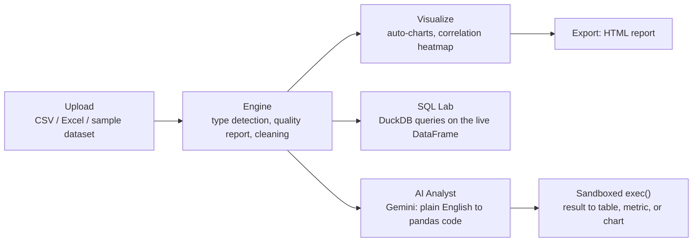

# Prism

**An Auto-EDA web app with an AI analyst layer — clean, visualize, query, and chat with any dataset, no code required.**


<!-- demo.gif here -->

Developed by **Prathmesh Katkade** —
[GitHub](https://github.com/anonymousnotavailable) ·
[LinkedIn](https://linkedin.com/in/your-profile)

---

## Features

Organized by tab — this is literally how the app is laid out, top to bottom.

### Landing Screen
- Hero title, 4 feature cards, and 3 bundled sample datasets (Sales, HR,
  Stocks — see `/samples`) so you can explore Prism without uploading anything
- Restore a previously saved `.json` session and pick up exactly where you left off
- Collapses into the tabbed app the moment a dataset becomes active

### Overview
- Data quality report: row/column counts, missing % per column, duplicate
  count, IQR-based outlier detection, memory usage
- **Column Health** — skewness/kurtosis in plain English ("highly
  right-skewed"), constant/near-constant detection, cardinality warnings for
  probable ID columns, all rolled into a good/warning/issue badge per column
- **Column Drill-Down** — pick any column for a dedicated mini-report:
  distribution chart, top-10 values, missing %, outliers, descriptive stats
- **Anomaly Detection** — scikit-learn's `IsolationForest` flags unusual
  rows with a plain-English reason each (e.g. "salary is 6.4x above the
  column median"), with one-click exclusion

### Clean
- Sidebar cleaning controls: drop/fill (mean, median, mode, custom) missing
  values, one-click duplicate removal, column dtype conversion, column dropping
- **Datetime Intelligence**: one-click year/month/day/weekday/quarter
  extraction, plus gap detection ("15 days missing between Mar 03 and Mar 17")
- **Smart Type Coercion**: detects currency symbols, thousands separators,
  `%` signs, and `K`/`M`/`B` suffixes in text columns, with a before/after
  preview and one-click convert
- **Cleaning History + Undo**: every action is logged with its equivalent
  pandas code line; Undo restores a DataFrame snapshot (last 10 steps kept)
- **Export as Python Script** — downloads a runnable `.py` reproducing every
  logged step, in order, with comments
- Before/after comparison view + download the cleaned dataset as CSV

### Combine
- Upload a second CSV/Excel file and join it onto your active dataset
- Auto-detects candidate join keys by name overlap **and** value overlap
  (a Jaccard-style %), with a manual override for any column pairing
- Inner/left/right/outer join, each with a plain-English one-liner
- Preview shows rows before → after, columns gained, and key match rate
  before committing — "Use as Active Dataset" rewires every other tab onto
  the joined data

### Visualize
- Smart chart picker per column type (pie/bar for categoricals, histogram +
  boxplot for numerics, line trend for datetime × numeric, scatter for
  numeric × numeric) — probable ID columns are automatically excluded
- Correlation heatmap with the top-3 strongest correlations flagged automatically
- Manual chart builder for full control over axes and chart type
- One-click export to a self-contained HTML report (quality summary + all charts + stats)

### SQL Lab
- Run raw SQL directly against the active dataset via **DuckDB** — the
  DataFrame is registered as a table named `data`, entirely in-memory
- 4 clickable example queries (`SELECT *`, `GROUP BY` aggregation, `WHERE`
  filter, `ORDER BY` + `LIMIT`) auto-filled with your dataset's real column names
- Results show row count and execution time; SQL errors are caught and
  shown in a styled alert instead of crashing the app
- "Explain This Query" sends the SQL to Gemini for a plain-English explanation

### AI Analyst
- Natural-language chat — typed or **by voice** — answered with generated
  pandas code, executed in a locked-down sandbox, displayed as a table,
  metric card, and/or chart
- **Self-healing retry**: if the generated code errors out, the error is
  sent back to Gemini once for a corrected version before giving up
- "Generate Key Insights" — 5 analyst-style findings, each referencing an
  actual number from the data, rendered as styled cards
- Every request sends only the column schema, a 5-row sample, and summary
  statistics — **never the full dataset**

### Throughout
- Light/dark theme toggle in the sidebar (default: dark cyan)
- Dismissible first-visit onboarding, a "? Help" expander on every tab,
  `st.toast()` confirmations, and styled error/warning alerts everywhere
- Runs fully without a Gemini API key — only the AI-dependent parts of AI
  Analyst and SQL Lab show a friendly "add your key" message instead of breaking

---

## Architecture



```
prism/
├── app.py                  # Entry point — landing screen, sidebar, 6 tabs, session-state wiring
├── modules/
│   ├── data_engine.py       # File loading (incl. multi-sheet Excel), type detection, quality report
│   ├── cleaning.py          # Null handling, dedup, dtype conversion, code-gen, export_script()
│   ├── visualization.py     # Smart chart picker, correlation heatmap, overview stats
│   ├── profiling.py         # Skew/kurtosis labels, cardinality, constants, column health
│   ├── anomaly.py           # IsolationForest wrapper + plain-English reasons
│   ├── datetime_intel.py    # Datetime feature extraction + gap detection
│   ├── type_coercion.py     # Numeric-in-text detection + conversion
│   ├── session_io.py        # JSON session save/load
│   ├── join_engine.py       # Candidate join-key detection, join execution + stats
│   ├── sql_lab.py           # DuckDB query execution, example query builder
│   ├── voice_input.py       # streamlit-mic-recorder wrapper, graceful fallback
│   ├── ai_analyst.py        # Gemini integration, safe code execution, self-healing retry
│   ├── atlas.py             # Voice operator: intent router, command registry, TTS, persona, orb
│   ├── story_mode.py        # Voice-narrated insight slides + the scripted hands-free Demo Mode
│   ├── report.py            # Standalone HTML report generation
│   ├── theme.py             # Multi-theme (Graphite/Midnight/Arctic) CSS + matching Plotly templates
│   └── ui.py                # Landing screen, footer, help expanders, onboarding
├── samples/                  # sales/hr/stock/indian_startup_funding_messy.csv for "Try a sample dataset"
├── eval/atlas_eval.py        # 8-utterance accuracy check for Atlas's intent router
├── .streamlit/config.toml   # Theme config
├── requirements.txt          # Pinned, tested-together versions
└── DEPLOYMENT.md             # Streamlit Community Cloud deployment steps
```

### Safe-execution sandbox (AI Analyst)

The AI Analyst never lets Gemini touch the real dataset or the real Python
runtime:

1. **Context, not data.** Every question sends Gemini the column schema, a
   5-row sample, and `describe()` output — never the full DataFrame.
2. **Fenced code only.** The system prompt requires a single ` ```python `
   block that uses only `df`/`pd`/`np` and assigns to a `result` variable.
3. **Restricted `exec()`.** A keyword blocklist (`import os`, `open(`,
   `eval(`, `__`, `subprocess`, `requests`, ...) is checked first; the real
   boundary is `exec_globals = {"__builtins__": <~20 safe builtins only>,
   "pd", "np", "df": df.copy()}` — no `__import__`, no file or network
   access reachable even if the blocklist is bypassed. `df.copy()` means a
   destructive-but-valid operation (`df.drop(..., inplace=True)`) can't
   corrupt the app's real working dataset either.
4. **Self-healing retry.** If the generated code raises, the exact error is
   sent back to Gemini once for a corrected version, then executed again. A
   failed Gemini *request* (bad key, quota, network) is a different failure
   mode from a failed *execution* — the two are surfaced with different
   messages, and only the latter triggers a retry.
5. **Charts stay outside the sandbox.** The model only ever returns pandas
   code; `build_chart_from_result()` decides — from the already-computed,
   already-trusted result plus a keyword heuristic — whether to also render
   a Plotly chart. This keeps the sandbox's surface area to exactly
   `df`/`pd`/`np` while still producing chart output for trend questions.

### A few judgment calls worth knowing about

- **Session files are JSON, not pickle.** `pickle.loads()` on a
  user-supplied file is a code-execution vulnerability — a crafted pickle
  runs arbitrary code the instant it's loaded, and a "restore session" file
  is uploaded through the browser exactly like any other file. `session_io.py`
  serializes DataFrames via `to_json(orient="split")` instead, keeping "load
  session" exactly as safe as "upload CSV."
- **Secrets: `st.secrets` first, `.env` second.** `ai_analyst.get_api_key()`
  checks Streamlit's secrets manager before falling back to the
  `python-dotenv`-populated environment, so the identical code path works
  unmodified on Streamlit Community Cloud and on `localhost`.
- **Cardinality flagging excludes floats and datetimes.** An early version
  flagged *any* >90%-unique column as a probable ID — which is also true of
  nearly every continuous float measurement and every datetime column by
  nature, and would have silently excluded ordinary numeric/date columns
  from auto-charts on most real datasets. Caught by testing before shipping.
- **File structure stayed one-concern-per-module.** Rather than
  consolidating into a few large files, each new capability got its own
  small module — more files, but each one explainable in isolation (useful
  when the whole point of the project is being able to walk through it).

---

## Atlas Voice Operator

Atlas is a JARVIS-style voice/typed operator layered over the whole app —
not just another chat box. Every utterance, spoken into the persistent mic
or typed into the command bar at the top of every screen, goes through one
router before anything happens.

### The intent router

`modules/atlas.py`'s `classify_intent()` is a single Gemini call per
utterance, constrained to return strict JSON:

```json
{"type": "APP_COMMAND | DATA_QUESTION | CHITCHAT",
 "action": "navigate | clean_nulls | run_auto_analysis | generate_report | ...",
 "target": "<tab name, column name, or null>",
 "question": "<verbatim question if DATA_QUESTION, else null>",
 "spoken_reply": "<1-2 sentences, said aloud>"}
```

Why route through a classifier instead of letting the AI Analyst's own
Gemini call just handle everything? Because "clean the nulls" and "what's
the average revenue by region" need to go to two completely different
places — one mutates `st.session_state.working_df` through the cleaning
module, the other reads it through a sandboxed pandas-code pipeline. A
single, cheap, structured-output call up front means the router's whole
job is deciding *where to send* an utterance, not answering it — the two
concerns stay separable, testable, and (mostly) provider-agnostic.

**Malformed JSON gets exactly one retry** (re-asking with "respond with
ONLY the JSON object this time"), then a graceful spoken fallback — the
router never raises into the app underneath it, and neither does the TTS
layer, which cascades **edge-tts → gTTS → text-only** for the same reason.

**Dispatch** goes through `atlas.COMMAND_REGISTRY`, a plain
`{action_name: function}` dict `app.py` populates with its own functions
at import time — `atlas.py` owns *routing*, never the app-specific
mutations. `DATA_QUESTION` is the one type atlas.py deliberately does
*not* execute itself: it hands the parsed question back to `app.py`, which
feeds it into the same `ai_analyst.ask_and_execute()` pipeline typed
questions always used — so voice and typed questions share one
`chat_history`, and a follow-up like "now by month" works identically
regardless of which path the previous turn came in on.

### Destructive actions are two-phase, always

Nothing that mutates data executes from a single utterance. Any destructive
command calls `atlas.guarded(action, target, message)` first: the first
call stages a confirmation (spoken + on-screen Confirm/Cancel) and returns
without touching the data; only a matching `confirm` — voice or click —
re-dispatches the *same* action, at which point `guarded()` sees it was
already approved and lets it through.

### Navigation had to stop being `st.tabs()`

`st.tabs()` has no API to switch the active tab from Python, so a voice
"go to Visualize" command had nothing to actually do. The tab bar became a
`st.segmented_control` bound to `st.session_state.active_section` instead
— setting that key and calling `st.rerun()` genuinely switches sections,
and the six tab bodies became an `if/elif` chain (only the active
section's code runs each rerun now, rather than all six every time, which
`st.tabs()` did unconditionally).

### Story Mode / Demo Mode

Neither existed before Atlas — both are new. Story Mode turns
`generate_key_insights()`'s findings into voice-narrated slides with
Previous/Next/Pause controls (plus voice "next"/"previous"); auto-advance
is a best-effort word-count-based timer, not a true "audio ended" signal —
Streamlit has no built-in channel for that without a full bidirectional
custom component, so treat auto-advance as a nice-to-have and the manual
controls as the reliable path. Demo Mode is a scripted, fully hands-free
walkthrough (`say "demo mode"`) over a bundled synthetic dataset
(`samples/indian_startup_funding_messy.csv`): quality scan → hell-mode
cleaning → auto-analysis → top 3 findings → "That's what I can do."

### Eval harness

`eval/atlas_eval.py` runs 8 utterances (5 commands, 1 data question, 1
chitchat, 1 confirm) through the real `classify_intent()` and checks
type/action/target accuracy — `python -m eval.atlas_eval` from the project
root. Needs `GEMINI_API_KEY` configured; it reports that plainly and exits
rather than pretending to pass.

---

## Why I built this

I wanted one tool that covered the parts of a real data-analysis workflow I
was otherwise juggling across five different tools — pandas for cleaning, a
notebook for charts, a separate SQL client for ad-hoc queries, and a
browser tab open to an LLM for the "just explain this to me" questions.
Prism is that tool, and it's also the project I point to when someone asks
what I can actually build: a full pipeline from messy CSV to clean insight,
with the judgment calls (safety, secrets, data format choices) made
deliberately rather than defaulted into.

---

## Run locally

```bash
git clone https://github.com/anonymousnotavailable/prism.git
cd prism
python -m venv .venv
.venv\Scripts\activate        # Windows — use `source .venv/bin/activate` on macOS/Linux
pip install -r requirements.txt
```

Add your free Gemini API key (optional — everything except the AI-powered
parts of AI Analyst and SQL Lab works without it):

```bash
cp .env.example .env          # macOS/Linux — use `copy .env.example .env` on Windows
# then edit .env and set GEMINI_API_KEY=your_key_here
```

Get a free key at [aistudio.google.com/apikey](https://aistudio.google.com/apikey).

```bash
streamlit run app.py
```

The app opens at `http://localhost:8501`. No dataset handy? Use one of the 3
bundled samples on the landing screen — each one ships with deliberate
messiness (nulls, duplicates, currency-as-text, a date gap) specifically so
the cleaning tools have something to do immediately.

**Deploying this yourself?** See [`DEPLOYMENT.md`](DEPLOYMENT.md) for exact
steps to put it on Streamlit Community Cloud for free.

---

## Tech Stack

| Layer          | Choice                                  |
|----------------|-------------------------------------------|
| UI framework   | Streamlit                               |
| Data engine    | Pandas + NumPy                          |
| Charts         | Plotly (fully interactive, dark + light templates) |
| SQL engine     | DuckDB (in-memory, queries the live DataFrame) |
| Anomaly detection | scikit-learn (`IsolationForest`)     |
| Voice input    | streamlit-mic-recorder (browser speech-to-text) |
| AI layer       | Google Gemini API (`gemini-2.5-flash`)  |
| Secrets        | `st.secrets` (Cloud) → `.env` via python-dotenv (local) |
| Session files  | JSON (not pickle — see architecture note above) |

---

## Screenshots

### 1. Landing Screen
Your first stop — hero banner with "Your AI-Powered Data Analyst" tagline, 4 feature cards highlighting the core capabilities (Clean, Visualize, Ask AI, SQL Lab), and 3 sample datasets ready to explore without uploading your own data. Perfect entry point for both first-time users and those with their own CSV.


### 2. Overview
Data quality at a glance — rows/columns metrics, missing % per column, duplicate count, and memory usage. The **Missing Values by Column** table reveals data completeness patterns, and the system auto-detects column types. Perfect for your first look at a messy dataset to understand what needs cleaning.


### 3. Clean
**Before vs After** metrics at the top (rows, columns, missing cells) track your progress. The **Cleaning Log** shows every action with its equivalent pandas code line. Sidebar **Cleaning Controls** include Handle Missing Values, Duplicates & Columns, Fix Column Types, Smart Type Coercion, and Datetime Features — all with full undo history (last 10 steps) and a **Reset to Original Data** button. Export cleaned data as CSV or a runnable Python script.


### 4. Visualize
Smart chart picker per column type — pie/bar for categoricals, histogram + boxplot for numerics, line trend for datetime × numeric, scatter for numeric × numeric — with probable ID columns automatically excluded from auto-charts. A correlation heatmap flags the top-3 strongest relationships automatically, and the Manual Chart Builder gives full control over axes and chart type when auto mode doesn't show what you need. Export everything to a self-contained HTML report.


### 5. SQL Lab
Run raw SQL directly against your dataset via DuckDB. The table is auto-registered as `data`. 4 clickable example queries (`SELECT *`, `GROUP BY`, `WHERE`, `ORDER BY + LIMIT`) auto-fill with your real column names. Results show row count and execution time; errors are caught and displayed in styled alerts. "Explain This Query" sends your SQL to Gemini for a plain-English summary.


### 6. AI Analyst
Chat with your data in plain English — typed or by voice. Gemini generates pandas code, executed in a locked-down sandbox, with results displayed as tables, metric cards, or charts. The **"Generate Key Insights"** button produces 5 analyst-style findings (each citing actual data numbers) rendered as styled cards — e.g., "The dataset exhibits a very low fraud rate, with only 76 transactions (0.15% of total) flagged as fraudulent." Self-healing retry on errors; no access to the real dataset, only schema + sample.


### 7. Combine
Upload a second dataset and join it to your active one. Auto-detect candidate keys by name overlap and value overlap (Jaccard %), see a before/after preview with row counts, columns gained, and key match rate. Commit with one click — rewires all other tabs to work with the joined result.


---

## Roadmap / Future Improvements

- Persist uploaded datasets across sessions (currently in-memory only)
- Export cleaned data + charts directly to a shareable dashboard link
- Streaming responses in the AI Analyst chat
- Saved SQL query history / a query library
- Configurable anomaly-detection sensitivity (`contamination`) from the UI
- Persist the light/dark theme choice across browser sessions

---

## License

MIT — see [`LICENSE`](LICENSE).

---

Developed by **Prathmesh Katkade** —
[GitHub](https://github.com/anonymousnotavailable) ·
[LinkedIn](https://linkedin.com/in/your-profile)
