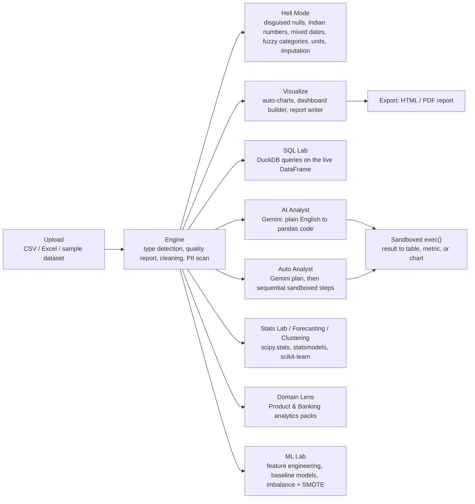
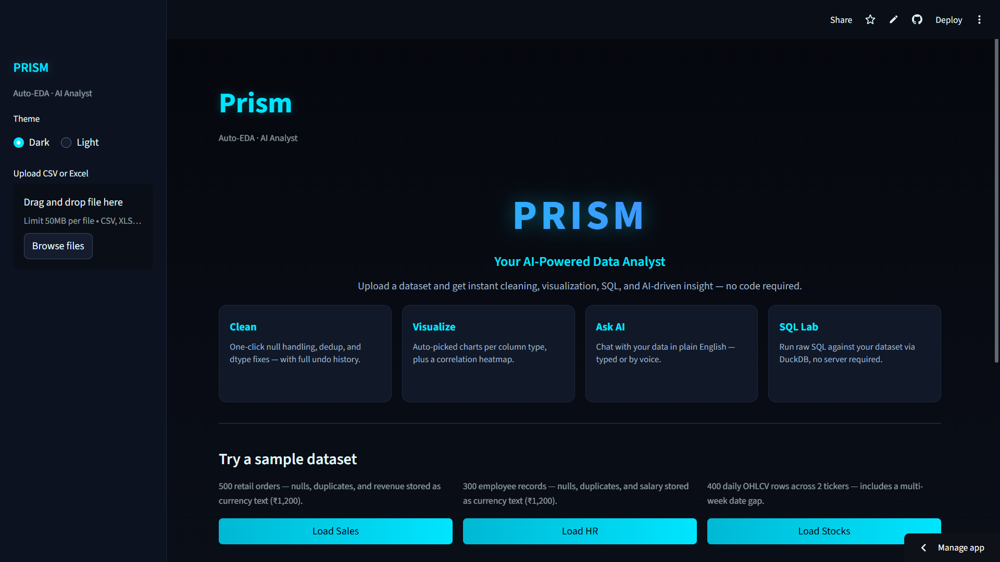
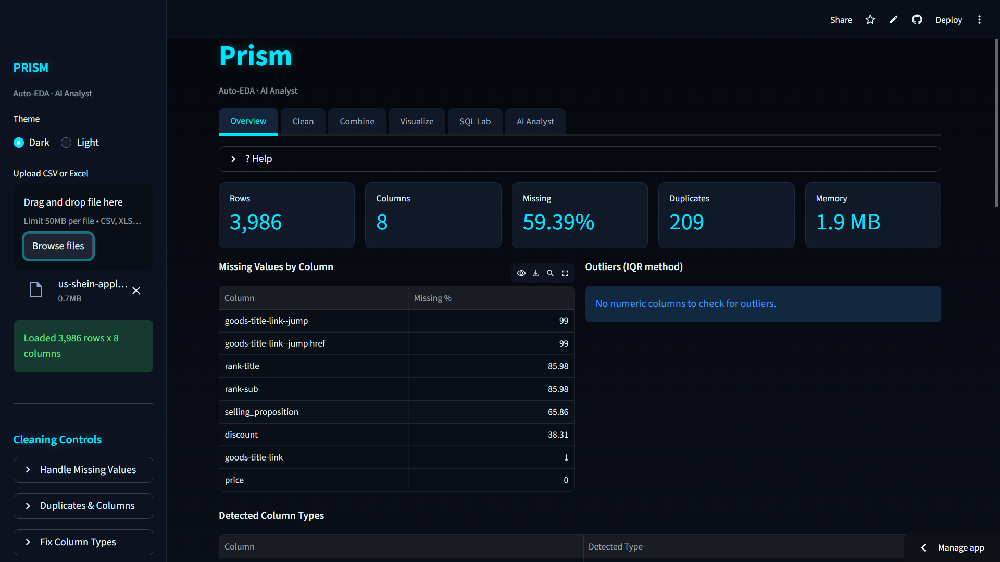
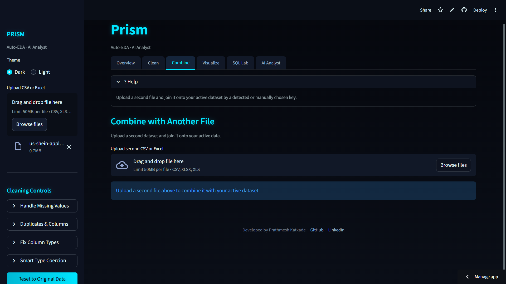
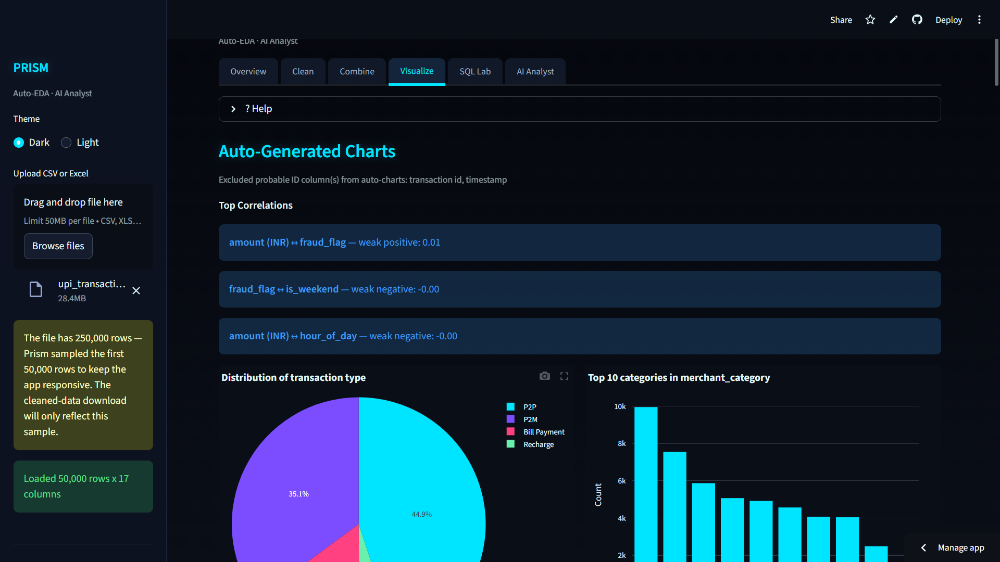
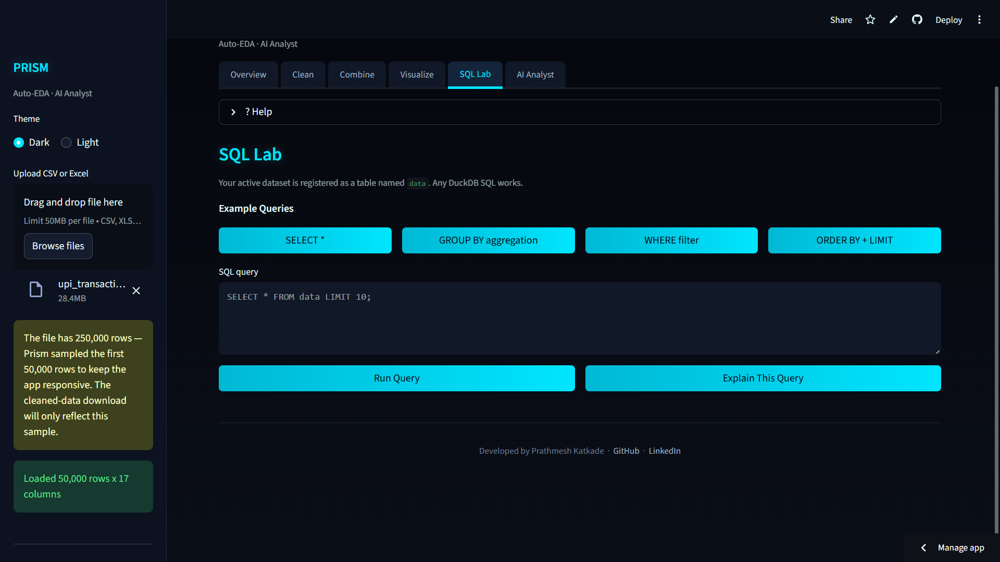
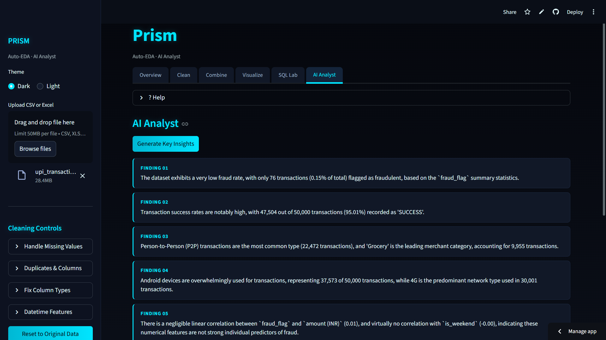
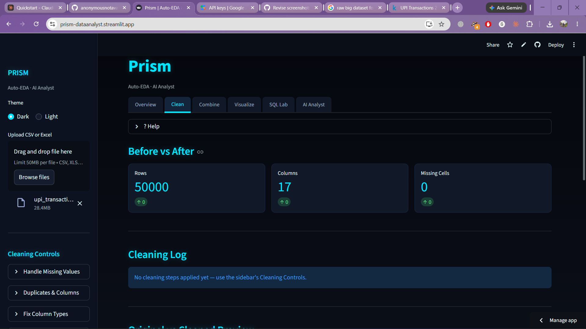

# Prism

**An Auto-EDA web app with an AI analyst layer — clean, visualize, query, and chat with any dataset, no code required.**


[-yellow)](eval/eval_results.md)

<!-- demo.gif here -->

Developed by **Prathmesh Katkade** —
[GitHub](https://github.com/anonymousnotavailable) ·
[LinkedIn](https://linkedin.com/in/your-profile)

---

## Features

Organized by tab — this is literally how the app is laid out, top to bottom.

### Landing Screen
- Hero title, 4 feature cards, and 3 bundled sample datasets (Sales, HR,
  Stocks — see `/samples`) so you can explore Prism without uploading anything
- Restore a previously saved `.json` session and pick up exactly where you left off
- Collapses into the tabbed app the moment a dataset becomes active

### Overview
- Data quality report: row/column counts, missing % per column, duplicate
  count, IQR-based outlier detection, memory usage
- **Column Health** — skewness/kurtosis in plain English ("highly
  right-skewed"), constant/near-constant detection, cardinality warnings for
  probable ID columns, all rolled into a good/warning/issue badge per column
- **Column Drill-Down** — pick any column for a dedicated mini-report:
  distribution chart, top-10 values, missing %, outliers, descriptive stats
- **Anomaly Detection** — scikit-learn's `IsolationForest` flags unusual
  rows with a plain-English reason each (e.g. "salary is 6.4x above the
  column median"), with one-click exclusion
- **PII Detector** — regex-scans text/categorical columns for emails, phone
  numbers, and likely person names the moment a dataset becomes active; a
  privacy banner lists what was found, with one-click masking per column
  (`j***@gmail.com`) that never displays the raw value first

### Auto Cleaner
The flagship v5 feature — one button that scans, plans, and fixes a messy
dataset, without ever guessing on your behalf:

1. **SCAN** — runs every existing Hell Mode detector (disguised nulls,
   Indian-formatted numbers, mixed date formats, fuzzy category spellings,
   mixed measurement units, exact duplicates, missingness, outliers)
2. **PLAN** — turns the raw findings into a concrete action list, each one
   tagged **SAFE** or **REVIEW**
3. **EXECUTE** — every SAFE action applies automatically; every REVIEW
   action becomes an approve/reject card
4. **REPORT** — a plain-English narration line, a Data Health Score
   before/after delta, and a full log of what changed

**The SAFE/REVIEW split is a fixed property of the action type, decided in
Python — never inferred per-instance by Gemini.** `modules/autocleaner.py`
hard-codes two sets, `SAFE_ACTIONS` and `REVIEW_ACTIONS`, and every plan
action's risk tier comes from a membership check against those sets, not
from a model's opinion:

- **SAFE** (auto-applied instantly): trim whitespace, convert disguised
  nulls (`"NA"`, `"-"`, ...), parse Indian-formatted numbers (₹/lakh/crore
  text → real numbers), standardize unambiguous mixed date formats, remove
  exact duplicate rows — all lossless or trivially reversible
- **REVIEW** (needs your approve/reject): resolve genuinely ambiguous dates
  (day-first vs. month-first truly disagree), fill missing values (changes
  real data), merge fuzzy category spellings, normalize mixed measurement
  units (which unit becomes the target is a judgment call), remove
  statistical outliers (could be real extreme values, not errors) — all
  either lossy or require a choice only a human should make

Gemini's only job in the whole pipeline is the one-line narration ("Scan
complete. 3 safe fixes applied. 2 need your judgment.") — the plan itself
and every action's execution are fully deterministic, so Auto Cleaner works
correctly with zero Gemini API key configured, and a bad or manipulated LLM
response can never talk its way into a destructive action being marked
safe. "Undo All Auto Clean Changes" restores the pre-scan snapshot in one
click, and the whole run exports as a runnable Python script alongside the
rest of the Clean tab's history. Say "auto clean" to Atlas to trigger it by
voice.

### India Mode
A sidebar toggle (default **on**) that reframes number, date, and calendar
conventions for an Indian audience everywhere in the app, not just one tab:

- **Fiscal year labels** — April-March fiscal years/quarters (`FY2025-26`,
  `Q1 FY2025-26`), with a one-click "Add Fiscal Year / Quarter" column
- **Indian number formatting** — one `format_inr()` helper, used
  everywhere a rupee or large number is displayed: Indian digit grouping
  (`1,20,000` not `120,000`) and compact lakh/crore notation (`₹1.2L`,
  `₹3.4Cr`)
- **Day-first dates** throughout date parsing
- **Festival awareness** — a bundled `data/festivals.csv` (Holi, Eid,
  Raksha Bandhan, Dussehra, Diwali) adds dashed marker lines to
  auto-generated trend charts so spikes around festival dates read as
  context, not anomalies

Turning it on also switches the PII Detector into **Indian PII Vault**
mode (Aadhaar/PAN/GSTIN/IFSC/mobile-number detection with
pattern-preserving masking, e.g. `XXXX-XXXX-1234` for Aadhaar) and unlocks
**Geo Lens**, a choropleth tab for any state/UT column.

### Clean
- Sidebar cleaning controls: drop/fill (mean, median, mode, custom) missing
  values, one-click duplicate removal, column dtype conversion, column dropping
- **Datetime Intelligence**: one-click year/month/day/weekday/quarter
  extraction, plus gap detection ("15 days missing between Mar 03 and Mar 17")
- **Smart Type Coercion**: detects currency symbols, thousands separators,
  `%` signs, and `K`/`M`/`B` suffixes in text columns, with a before/after
  preview and one-click convert
- **Cleaning History + Undo**: every action is logged with its equivalent
  pandas code line; Undo restores a DataFrame snapshot (last 10 steps kept)
- **Export as Python Script** — downloads a runnable `.py` reproducing every
  logged step, in order, with comments
- **Cleaning Recipes** — save the current cleaning history as a named,
  portable JSON recipe; apply a saved recipe to any new file with a
  per-step applied/skipped log (a step that doesn't apply — a missing
  column, an unreproducible join — is skipped, never crashes the rest)
- Before/after comparison view + download the cleaned dataset as CSV

### Hell Mode
A deeper cleaning engine for the kind of real-world-messy data that Smart
Type Coercion doesn't cover — built and demoed against 3 bundled "hell"
datasets in `/samples/hell` (Indian startup funding, bank transactions,
product events; see [Screenshots](#screenshots) below):
- **Null Synonym Detection** — scans text columns for disguised nulls
  ("NA", "-", "Nil", "N/A", whitespace-only, ...) pandas doesn't recognize
  as missing by default, reports per-column counts, and converts them all
  to real `NaN` in one click, with an editable synonym list
- **Indian Number Parser** — a custom regex parser (not locale-based) for
  `₹1,20,000` (Indian comma grouping), `Rs. 45,000`, `1.2 Cr`, `45 lakh`,
  `3.5L`, `2.3 crore`, plus `$`/`K`/`M`/`%` — converts to an absolute
  numeric value with a before/after preview and an `_inr` column suffix
  noting the conversion
- **Mixed Date Format Resolver** — detects a column mixing `12/03/2024`,
  `2024-03-12`, `12-Mar-24`, `12th March 2024`, and `12.03.2024` in the same
  column; explicitly flags genuinely ambiguous dates (`05/03/2024` — May or
  March?) in a review table where you pick day-first or month-first for the
  whole column (day-first by default); reports rows that failed to parse
  instead of silently dropping them
- **Fuzzy Category Cleanup** — `rapidfuzz`-powered clustering of similar
  category values (case variants, trailing spaces, misspellings like
  "Maharashtra"/"maharashtra "/"Maharastra") into suggested merge groups
  with counts; pick which groups to merge and the canonical name, with an
  adjustable similarity threshold (default 85)
- **Unit Chaos Detector** — scans for mixed measurement units in one column
  (`5km`/`3000m`/`2 miles`, `60 kg`/`132 lbs`, `90 sec`/`5 min`) and
  normalizes everything to a single chosen unit, logging the conversion
- **Imputation Intelligence** — beyond mean/median/mode: forward/back fill,
  KNN imputation (`sklearn.KNNImputer`), and group-wise fill (e.g. salary by
  department); an "AI Recommend" button sends column stats and the
  missingness pattern to Gemini for a suggested strategy per column with a
  one-line reason, which you approve before anything is applied

*(all of it fully logged to the same Cleaning History + Undo as every other
cleaning action)*

### Combine
- Upload a second CSV/Excel file and join it onto your active dataset
- Auto-detects candidate join keys by name overlap **and** value overlap
  (a Jaccard-style %), with a manual override for any column pairing
- Inner/left/right/outer join, each with a plain-English one-liner
- Preview shows rows before → after, columns gained, and key match rate
  before committing — "Use as Active Dataset" rewires every other tab onto
  the joined data
- **Compare mode (drift)** — instead of joining, compare a second dataset
  (e.g. last month's export) against the active one column by column: mean/
  median shifts, new/missing categories, and a distribution-overlap chart per
  column, plus an overall 0-100 drift score highlighting what changed most

### Visualize
- Smart chart picker per column type (pie/bar for categoricals, histogram +
  boxplot for numerics, line trend for datetime × numeric, scatter for
  numeric × numeric) — probable ID columns are automatically excluded
- Correlation heatmap with the top-3 strongest correlations flagged automatically
- Manual chart builder for full control over axes and chart type
- **Auto-Dashboard Generator** — "Build My Dashboard": Gemini inspects the
  schema and returns a JSON spec (KPI cards + 4-6 charts, each with a
  one-line reason), rendered as a responsive grid; swap or remove any chart
  without regenerating the rest
- **Auto-Report Writer** — "Generate Report": an executive-style write-up
  (summary, data quality, key findings with embedded charts, recommendations)
  in Prism's brand colors, downloadable as PDF (`fpdf2` — no system
  dependencies, so it deploys cleanly to Streamlit Community Cloud where
  `weasyprint`'s GTK/Cairo requirement would not) or as standalone HTML
- One-click export to a self-contained HTML report (quality summary + all charts + stats)

### SQL Lab
- Run raw SQL directly against the active dataset via **DuckDB** — the
  DataFrame is registered as a table named `data`, entirely in-memory
- 4 clickable example queries (`SELECT *`, `GROUP BY` aggregation, `WHERE`
  filter, `ORDER BY` + `LIMIT`) auto-filled with your dataset's real column names
- Results show row count and execution time; SQL errors are caught and
  shown in a styled alert instead of crashing the app
- "Explain This Query" sends the SQL to Gemini for a plain-English explanation

### AI Analyst
- Natural-language chat — typed or **by voice** — answered with generated
  pandas code, executed in a locked-down sandbox, displayed as a table,
  metric card, and/or chart
- **Self-healing retry**: if the generated code errors out, the error is
  sent back to Gemini once for a corrected version before giving up
- "Generate Key Insights" — 5 analyst-style findings, each referencing an
  actual number from the data, rendered as styled cards
- Every request sends only the column schema, a 5-row sample, and summary
  statistics — **never the full dataset**

### Auto Analyst
The flagship v2 feature — one button, a full agentic analysis:
- "Run Full Analysis": Gemini first drafts a JSON **plan** (quality check →
  distributions → segments → correlations → time trends if a datetime
  column exists → conclusions), falling back to a sensible default plan
  built from column types if Gemini is unavailable or its JSON can't be parsed
- Each step runs through the exact same self-healing, sandboxed pipeline as
  the AI Analyst chat tab — a live `st.status` panel shows every step as
  pending → running → done, with its own generated code and result
- Ends with an "Analysis Complete" card summarizing the top 5 findings,
  synthesized by Gemini from everything the steps actually found

### Stats Lab
- Pick two columns; Stats Lab suggests the statistically appropriate test
  based on their types — independent t-test, one-way ANOVA, chi-square
  test of independence, or Pearson correlation significance — with a
  one-line reason before you run anything
- Runs the test via `scipy.stats`, then reports a plain-English verdict with
  the p-value and an effect size (Cohen's d / eta-squared / Cramer's V /
  Pearson r, each with a small/medium/large label)
- **Assumption checks**: Shapiro-Wilk normality per group for t-test/ANOVA,
  expected-cell-count checks for chi-square — surfaced as warnings, not
  silently ignored

### Forecasting
*(hidden automatically if the active dataset has no datetime column)*
- Pick a datetime + numeric column and a horizon (7-90 periods via slider)
- Fits `statsmodels`' ETS (Exponential Smoothing/Holt-Winters) with a 95%
  confidence band; falls back to SARIMAX if ETS can't fit the series (e.g.
  too little history for the seasonal component it picked)
- Plotly chart with history + forecast + shaded confidence band, a
  downloadable forecast CSV, and a plain-English reliability caveat scaled
  to how far out the forecast reaches relative to the available history

### Clustering & Segmentation
*(warns, but doesn't block, when the active dataset has fewer than 50 rows)*
- Pick numeric columns; KMeans runs on standardized features with an
  elbow-method suggestion for K (view the full elbow chart on demand)
- 2D scatter via PCA, colored by cluster, plus a per-cluster stats table
  (mean of each column, size, share of the data)
- "Name Segments with AI" sends the cluster stats to Gemini, which names and
  describes each segment in one line referencing a real number from the table

### Domain Lens
Map your own column names to a domain's expected roles and get ready-made,
interview-ready analytics — no need to already know the metric formulas:

**Product Analytics mode** (map user ID, event/order, timestamp, revenue optional):
- **Retention cohort heatmap** — monthly cohorts by first-seen month, % returning each subsequent month
- **DAU/MAU + stickiness** — daily/monthly active users on one chart (same unit — never a dual-axis chart), stickiness ratio on its own
- **Funnel analysis** — pick 2-5 ordered event stages, see per-stage conversion % and drop-off, with true funnel semantics (each stage's users are a subset of the previous stage's)
- **Churn flag** — a simple, adjustable "inactive for N days" flag per user

**Banking Analytics mode** (map customer/account ID, amount, date; loan/limit/balance fields optional):
- **RFM segmentation** — Recency/Frequency/Monetary scored 1-5 by quantile, mapped to labeled segments (Champions, Loyal Customers, At Risk, Lost, ...)
- **Transaction anomaly flags** — amounts beyond 3xIQR per customer, and sudden daily transaction-frequency spikes
- **NPA / overdue analysis** *(if loan fields mapped)* — the standard 90+-day non-performing-asset ratio, plus a 0-30/31-60/61-90/90+ overdue bucket chart
- **Credit utilization** *(if limit + balance mapped)* — balance/limit distribution, with the ~30% risk threshold called out

Every metric ships with a 2-line, plain-English explanation card alongside it.

### ML Lab
The data-science bridge — explicitly framed as **baseline exploration, not
a deployed model**:
- **Feature Engineering Assistant** — pick a target column; get per-column
  suggestions (one-hot vs. ordinal encoding by cardinality, standard scaling
  for numerics, year/month/day/weekday expansion for datetimes, and up to 3
  candidate interaction features from the most-correlated numeric pairs),
  each with a one-line reason and a one-click apply (logged + undoable)
- **Baseline Model Runner** — auto-detects classification vs. regression
  from the target's dtype, an 80/20 stratified split, a
  `ColumnTransformer` preprocessing pipeline, and Logistic/Linear
  Regression vs. Random Forest compared side by side: accuracy/F1 or
  RMSE/R², a confusion matrix heatmap, a feature-importance chart, and a
  plain-English verdict card ("Random Forest wins on F1 score... Top
  driver: transaction_frequency")
- **Class Imbalance Detector** — flags a classification target with a
  minority class under 20%, explains why accuracy would be misleading, and
  switches the headline metric to F1; offers SMOTE resampling on the
  *training set only*, with before/after class counts and an explicit note
  on why the test set is never touched

### Throughout
- Light/dark theme toggle in the sidebar (default: dark cyan)
- Dismissible first-visit onboarding, a "? Help" expander on every tab,
  `st.toast()` confirmations, and styled error/warning alerts everywhere
- Runs fully without a Gemini API key. Features that *require* one (AI
  Analyst, Auto Analyst, "Explain This Query", "Name Segments with AI") show
  a friendly "add your key" message instead of breaking; features that only
  *benefit* from one (Auto-Dashboard Generator, Auto-Report Writer) fall back
  to a sensible non-AI default spec/narrative built from the data itself

---

## Architecture



```
prism/
├── app.py                  # Entry point — landing screen, sidebar, tabs, session-state wiring
├── modules/
│   ├── data_engine.py       # File loading (incl. multi-sheet Excel), type detection, quality report
│   ├── cleaning.py          # Null handling, dedup, dtype conversion, code-gen, export_script()
│   ├── visualization.py     # Smart chart picker, correlation heatmap, overview stats
│   ├── profiling.py         # Skew/kurtosis labels, cardinality, constants, column health
│   ├── anomaly.py           # IsolationForest wrapper + plain-English reasons
│   ├── datetime_intel.py    # Datetime feature extraction + gap detection
│   ├── type_coercion.py     # Numeric-in-text detection + conversion
│   ├── session_io.py        # JSON session save/load
│   ├── join_engine.py       # Candidate join-key detection, join execution + stats
│   ├── sql_lab.py           # DuckDB query execution, example query builder
│   ├── voice_input.py       # streamlit-mic-recorder wrapper, graceful fallback
│   ├── ai_analyst.py        # Gemini integration, safe code execution, self-healing retry
│   ├── atlas.py             # Voice operator: intent router, command registry, TTS, persona, orb
│   ├── auto_analyst.py      # v2: agentic plan generation + sequential sandboxed execution
│   ├── stats_lab.py         # v2: test suggestion, scipy.stats execution, plain-English verdicts
│   ├── forecasting.py       # v2: ETS/SARIMAX forecasting with confidence bands
│   ├── clustering.py        # v2: KMeans + elbow method + PCA + AI segment naming
│   ├── drift.py             # v2: dataset-vs-dataset drift report + score
│   ├── dashboard_builder.py # v2: AI-designed KPI + chart dashboard spec
│   ├── report_writer.py     # v2: executive PDF/HTML report generation
│   ├── recipes.py           # v2: save/apply cleaning history as a portable JSON recipe
│   ├── pii_detector.py      # v2, upgraded v5: regex PII scan + Indian PII Vault (Aadhaar/PAN/GSTIN/IFSC/mobile) + masking
│   ├── hellmode.py          # v3: null synonyms, Indian number parser, mixed dates, fuzzy cleanup, units, imputation
│   ├── domains.py           # v3: Product & Banking analytics packs (Domain Lens tab)
│   ├── mllab.py             # v3: feature engineering, baseline models, class imbalance + SMOTE
│   ├── story_mode.py        # Voice-narrated insight slides + the scripted hands-free Demo Mode
│   ├── report.py            # Standalone HTML report generation (Visualize tab's basic export)
│   ├── theme.py             # Multi-theme (Graphite/Midnight/Arctic) CSS + matching Plotly templates
│   ├── autocleaner.py       # v5: Auto Cleaner — scan/plan/execute/report, SAFE/REVIEW risk tiers
│   ├── india.py             # v5: India Mode — fiscal year, format_inr(), day-first dates, festival markers
│   ├── geo.py                # v5: Geo Lens — state/UT fuzzy matching + choropleth
│   ├── data_dictionary.py   # v5: Data Dictionary Generator — AI + templated column docs, markdown/xlsx export
│   └── ui.py                # Landing screen, footer, help expanders, onboarding, column profiler, health ring
├── samples/                  # sales/hr/stock/indian_startup_funding_messy.csv for "Try a sample dataset"
│   └── hell/                 # Deliberately messy datasets exercising every Hell Mode feature
├── data/                     # festivals.csv (India Mode) + india_states.geojson (Geo Lens)
├── eval/                     # Eval harnesses — questions.json, run_eval.py, autocleaner_eval.py, atlas_eval.py
├── .streamlit/config.toml   # Theme config
├── requirements.txt          # Pinned, tested-together versions
└── DEPLOYMENT.md             # Streamlit Community Cloud deployment steps
```

### Safe-execution sandbox (AI Analyst)

The AI Analyst never lets Gemini touch the real dataset or the real Python
runtime:

1. **Context, not data.** Every question sends Gemini the column schema, a
   5-row sample, and `describe()` output — never the full DataFrame.
2. **Fenced code only.** The system prompt requires a single ` ```python `
   block that uses only `df`/`pd`/`np` and assigns to a `result` variable.
3. **Restricted `exec()`.** A keyword blocklist (`import os`, `open(`,
   `eval(`, `__`, `subprocess`, `requests`, ...) is checked first; the real
   boundary is `exec_globals = {"__builtins__": <~20 safe builtins only>,
   "pd", "np", "df": df.copy()}` — no `__import__`, no file or network
   access reachable even if the blocklist is bypassed. `df.copy()` means a
   destructive-but-valid operation (`df.drop(..., inplace=True)`) can't
   corrupt the app's real working dataset either.
4. **Self-healing retry.** If the generated code raises, the exact error is
   sent back to Gemini once for a corrected version, then executed again. A
   failed Gemini *request* (bad key, quota, network) is a different failure
   mode from a failed *execution* — the two are surfaced with different
   messages, and only the latter triggers a retry.
5. **Charts stay outside the sandbox.** The model only ever returns pandas
   code; `build_chart_from_result()` decides — from the already-computed,
   already-trusted result plus a keyword heuristic — whether to also render
   a Plotly chart. This keeps the sandbox's surface area to exactly
   `df`/`pd`/`np` while still producing chart output for trend questions.

### A few judgment calls worth knowing about

- **Session files are JSON, not pickle.** `pickle.loads()` on a
  user-supplied file is a code-execution vulnerability — a crafted pickle
  runs arbitrary code the instant it's loaded, and a "restore session" file
  is uploaded through the browser exactly like any other file. `session_io.py`
  serializes DataFrames via `to_json(orient="split")` instead, keeping "load
  session" exactly as safe as "upload CSV."
- **Secrets: `st.secrets` first, `.env` second.** `ai_analyst.get_api_key()`
  checks Streamlit's secrets manager before falling back to the
  `python-dotenv`-populated environment, so the identical code path works
  unmodified on Streamlit Community Cloud and on `localhost`.
- **Cardinality flagging excludes floats and datetimes.** An early version
  flagged *any* >90%-unique column as a probable ID — which is also true of
  nearly every continuous float measurement and every datetime column by
  nature, and would have silently excluded ordinary numeric/date columns
  from auto-charts on most real datasets. Caught by testing before shipping.
- **File structure stayed one-concern-per-module.** Rather than
  consolidating into a few large files, each new capability got its own
  small module — more files, but each one explainable in isolation (useful
  when the whole point of the project is being able to walk through it).

---

## Atlas Voice Operator

Atlas is a JARVIS-style voice/typed operator layered over the whole app —
not just another chat box. Every utterance, spoken into the persistent mic
or typed into the command bar at the top of every screen, goes through one
router before anything happens.

### The intent router

`modules/atlas.py`'s `classify_intent()` is a single Gemini call per
utterance, constrained to return strict JSON:

```json
{"type": "APP_COMMAND | DATA_QUESTION | CHITCHAT",
 "action": "navigate | clean_nulls | run_auto_analysis | generate_report | ...",
 "target": "<tab name, column name, or null>",
 "question": "<verbatim question if DATA_QUESTION, else null>",
 "spoken_reply": "<1-2 sentences, said aloud>"}
```

Why route through a classifier instead of letting the AI Analyst's own
Gemini call just handle everything? Because "clean the nulls" and "what's
the average revenue by region" need to go to two completely different
places — one mutates `st.session_state.working_df` through the cleaning
module, the other reads it through a sandboxed pandas-code pipeline. A
single, cheap, structured-output call up front means the router's whole
job is deciding *where to send* an utterance, not answering it — the two
concerns stay separable, testable, and (mostly) provider-agnostic.

**Malformed JSON gets exactly one retry** (re-asking with "respond with
ONLY the JSON object this time"), then a graceful spoken fallback — the
router never raises into the app underneath it, and neither does the TTS
layer, which cascades **edge-tts → gTTS → text-only** for the same reason.

**Dispatch** goes through `atlas.COMMAND_REGISTRY`, a plain
`{action_name: function}` dict `app.py` populates with its own functions
at import time — `atlas.py` owns *routing*, never the app-specific
mutations. `DATA_QUESTION` is the one type atlas.py deliberately does
*not* execute itself: it hands the parsed question back to `app.py`, which
feeds it into the same `ai_analyst.ask_and_execute()` pipeline typed
questions always used — so voice and typed questions share one
`chat_history`, and a follow-up like "now by month" works identically
regardless of which path the previous turn came in on.

### Destructive actions are two-phase, always

Nothing that mutates data executes from a single utterance. Any destructive
command calls `atlas.guarded(action, target, message)` first: the first
call stages a confirmation (spoken + on-screen Confirm/Cancel) and returns
without touching the data; only a matching `confirm` — voice or click —
re-dispatches the *same* action, at which point `guarded()` sees it was
already approved and lets it through.

### Navigation had to stop being `st.tabs()`

`st.tabs()` has no API to switch the active tab from Python, so a voice
"go to Visualize" command had nothing to actually do. The tab bar became a
`st.segmented_control` bound to `st.session_state.active_section` instead
— setting that key and calling `st.rerun()` genuinely switches sections,
and the six tab bodies became an `if/elif` chain (only the active
section's code runs each rerun now, rather than all six every time, which
`st.tabs()` did unconditionally).

### Story Mode / Demo Mode

Neither existed before Atlas — both are new. Story Mode turns
`generate_key_insights()`'s findings into voice-narrated slides with
Previous/Next/Pause controls (plus voice "next"/"previous"); auto-advance
is a best-effort word-count-based timer, not a true "audio ended" signal —
Streamlit has no built-in channel for that without a full bidirectional
custom component, so treat auto-advance as a nice-to-have and the manual
controls as the reliable path. Demo Mode is a scripted, fully hands-free
walkthrough (`say "demo mode"`) over a bundled synthetic dataset
(`samples/indian_startup_funding_messy.csv`): quality scan → hell-mode
cleaning → auto-analysis → top 3 findings → "That's what I can do."

### Eval harness

`eval/atlas_eval.py` runs 8 utterances (5 commands, 1 data question, 1
chitchat, 1 confirm) through the real `classify_intent()` and checks
type/action/target accuracy — `python -m eval.atlas_eval` from the project
root. Needs `GEMINI_API_KEY` configured; it reports that plainly and exits
rather than pretending to pass.

---

## Why I built this

I wanted one tool that covered the parts of a real data-analysis workflow I
was otherwise juggling across five different tools — pandas for cleaning, a
notebook for charts, a separate SQL client for ad-hoc queries, and a
browser tab open to an LLM for the "just explain this to me" questions.
Prism is that tool, and it's also the project I point to when someone asks
what I can actually build: a full pipeline from messy CSV to clean insight,
with the judgment calls (safety, secrets, data format choices) made
deliberately rather than defaulted into.

---

## Run locally

```bash
git clone https://github.com/anonymousnotavailable/prism.git
cd prism
python -m venv .venv
.venv\Scripts\activate        # Windows — use `source .venv/bin/activate` on macOS/Linux
pip install -r requirements.txt
```

Add your free Gemini API key (optional — everything except the AI-powered
parts of AI Analyst and SQL Lab works without it):

```bash
cp .env.example .env          # macOS/Linux — use `copy .env.example .env` on Windows
# then edit .env and set GEMINI_API_KEY=your_key_here
```

Get a free key at [aistudio.google.com/apikey](https://aistudio.google.com/apikey).

```bash
streamlit run app.py
```

The app opens at `http://localhost:8501`. No dataset handy? Use one of the 3
bundled samples on the landing screen — each one ships with deliberate
messiness (nulls, duplicates, currency-as-text, a date gap) specifically so
the cleaning tools have something to do immediately. To try **Hell Mode**
specifically, upload one of the 3 deliberately-messier datasets in
[`samples/hell/`](samples/hell) via the sidebar's file uploader — each one
exercises every Hell Mode subsystem (disguised nulls, Indian-formatted
numbers, mixed date formats, fuzzy categories, mixed units, and
imputation-worthy missingness).

**Deploying this yourself?** See [`DEPLOYMENT.md`](DEPLOYMENT.md) for exact
steps to put it on Streamlit Community Cloud for free.

---

## Tech Stack

| Layer          | Choice                                  |
|----------------|-------------------------------------------|
| UI framework   | Streamlit                               |
| Data engine    | Pandas + NumPy                          |
| Charts         | Plotly (fully interactive, dark + light templates) |
| SQL engine     | DuckDB (in-memory, queries the live DataFrame) |
| Anomaly detection | scikit-learn (`IsolationForest`)     |
| Statistical testing | `scipy.stats` (t-test, ANOVA, chi-square, Pearson, Shapiro-Wilk) |
| Forecasting    | `statsmodels` (ETS/Exponential Smoothing, SARIMAX) |
| Clustering     | scikit-learn (`KMeans`, `PCA`, `StandardScaler`) |
| Fuzzy matching | `rapidfuzz` (Fuzzy Category Cleanup) |
| Imbalanced classes | `imbalanced-learn` (`SMOTE`, training-set only) |
| Baseline ML    | scikit-learn (`LogisticRegression`, `LinearRegression`, `RandomForest*`, `ColumnTransformer`) |
| PDF reports    | `fpdf2` (pure Python, no system dependencies) + `kaleido` (chart rasterization) |
| Voice input    | streamlit-mic-recorder (browser speech-to-text) |
| AI layer       | Google Gemini API (`gemini-2.5-flash`)  |
| Secrets        | `st.secrets` (Cloud) → `.env` via python-dotenv (local) |
| Session files  | JSON (not pickle — see architecture note above) |

---

## Code-Gen Eval Harness

A hidden quality-assurance layer that keeps the AI Analyst / Auto Analyst
pipeline honest: [`eval/questions.json`](eval/questions.json) has 25 fixed
question-answer pairs against the bundled sample datasets — 20 against the
original Sales/HR/Stocks samples, plus 5 against the Hell Mode datasets
(fraud counts, unique customers/startups/users) — and
[`eval/run_eval.py`](eval/run_eval.py) runs each one through the *real*
pipeline (`ai_analyst.ask_and_execute` — Gemini-generated pandas code,
executed in the safe-execution sandbox), grades the result against a fixed
ground truth, and writes the score to
[`eval/eval_results.md`](eval/eval_results.md).

```bash
python eval/run_eval.py
```

The most recent run passed **7/7 (100%)** of the questions it reached before
hitting the Gemini free-tier's daily quota mid-run — see
`eval_results.md` for the full breakdown and a note on re-running once quota
resets. A question that can't be evaluated (quota-blocked) is reported as
`NOT RUN`, never silently counted as a failure.

A second, separate harness covers Auto Cleaner:
[`eval/autocleaner_eval.py`](eval/autocleaner_eval.py) runs 5 test cases
directly against `modules.autocleaner`'s scan → plan → execute pipeline
over the Hell Mode datasets (e.g. asserting `parse_indian_number` fires on
a lakh/crore-formatted column and leaves it numeric, or that 40 exact
duplicate rows drop to 0) and writes
[`eval/autocleaner_eval_results.md`](eval/autocleaner_eval_results.md).
Unlike the question eval above, **this one needs no Gemini API key** —
Auto Cleaner's plan and execution are fully deterministic, so the harness
never touches the network:

```bash
python eval/autocleaner_eval.py
```

The most recent run passed **5/5 (100%)**.

---

## Screenshots

### 1. Landing Screen
Your first stop — hero banner with "Your AI-Powered Data Analyst" tagline, 4 feature cards highlighting the core capabilities (Clean, Visualize, Ask AI, SQL Lab), and 3 sample datasets ready to explore without uploading your own data. Perfect entry point for both first-time users and those with their own CSV.



### 2. Overview
Data quality at a glance — rows/columns metrics, missing % per column, duplicate count, and memory usage. The **Missing Values by Column** table reveals data completeness patterns, and the system auto-detects column types. Perfect for your first look at a messy dataset to understand what needs cleaning.



### 3. Clean
**Before vs After** metrics at the top (rows, columns, missing cells) track your progress. The **Cleaning Log** shows every action with its equivalent pandas code line. Sidebar **Cleaning Controls** include Handle Missing Values, Duplicates & Columns, Fix Column Types, Smart Type Coercion, and Datetime Features — all with full undo history (last 10 steps) and a **Reset to Original Data** button. Export cleaned data as CSV or a runnable Python script.



### 4. Visualize
Smart chart picker per column type — pie/bar for categoricals, histogram + boxplot for numerics, line trend for datetime × numeric, scatter for numeric × numeric — with probable ID columns automatically excluded from auto-charts. A correlation heatmap flags the top-3 strongest relationships automatically, and the Manual Chart Builder gives full control over axes and chart type when auto mode doesn't show what you need. Export everything to a self-contained HTML report.



### 5. SQL Lab
Run raw SQL directly against your dataset via DuckDB. The table is auto-registered as `data`. 4 clickable example queries (`SELECT *`, `GROUP BY`, `WHERE`, `ORDER BY + LIMIT`) auto-fill with your real column names. Results show row count and execution time; errors are caught and displayed in styled alerts. "Explain This Query" sends your SQL to Gemini for a plain-English summary.



### 6. AI Analyst
Chat with your data in plain English — typed or by voice. Gemini generates pandas code, executed in a locked-down sandbox, with results displayed as tables, metric cards, or charts. The **"Generate Key Insights"** button produces 5 analyst-style findings (each citing actual data numbers) rendered as styled cards — e.g., "The dataset exhibits a very low fraud rate, with only 76 transactions (0.15% of total) flagged as fraudulent." Self-healing retry on errors; no access to the real dataset, only schema + sample.



### 7. Combine
Upload a second dataset and join it to your active one. Auto-detect candidate keys by name overlap and value overlap (Jaccard %), see a before/after preview with row counts, columns gained, and key match rate. Commit with one click — rewires all other tabs to work with the joined result.



### 8. Hell Mode
The Indian Number Parser's before/after preview table in action — messy ₹/Rs./lakh/crore-formatted text on the left, the converted absolute numeric value on the right, before you commit the conversion. The same tab also handles disguised nulls, mixed date formats, fuzzy category cleanup, unit chaos, and richer imputation strategies.


---

## Roadmap / Future Improvements

- Persist uploaded datasets across sessions (currently in-memory only)
- Export cleaned data + charts directly to a shareable dashboard link
- Streaming responses in the AI Analyst chat
- Saved SQL query history / a query library
- Configurable anomaly-detection sensitivity (`contamination`) from the UI
- Persist the light/dark theme choice across browser sessions

---

## License

MIT — see [`LICENSE`](LICENSE).

---

Developed by **Prathmesh Katkade** —
[GitHub](https://github.com/anonymousnotavailable) ·
[LinkedIn](https://linkedin.com/in/your-profile)
