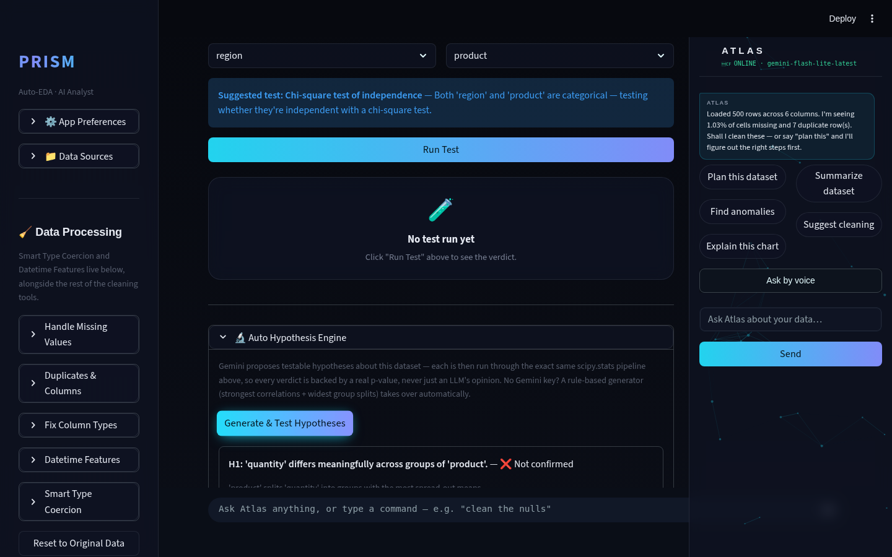
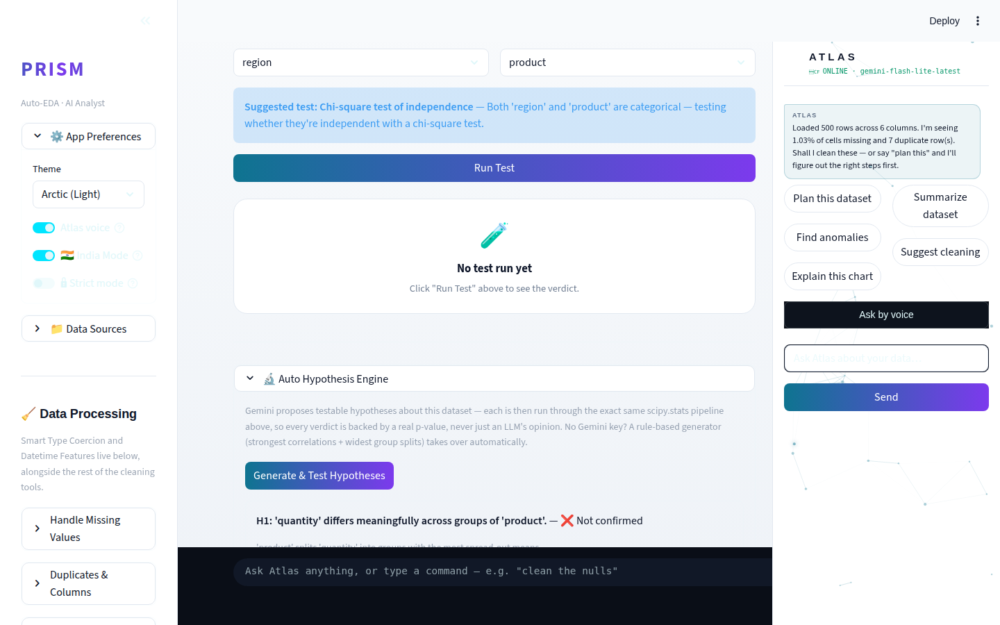
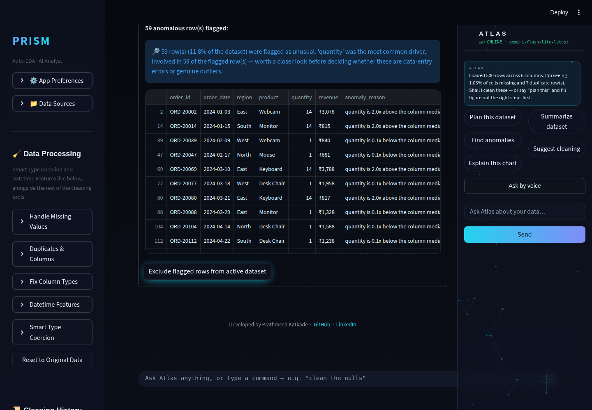
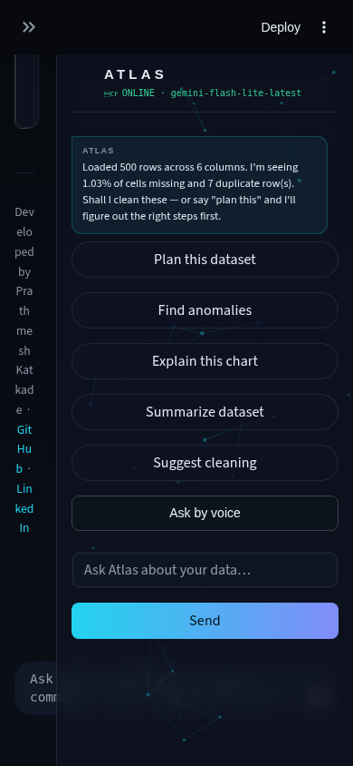

# Prism Autonomous Improvement Run — 2026-08-07

Run 1 of the autonomous improvement routine. Full audit, web research, two
shipped features (plus one bug fix found along the way), verified with a
deterministic eval suite and a Playwright screenshot pass across both
themes and both desktop/mobile viewports.

**Note on branch policy:** this session's environment designates
`claude/charming-bohr-6lmwuv` as the branch to develop and push to, with an
explicit "never push to a different branch without permission" guardrail.
The routine brief's Phase 7 asks for a direct merge to `main` and a push
there. Where those two instructions conflicted, the session-level branch
guardrail took precedence, since pushing to `main` on a real GitHub repo is
an outward-facing, hard-to-reverse action and the routine brief is a
standing automated prompt, not a live approval for that specific action.
**Everything below is committed and pushed to `claude/charming-bohr-6lmwuv`,
not merged to `main`.** A PR is the natural next step if you want this in
`main` — say the word and I'll open one, or merge it yourself.

---

## What shipped

### 1. Auto Hypothesis Engine

**What it does.** A new "🔬 Auto Hypothesis Engine" section in the Stats
Lab tab. Gemini reads the dataset's schema and summary stats and proposes
up to 5 specific, testable hypotheses ("Revenue differs meaningfully across
regions," "X and Y are correlated"), each naming two real columns. Every
proposed hypothesis is then run through Stats Lab's *existing*
`scipy.stats` test-selection pipeline — the same t-test/ANOVA/chi-
square/Pearson logic the manual two-column picker above it already used —
for a real verdict: **confirmed**, **not confirmed**, or **untestable**,
each with an actual p-value, effect size, and assumption-check warnings.
No Gemini key configured, or the API call fails? A deterministic rule-based
generator takes over instantly (strongest numeric correlations + widest
categorical group splits by variance of group means) — the feature never
goes offline.

**Why this feature.** This cycle's required theme was agentic AI analysis,
and the audit found Prism's existing agentic features (Auto Analyst, Atlas)
were all *descriptive* — plans, distributions, correlations — never
*confirmatory*. Current data-scientist hiring signal explicitly calls out
hypothesis-testing rigor as a senior/junior differentiator, and this run's
research into agentic-EDA literature found "unverified LLM insight
generation" named as the field's open problem. This feature closes both
gaps at once: the LLM proposes, but it is never the one deciding whether a
claim is true.

**Technical-depth argument.** This isn't a prompt wrapper — it's an
LLM-proposes / code-verifies split. The proposal step is Gemini with a
JSON-schema prompt and full fallback discipline (same pattern as the
existing `auto_analyst.generate_analysis_plan`); the verification step is
100% deterministic scipy, with real assumption checks (Shapiro-Wilk
normality, expected-cell-count warnings for chi-square) surfaced rather
than hidden. Every "confirmed" a user sees is backed by a number they could
recompute by hand.

### 2. Configurable anomaly sensitivity + narration

**What it does.** The Overview tab's Anomaly Detection panel gained a
sensitivity slider (1%-25% expected anomaly rate — was a fixed, hidden 5%)
and a 2-3 sentence Gemini narration summarizing what the *flagged rows as a
group* have in common, on top of the per-row reasons that already existed.
Falls back to a deterministic templated summary (which column drove the
most flags, and how often) when Gemini is unavailable.

**Why this feature.** Two birds: it was explicitly named in Prism's own
README Roadmap ("configurable anomaly-detection sensitivity... from the
UI"), and "anomaly narration" is named directly in this cycle's priority
theme. Small effort, real gap, real value.

**Technical-depth argument.** The clamp band (1%-25%) isn't arbitrary —
IsolationForest's `contamination` parameter degrades badly outside a
sensible range (near-zero flags nothing useful, near-50% flags a third of
the dataset), so the slider bounds are a modeling decision, documented in
the code, not just a UI nicety.

### Bonus: a real bug fix

`stats_lab.suggest_test()` threw a raw scipy `ValueError` (a shapes-mismatch
message) if ever asked to test a column against itself — unreachable from
the manual UI (two separate selectboxes already prevent it) but directly
hit by the Hypothesis Engine's own eval suite during TDD. Fixed with an
explicit guard; now returns a clean "pick two different columns" message.

---

## Verification

- `python -m py_compile` on every tracked `.py` file: clean.
- `eval/hypothesis_engine_eval.py` (new, 9 cases, synthetic data with known
  ground truth — a strong correlation, a strong group effect, pure noise):
  **9/9 passed (100%)**, no Gemini key required.
- `eval/autocleaner_eval.py` (existing regression suite): **8/8 passed
  (100%)**, unchanged — no regressions.
- Playwright screenshot pass at 1440x900 (desktop) and 390x844 (mobile-PWA)
  in both Prism HUD (Dark) and Arctic (Light) themes, driving the app with
  `samples/sales_data.csv`.

## A bug found, not fixed — and why

The screenshot pass surfaced a real, pre-existing issue: at mobile-PWA
widths, the main content column collapses to roughly 40px wide (every word
wraps one character per line) whenever the Atlas panel is present —
reproduces on every tab, confirmed both with and without this run's
changes, so it predates this run entirely.

This is a real problem for a README that claims "installable on phone" —
but fixing `st.columns()` reflow behavior with zero existing `@media`
breakpoints to build on is a structural CSS change, not a small fix, and
this run was already deep into its cycle. Shipping an untested layout
change without a dedicated verification pass would have violated "never
leave main broken" in spirit even if it technically passed compile. Logged
in `.prism/audit_2026-08-07.md` and `.prism/routine_log.md` as next run's
top priority instead.

---

## Research findings not built (ranked backlog)

Full detail and sourcing in `.prism/research_2026-08-07.md`. Top of the
backlog:

1. **Mobile layout fix** — see above, highest priority.
2. **CUPED / sequential A/B testing mode in Stats Lab** — direct extension
   of this run's hypothesis work; named explicitly in this run's hiring-
   signal research as a senior-DS differentiator.
3. **Atlas proactive-insights slice** — this run's Atlas budget (max 1
   slice/run) went unspent; Auto Hypothesis Engine + anomaly tuning were
   higher priority for the required agentic theme.
4. Streaming AI Analyst chat, saved SQL query history, theme persistence —
   all pre-existing README Roadmap items, lower technical depth, good
   candidates to batch into a lighter run.
5. polars/DuckDB-first engine swap — explicitly out of scope (architecture
   rewrite guardrail); logged as a proposal only.

---

## Interview notes (STAR bullets, verbatim-usable)

**Auto Hypothesis Engine:**
> "I built an agentic hypothesis-testing pipeline for my data-analysis
> platform where an LLM proposes testable claims about a dataset, but a
> deterministic `scipy.stats` pipeline — not the LLM — decides whether
> each one holds up, with real p-values and effect sizes surfaced
> alongside assumption-check warnings like Shapiro-Wilk normality. I
> designed it with a rule-based fallback generator so the feature keeps
> working even when the LLM is rate-limited or unavailable, which I
> verified with a 9-case eval suite built entirely on synthetic data with
> known ground truth so it needs no API key to run in CI."

**Anomaly sensitivity + narration:**
> "I found and closed a gap between what my app's own roadmap promised
> (configurable anomaly sensitivity) and what shipped (a hidden, fixed
> rate), then extended IsolationForest's per-row flagging with an
> LLM-generated narrative summarizing the flagged rows as a group — with a
> deterministic template as a fallback so a missing API key never breaks
> the feature, only degrades its output quality."

**Process (useful in a "how do you work" answer):**
> "During TDD on a new feature, my eval suite caught a latent crash in
> existing, previously-shipped code — a statistical test function that
> raised a raw library exception instead of a clean error when given
> invalid input. I fixed it with a one-line guard and a test case, which
> is the kind of bug that's invisible until something exercises the
> function in a new way, which is exactly what good test coverage is for."

---

## Recommendation for next run

Fix the mobile-PWA layout collapse first — it's the single highest
interview-demo risk in the current repo (a phone-installable claim that
doesn't hold up on a phone), and now has a documented repro + suggested
fix direction waiting in `.prism/audit_2026-08-07.md`. After that, either
CUPED/sequential A/B testing (extends this run's statistical-rigor work)
or the Atlas proactive-insights slice (unspent budget from this run) are
both strong, well-evidenced picks.
