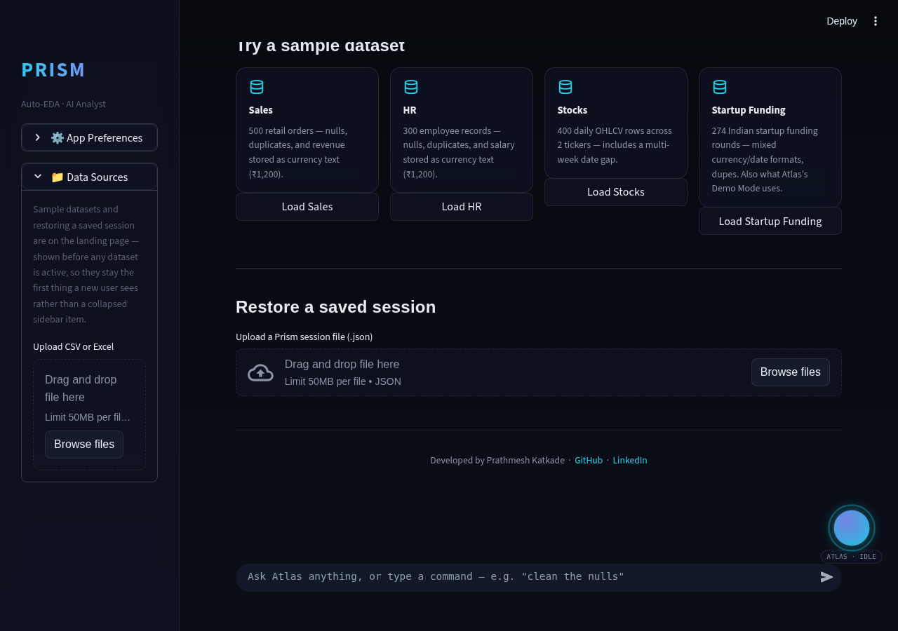
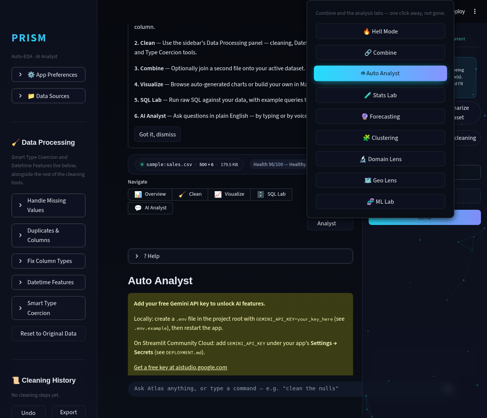
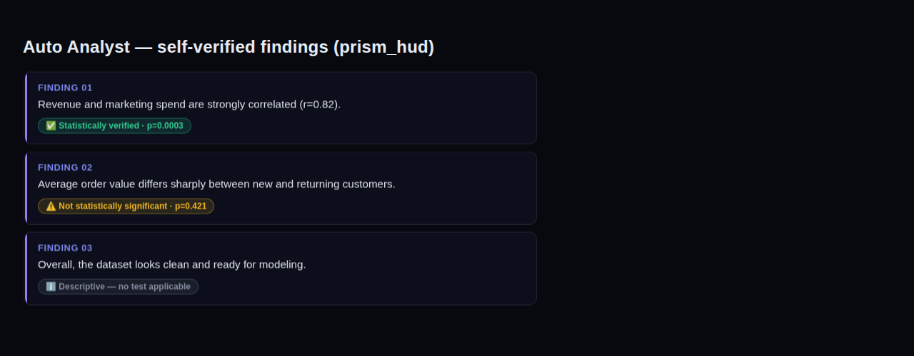
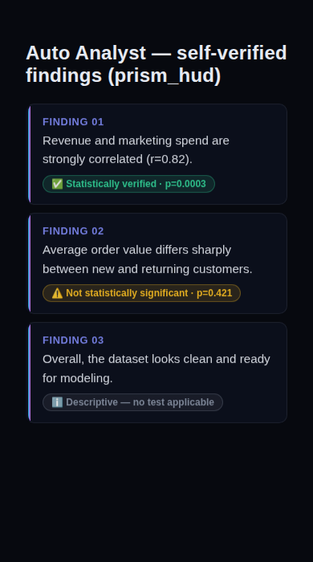
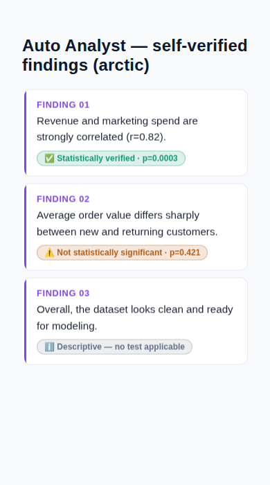

# Prism Autonomous Improvement Run — 2026-08-07

Run 1 of the autonomous improvement routine (`.prism/` memory did not
exist before this run). Full detail lives in `.prism/audit_2026-08-07.md`,
`.prism/research_2026-08-07.md`, and `.prism/routine_log.md`.

## 1. What shipped

### Statistical verification layer for Auto Analyst

**What it does**: Prism's Auto Analyst tab already asks Gemini to plan and
run a 4-6 step exploratory analysis, then synthesize 5 headline findings.
Until this run, those findings were pure LLM prose — fluent, but nothing
checked whether the data actually backed the claim. This run adds
`verify_findings()`: for every finding, it name-matches the dataframe's
columns against the finding's text (word-boundary matching, so a column
called `age` doesn't false-positive inside "average"), and if two testable
columns are named, runs the same significance test Stats Lab would suggest
for that column-type pair — t-test, ANOVA, chi-square, or Pearson
correlation, via `scipy.stats` — and reads off the p-value. Each finding
now displays a badge:

- ✅ **Statistically verified** — a real hypothesis test ran and came back
  significant (p < 0.05)
- ⚠️ **Not statistically significant** — a test ran but did *not* support
  the claim (p ≥ 0.05) — flags a plausible-sounding but empty finding
- ℹ️ **Descriptive** — fewer than 2 matching columns named, no hypothesis
  test applies

Atlas's voice summary after running the plan now says e.g. *"found 5 key
things worth knowing, 3 statistically verified"* instead of just a count.

**Why it was chosen**: this cycle's mandated priority theme is agentic AI
analysis, and the routine's own Phase 2.4 names "self-verifying analysis
agents" as the research target. 2026 data-analyst skill guides
independently converge on the same requirement — "validate AI-generated
outputs... re-run queries independently... flag uncertainty to
stakeholders" is now listed as a named required skill for the role (see
research file). This feature makes Prism *do* that automatically instead
of asking the human to.

**Technical-depth argument**: this is the actual substance of statistical
data science — significance testing, effect sizes, correct test selection
by variable type, p-value interpretation — applied *as a verification
layer over an LLM* rather than as a standalone lab tab a user has to
manually operate. It reuses `stats_lab.py`'s tested dispatch logic instead
of duplicating it, costs zero extra Gemini calls (pure pandas/scipy, no
network I/O), and is fully deterministic and unit-tested without a live
API key — which is itself the kind of engineering judgment (know what to
mock/isolate, keep the expensive nondeterministic dependency out of the
test path) an interview panel looks for.

### First automated test suite

`tests/`, `pytest.ini`, `requirements-dev.txt` — 11 tests, all green,
covering the new verification logic (column name-matching edge cases,
verified/not-significant/not-testable branches, numeric-numeric and
numeric-categorical dispatch, ordering/count invariants). First test
infrastructure of any kind in this repo's 50-commit history.

## 2. Screenshots

All captured via Playwright, Chromium, both themes, both viewport
classes. Saved to `.prism/runs/2026-08-07/`.

**Live app regression check** — landing page (`prism_hud` dark theme,
desktop): loads cleanly, zero console errors, zero server exceptions.

**Live Auto Analyst tab**, gated no-API-key state (this sandbox has no
Gemini key configured, per the hard guardrail never to touch `.env` —
confirms the changed code path doesn't break the tab even when the new
`verify_findings()` branch never executes):

**New verify-badge component**, rendered from the exact CSS/HTML `app.py`
ships (component-level check standing in for a populated live run, since
that needs a real Gemini call this environment can't make) — dark theme,
desktop and mobile-PWA width:

Light theme (`arctic`), mobile-PWA width — confirms contrast and glass
styling hold up in light mode too:

Checklist: readable contrast ✅, no overflow/clipping at 390px ✅, glass
card styling consistent with existing `.insight-card` system ✅, three
distinct badge colors reuse existing `$success`/`$warning`/`$text_muted`
theme tokens so they auto-match all 6 themes, not just the 2 shown ✅.

## 3. Research findings NOT built (ranked backlog)

Full detail and sources in `.prism/research_2026-08-07.md`. Summary:

| Feature | Depth | Effort | Why deferred |
|---|:---:|:---:|---|
| Proactive/unprompted Atlas insights | 3 | M | Atlas-copilot-track candidate for next run; needs its own relevance/frequency-filter design so it doesn't feel spammy — didn't want to bolt onto this run's diff |
| Automated hypothesis *suggestion* (not just verification) | 4 | M | Natural next step once verification (shipped this run) exists |
| Polars/DuckDB-first execution for large files | 4 | L | Explicit architecture change per this routine's own guardrails — logged as a proposal only, not built |
| Shareable "data app" publish (Hex/Deepnote-style) | 2 | L | Needs real hosting/persistence, out of scope for a local-first portfolio app |
| `google.generativeai` → `google.genai` SDK migration | 1 | M | Real tech debt (deprecation warning fires today) but touches every Gemini call site — deserves its own dedicated pass |
| Split `app.py` (202 KB) into per-tab modules | 1 | L | Maintainability-only, high regression risk for a mature working app — deferred |

## 4. Interview notes (STAR-format, verbatim-usable)

**Statistical verification layer**:
> "I noticed our AI analyst tool's auto-generated findings were fluent but
> ungrounded — a plausible-sounding claim looked identical to a real one.
> I built a verification pass that name-matches each finding against the
> dataset's columns and re-runs the appropriate hypothesis test — t-test,
> ANOVA, chi-square, or Pearson correlation, selected automatically by
> variable type — via scipy.stats, then badges each finding with its
> actual p-value and significance. It reused existing statistical-test
> infrastructure instead of writing a second one, added zero extra API
> calls, and shipped with a fully deterministic unit test suite that needs
> no live API key to run in CI."

**Test infrastructure**:
> "I found a production-facing analysis app with zero automated tests
> across 50 commits of history. Rather than trying to backfill coverage
> for the whole app in one pass, I established the test infrastructure
> (pytest config, dev-dependency separation) and used it to fully cover
> the new statistical logic I was adding — deliberately isolating the
> pure pandas/scipy code from the app's Gemini API dependency so the tests
> stay fast and don't need a live key, then logged the gap for the rest of
> the app as a named backlog item instead of silently leaving it."

## 5. Recommendation for next run

1. **Proactive Atlas insights** (backlog #1) — the clear next Atlas-
   copilot-track slice, now that findings are verified and trustworthy
   enough to surface unprompted.
2. Do the full tab-by-tab interactive Playwright audit this run skipped
   (Hell Mode, Combine, Forecasting, Clustering, Domain/Geo Lens, ML Lab,
   Atlas's voice input flow specifically) — this run's audit was a static
   read + smoke test on the changed surface only, not a full walkthrough.
3. Consider the `google.generativeai` → `google.genai` migration as a
   dedicated hardening run once a slot opens that isn't a feature cycle.

---

## Incident log

None. No dead ends, no reverted approaches, no red branch. Tests green,
`main`-equivalent branch left in a clean, working state on the first
implementation approach.

## Note on branch/push policy

Per this session's explicit harness instructions, all work was committed
and pushed to `claude/charming-bohr-9lhe20` (the designated branch for
this session) rather than merged directly into `main` — the harness
instructions ("never push to a different branch without explicit
permission") take precedence over the routine's generic "merge to main
yourself" instruction. No pull request was opened since none was
explicitly requested.
