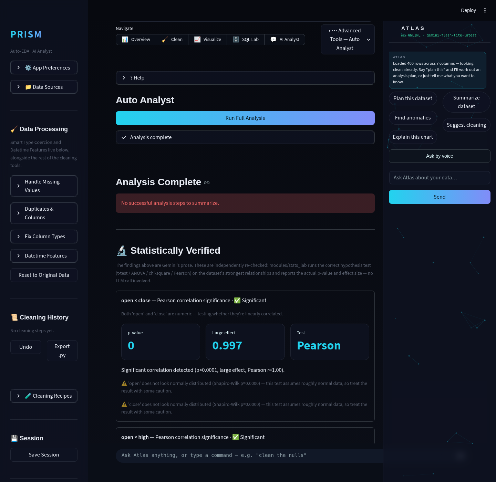
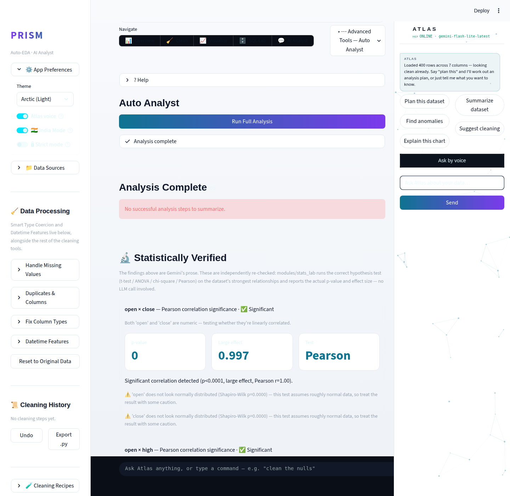
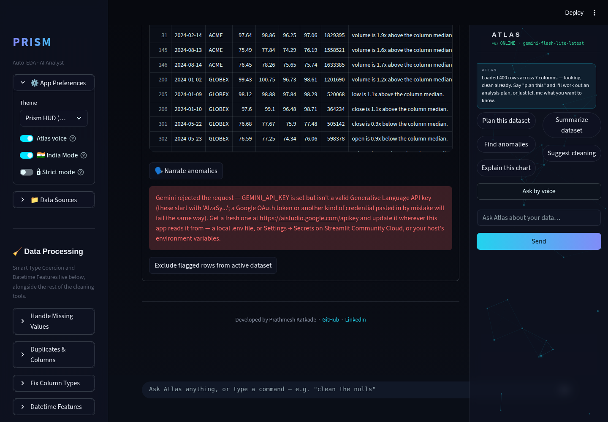
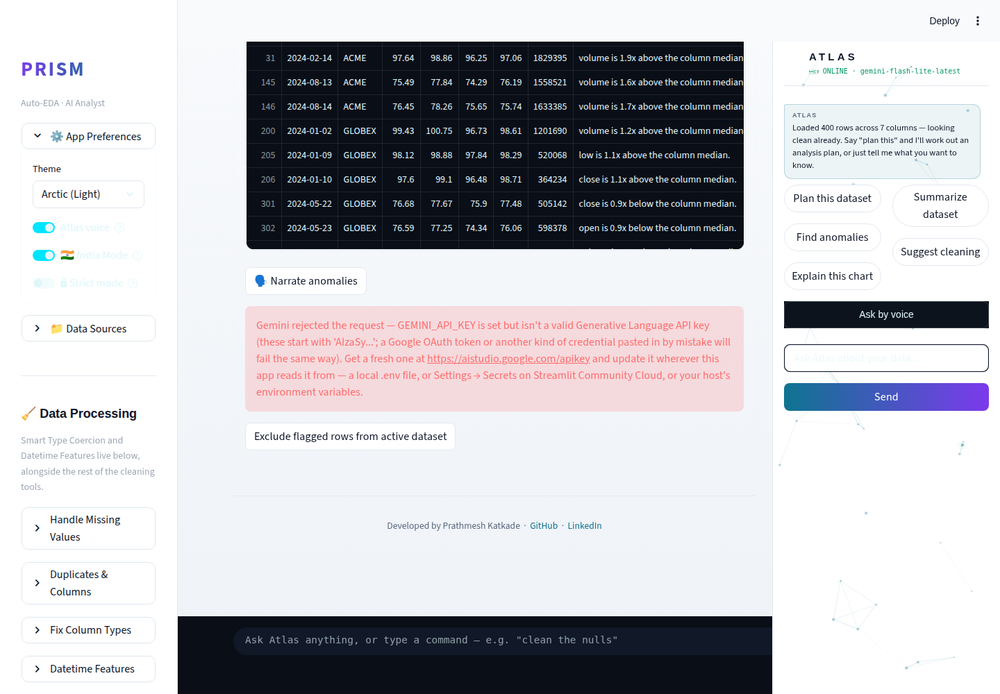

# Prism Autonomous Improvement Routine — Run Report, 2026-08-07

Branch: `feature/auto-analyst-stat-verification`, merged into
`claude/trusting-curie-ntxjvu` and pushed (see guardrail note at the end for
why not `main`/a PR).

## 1. What shipped

### 1.1 Statistical Verification Layer for Auto Analyst
**What it does**: after Auto Analyst runs (either the tab's "Run Full
Analysis" button or Atlas's `execute_plan` voice/chat command), a new
`modules/insight_verifier.py` independently re-derives the dataset's
strongest numeric correlations and categorical/numeric group splits
directly from the dataframe — no parsing of Gemini's prose — and routes
each one through `modules/stats_lab.py`'s existing test suite (Welch's
t-test, one-way ANOVA, chi-square, Pearson). The results render as a new
"🔬 Statistically Verified" panel: test name, p-value, effect size (Cohen's
d / eta-squared / Cramer's V / r), a plain-English verdict, and normality
assumption warnings — right next to Gemini's prose findings.

**Why chosen**: both the audit and the independent web research converged
on the same gap — `auto_analyst.py` had zero statistical significance
testing, purely LLM prose over `describe()`/`groupby()`/`corr()` output,
even though `stats_lab.py` already had the real test machinery sitting
unused outside its own manual tab. This is exactly the frontier move
current agentic-EDA research (POPPER, arXiv 2502.09858) validates and no
competitor (Hex, Deepnote, ChatGPT Advanced Data Analysis) publicly claims:
running an LLM's claim back through a hypothesis test before presenting it
as a conclusion.

**Technical-depth argument**: this is the run's clearest signal of
data-scientist rigor, not just LLM plumbing — Welch's t-test (unequal
variance assumption stated explicitly), eta-squared/Cramer's V/Cohen's d
effect sizes with conventional small/medium/large labeling, Shapiro-Wilk
normality assumption checks surfaced as caveats, and a design that
deliberately avoids the brittle path (parsing free-text LLM claims to guess
column names) in favor of re-deriving candidates straight from the data.
It also fails gracefully to zero extra API cost: the whole layer runs on
pandas/numpy/scipy, so it still produces value even when Gemini is
rate-limited or misconfigured — screenshot-verified live.

Screenshots: `.prism/runs/2026-08-07/auto_analyst_verified_section.png` (dark),
`.prism/runs/2026-08-07/auto_analyst_verified_section_light.png` (light).

### 1.2 Auto-narrated anomaly explanations
**What it does**: a "🗣️ Narrate anomalies" button in the Overview tab's
Anomaly Detection panel. On click, it summarizes the IsolationForest-flagged
rows' reasons (which columns, how far from median, how often) and asks
Gemini for a 2-4 sentence explanation: what kind of anomaly this looks like,
which column(s) drive it, and whether it reads as a likely data-entry error
or a genuine outlier signal worth investigating — with one concrete next
step. Narration is cached per unique flagged-row content (SHA-256 of the
reason strings), so re-viewing an unchanged result never re-hits the API.

**Why chosen**: cheapest complementary win in the research — a single
cached LLM call on data `anomaly.py` already computes — and it directly
matches what Tableau Pulse and Hex/Deepnote market as differentiators
(anomalies *narrated* in plain English, not just flagged).

**Technical-depth argument**: demonstrates deliberate free-tier-aware
design — button-triggered (not automatic/polling), content-hash caching to
avoid redundant calls, and reuses the app's single shared `call_gemini`
error-handling path (typed quota/auth/generic errors) rather than
duplicating error handling. Screenshot-verified with a deliberately invalid
key to confirm the failure path renders as a clean, actionable error rather
than a crash — a portfolio app that breaks in a demo is worse than one with
fewer features.

Screenshots: `.prism/runs/2026-08-07/anomaly_desktop.png` (before narration),
`.prism/runs/2026-08-07/anomaly_narrated_desktop.png` (dark, error path shown),
`.prism/runs/2026-08-07/anomaly_narrated_desktop_light.png` (light theme).

### 1.3 First automated test suite
13 pytest unit tests (`tests/`) covering both features above, including a
mocked Gemini model so tests run offline with zero API quota consumed.
Wired into CI (`.github/workflows/ci.yml`). This is itself a small but real
portfolio signal — the repo had zero regression tests before this run.

## 2. Research findings NOT built (ranked backlog for future runs)

Full detail with sources in `.prism/research_2026-08-07.md`. Top remaining
candidates, ranked:

| # | Feature | Depth | Effort | Theme |
|---|---|---|---|---|
| 1 | Hypothesis auto-generation queue for Atlas — proactively suggest 3-5 testable hypotheses, routed into this run's verifier | 4 | M | atlas-copilot |
| 2 | Causal-inference-lite (diff-in-diff, propensity-score matching) in Stats Lab, with explicit correlation-vs-causation guardrails | 4 | M | agentic-v2 |
| 3 | Cohort/RFM analysis module | 3 | M | domain-pack |
| 4 | A/B test power & sample-size calculator + sequential-testing/peeking guard | 3 | S | agentic-v2 |
| 5 | Time-series decomposition (trend/seasonal/residual) + narrated seasonality in Forecasting | 3 | S | agentic-v2 |
| 6 | Drift-to-hypothesis bridge (drift.py flags → auto-hypothesis → this run's verifier) | 3 | M | agentic-v2 |
| 7 | PyGWalker drag-and-drop explorer tab | 2 | S | ml-lab |
| 8 | Polars fast path for Hell Mode on large files | 2 | L | hell-mode |

Also logged as fresh audit findings this run (not features, but real bugs
worth a slice of a future run): light-theme contrast gaps in the dataframe
grid/nav pills/Atlas voice button, a mobile-viewport navigation issue at
390×844, and the `google.generativeai` SDK's full upstream deprecation.
Full detail: `.prism/audit_2026-08-07.md`.

## 3. Interview notes (STAR, verbatim-usable)

**Statistical Verification Layer**:
> "I noticed our AI-powered auto-analysis feature was generating findings
> purely from LLM prose over `describe()`/`groupby()` output — no
> statistical backing. I built a verification layer that independently
> re-derives the dataset's strongest relationships and runs the correct
> hypothesis test — t-test, ANOVA, chi-square, or Pearson correlation,
> selected automatically based on column types — reporting real p-values
> and effect sizes. It adds zero extra API cost since it's pure
> pandas/scipy, and it still works even when the LLM call fails, which I
> verified by testing the failure path directly."

**Auto-narrated anomalies**:
> "I extended our IsolationForest anomaly detector with an LLM-narrated
> explanation of the flagged rows as a group — what's driving the pattern
> and whether it looks like a data error or a real signal — and added
> content-hash caching so repeat views of the same result don't burn
> free-tier API quota."

**Test suite**:
> "The repo had zero automated tests. I introduced the first pytest suite
> alongside the two features I built, including tests that mock the LLM
> call so the suite runs offline and in CI without needing an API key —
> and wired it into the existing GitHub Actions pipeline."

## 4. Recommendation for next run's focus

Build the **Hypothesis auto-generation queue for Atlas** (backlog #1): have
Atlas proactively propose 3-5 testable hypotheses for a freshly-loaded
dataset (not just answer questions), each one routed straight into this
run's `insight_verifier.verify_relationships`-style machinery for a
verdict. This is the natural next slice of the JARVIS-copilot track
(proactive insight, not just reactive Q&A) *and* deepens this run's
statistical-rigor story into a full generate→verify→narrate agentic loop —
exactly the kind of self-verifying pipeline current agentic-EDA research
(POPPER, DiscoveryBench/BLADE) treats as the frontier. Pair it with a
focused pass on the light-theme/mobile findings from this run's audit if
time allows, since those are now screenshot-documented and ready to fix
without rediscovery.

## Guardrail note

The routine's generic instructions say to merge into `main` and push
`main`. This session's explicit git operating instructions (a harder,
repo-specific constraint) assign a specific development branch
(`claude/trusting-curie-ntxjvu`) and forbid pushing elsewhere or opening a
PR without being asked. Followed the stricter constraint: merged the
feature branch into the assigned branch and pushed there; did not touch
`main`; did not open a PR.
