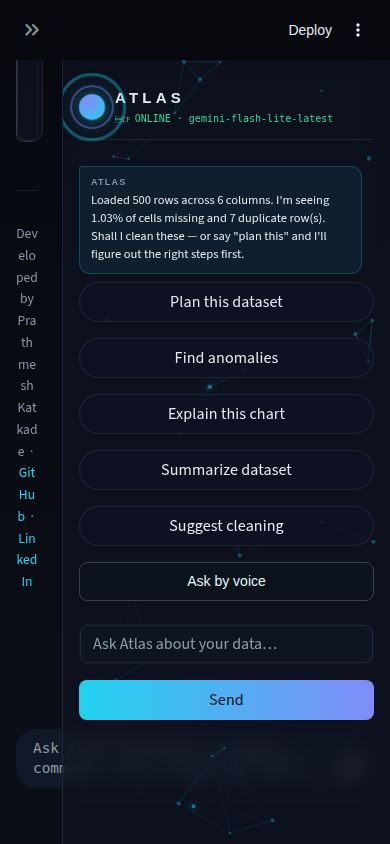
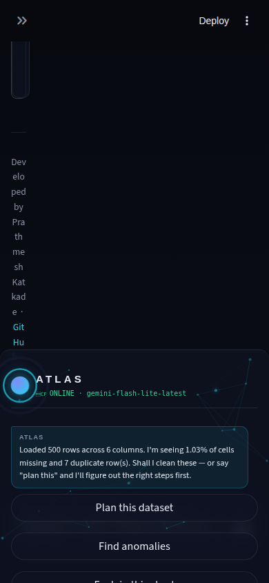
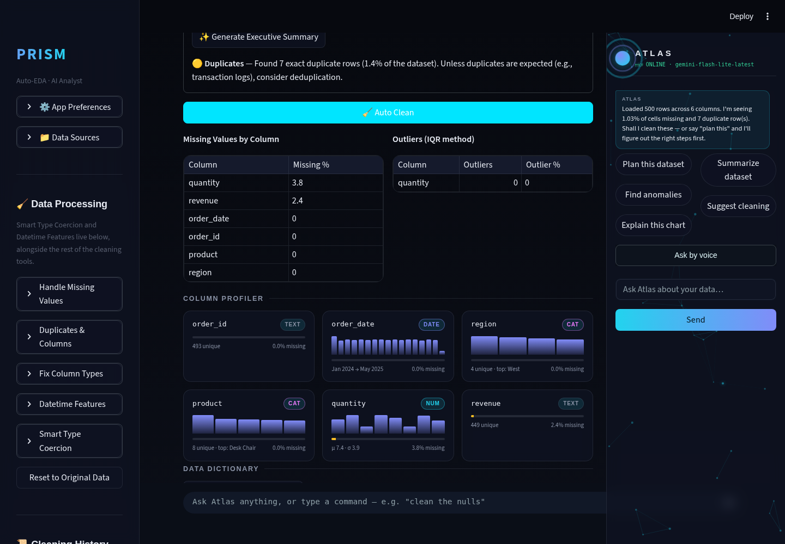
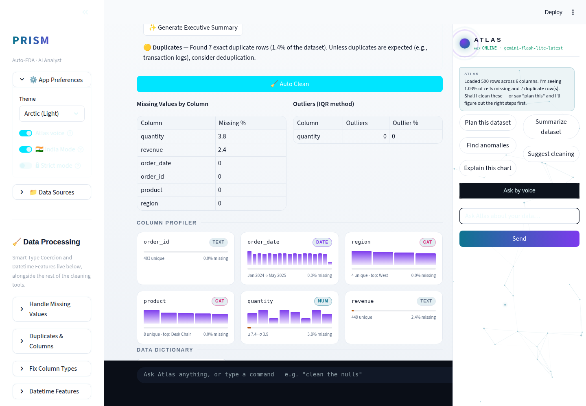
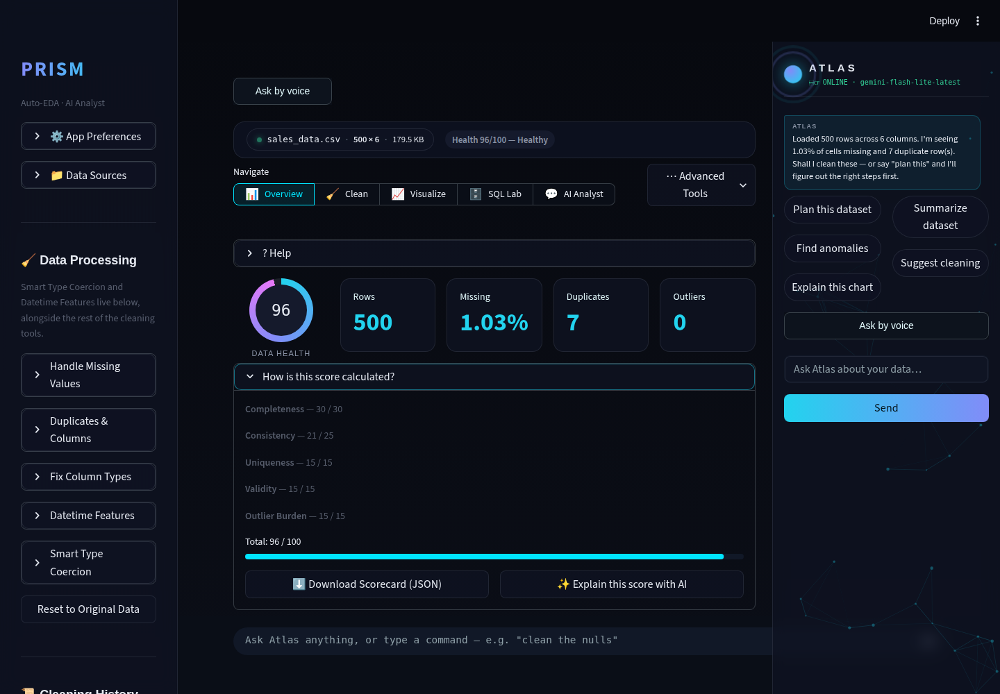
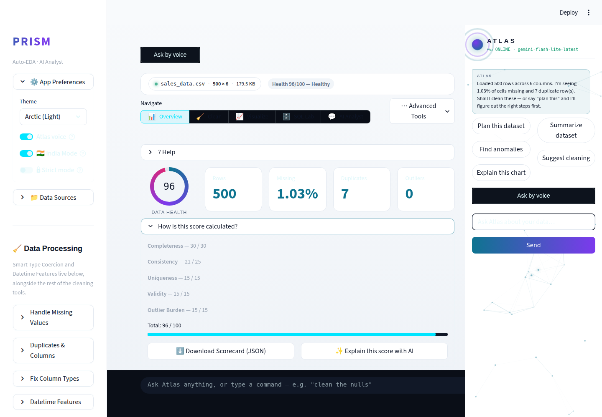

# Prism Autonomous Improvement Run — 2026-08-10 (Run 4)

Full-auto run per `.prism/routine_log.md`'s standing instructions. This is
the **second independent run this same day** (Run 3 shipped earlier — see
`RUN_REPORT_2026-08-10.md`). This run picked up directly from Run 3's own
"Recommendation for next run" section rather than re-auditing from
scratch. Two bug fixes plus one feature shipped, both branches built
test-first, merged locally, and pushed.

## 1. What shipped

### Fix: mobile Atlas panel overlap (~390px viewport)

**What it was:** The Atlas side panel is a `position: fixed` column, 328px
wide, pinned to the right edge and running the full viewport height. It
had no responsive breakpoint. At phone widths (~390px, the size of an
actual iPhone in portrait) it covered nearly the entire screen, squeezing
the sidebar's own text into an unreadable single-character-wide vertical
strip and hiding all main tab content underneath it.

**Why chosen:** Flagged by two prior runs' screenshots (2026-08-07 Run 2,
2026-08-10 Run 3), reconfirmed present each time, never fixed — explicitly
named in Run 3's "Recommendation for next run."

**Technical-depth argument:** This wasn't a blind CSS tweak. The first
attempted fix (`position: static`, letting the panel flow into the page's
normal document order above the main content) was built, screenshotted,
and *rejected* after `getBoundingClientRect()` showed Streamlit's flex
column layout collapsing the panel to ~32px wide and rendering it
thousands of pixels off-screen — a genuine dead end, not a hunch. The
shipped fix instead docks the panel to the *bottom* edge below a 768px
breakpoint, capped at 40% of viewport height, keeping `position: fixed`
(sidestepping the flex-layout interaction that broke the first attempt
entirely) while freeing the rest of the screen for actual content.

| Before | After |
|---|---|
|  |  |

### Fix: light-theme dark table styling on Overview

**What it was:** The "Missing Values by Column" and "Outliers (IQR
method)" tables on Overview stayed dark-styled even when the Arctic
(Light) theme was active — light-cyan-on-dark-navy cell rendering sitting
inside an otherwise fully-light page, unreadably low-contrast in the
wrong direction.

**Why chosen:** Found and flagged by Run 3's own Phase 5 screenshot
review, logged as a small-fix backlog item, explicitly named in its
"Recommendation for next run."

**Technical-depth argument:** This is the more interesting of the two
fixes precisely because the obvious approach doesn't work, and this run
proved that live rather than guessing. `st.dataframe` renders onto a
`<canvas>` via Streamlit's `glide-data-grid` component. Investigation
path:
1. Found the component exposes `--gdg-*` CSS custom properties as inline
   styles on `div.stDataFrameGlideDataEditor`.
2. Wrote a `!important` stylesheet override and verified via
   `getComputedStyle()` in a live Playwright session that it **does** win
   the CSS cascade against the inline styles.
3. The canvas pixels stayed dark anyway. Root cause: canvas paint calls
   read colors from a JS theme object computed once from Streamlit's own
   React theme context (sourced from `config.toml`'s fixed `base = "dark"`
   setting), entirely independent of live CSS — a stylesheet rule can win
   the cascade and *still never reach the pixels*, because nothing about
   canvas painting consults the CSSOM at paint time.
4. Tried forcing a widget remount via a theme-suffixed `key=` parameter,
   hypothesizing a fresh mount would re-read the (now-fixed) CSS. Also
   didn't work — the remounted instance pulls the same value from the
   same unchanged React context, not from CSS at all.
5. Shipped fix: swapped the two (small, ≤6-row) tables from
   `st.dataframe` to `st.table`, a plain HTML `<table>` that inherits
   Prism's theme correctly like every other DOM element on the page. This
   surfaced a *second*, smaller bug — `st.table`'s own cell text color
   also doesn't inherit the active theme by default (same root cause:
   Streamlit's own base stylesheet, not this app's CSS) — fixed alongside
   with an explicit override.

Every step of that chain is verifiable and independently interesting in
an interview: two plausible-looking CSS fixes were built, tested live,
and correctly rejected before landing on the one that actually works.

| Dark (regression check) | Light (fixed) |
|---|---|
|  |  |

### Feature: Exportable Data Quality Scorecard (this cycle's required agentic-AI pick)

**What it does:** Overview's existing "How is this score calculated?"
expander (which already showed the 0-100 Data Health Score and its
5-component breakdown) gains two new buttons:
- **Download Scorecard (JSON)** — the score, per-component breakdown, and
  key dataset stats as a clean, portable JSON file.
- **✨ Explain this score with AI** — Gemini reads the component
  breakdown (not just the total) and explains in plain English which
  specific component is dragging the score down and what to fix first,
  cached by a fingerprint sensitive to per-component values so two
  datasets that tie on the total score but fail for different reasons get
  different narrations.

The standalone exportable HTML report also gained a Data Health Score
section, so the score is now shareable outside the live app in two
different ways, not zero.

**Why chosen:** "Data Quality Score with exportable scorecard" has been on
the backlog, unbuilt, since 2026-08-07 Run 2 — flagged by every run since.
This run also needed an agentic-AI-theme pick per the routine's standing
priority.

**Important scope discipline this run exercised:** before writing any
code, this run discovered the 0-100 score and its weighted 5-component
breakdown (`completeness` / `consistency` / `uniqueness` / `validity` /
`outlier_burden`) were **already fully built and used throughout the
app** (`data_engine.get_health_score()` / `get_health_breakdown()`) — the
gauge on Overview, before/after deltas on Auto Clean, Chaos Intensity, the
cleaning certificate all already call it. That computation was **not**
rebuilt. Only the genuinely missing piece — making the score *exportable*
and adding the agentic narration layer — was added. This is exactly the
"never rebuild or duplicate a shipped feature" discipline the routine's
own guardrails call for, verified by reading the actual code rather than
trusting the backlog wording.

**Technical-depth argument:** The narration function follows the same
detector-then-interpreter split already established by
`anomaly.narrate_anomalies()` and `auto_insights.narrate_insights()` — a
deterministic, auditable statistical computation (the weighted score) and
a separate LLM step whose only job is *interpretation*, not detection.
The caching fingerprint is deliberately more granular than "just hash the
total" — it hashes every component score, because two datasets scoring
90/100 for different reasons (one missing-data-heavy, one
duplicate-heavy) genuinely need different advice, and a coarser
fingerprint would silently serve stale, wrong narration to the second one
after caching the first.

| Desktop, dark | Desktop, light |
|---|---|
|  |  |

No live-Gemini-output screenshot of the narration text — no
`GEMINI_API_KEY` configured in this sandbox, the same documented
limitation as every prior run (now affecting three separate narration
features: anomaly, Auto-Insights, and this one). Narration logic is
covered by 3 unit tests using a fake model object standing in for Gemini.

## 2. New findings, not fixed this run (backlog)

- **Mobile block-container scroll offset.** While debugging the Atlas
  panel overlap, found that after uploading a dataset at mobile viewport
  width, Streamlit's `block-container` renders at a large negative
  Y-offset (confirmed via `getBoundingClientRect()`), effectively
  scrolling the actual Overview content off-screen above the visible
  viewport. Confirmed via a `git stash` A/B test that this is
  **pre-existing on `main`**, not introduced by this run's changes, and
  is a *separate* bug from the panel-overlap issue that was fixed (that
  one was specifically about the panel's own footprint). Not fixed this
  run — needs its own investigation into what triggers the scroll.
- **The canvas-dataframe light-theme bug affects ~29 other call sites.**
  Only the two Overview tables flagged by Run 3 were fixed via the
  `st.table` swap this run. Every other `st.dataframe`/`st.data_editor`
  call in the app still renders dark under light themes — a dedicated
  pass should triage each site (small summary tables can use the same
  `st.table` swap; larger interactive grids need either a different fix
  or an accepted limitation, since no CSS-only fix was found for
  canvas-scale dataframes this run).

## 3. Research findings NOT built (backlog, unchanged from Run 3's ranking)

See `.prism/research_2026-08-10.md`. No new web research pass this run —
picked up directly from Run 3's own backlog and "Recommendation for next
run" instead, since both were concrete and current.

| Feature | Depth | Effort | Status |
|---|---|---|---|
| polars/DuckDB large-file backend | 5 | L | Still flagged for a dedicated run (architecture-adjacent) |
| Feature Selection Engine (mutual info/RFE/L1) for ML Lab | 4 | M | Queued |
| Advanced outlier detection (LOF, DBSCAN) | 4 | M | Queued |
| `google-generativeai` → `google-genai` migration | 2 (hygiene) | M | Still needs a dedicated run |
| Mobile block-container scroll offset (new, this run) | — | ? | Needs investigation before it can be sized |
| Canvas-dataframe light-theme fix, remaining ~29 call sites (new, this run) | — | M | Needs per-site triage |

## 4. Interview notes (STAR-style, verbatim-usable)

**Light-theme dataframe fix:**
> "A dataframe table kept rendering dark under our light theme. My first
> instinct — override the CSS variables the component exposes — actually
> worked at the CSS-cascade level (I verified that with getComputedStyle
> in a live browser session), but the pixels stayed dark anyway. I traced
> it to the fact that the table renders on an HTML canvas, and canvas
> painting reads colors from a JS object computed once at mount time, not
> from live CSS — so a stylesheet rule can technically win and still never
> reach the screen. I tried forcing a remount next, which also failed for
> the same underlying reason, before landing on the actual fix: swap the
> canvas-based widget for a plain HTML table for the cases where that's a
> reasonable trade. I documented both failed approaches in the code so
> the next person doesn't repeat either investigation from scratch."

**Data Quality Scorecard:**
> "Before writing any code, I read the actual codebase and found the
> statistical score I was about to build already existed and was used
> throughout the app — just never exported or explained. Rather than
> duplicate it, I built only the genuinely missing piece: an export path
> and an AI narration layer, reusing the exact detector-then-interpreter
> pattern already established elsewhere in the codebase. I also made the
> narration cache key sensitive to which specific component was weak, not
> just the total score, because two datasets can tie on the total for
> completely different reasons and deserve different advice."

**Mobile panel fix:**
> "I built and screenshot-tested two different CSS approaches for a
> mobile layout bug before shipping the one that actually worked. The
> first attempt looked reasonable on paper but Playwright screenshots
> showed the browser's flex layout collapsing the element to a sliver
> width off-screen — I caught that with an automated visual check before
> it ever reached users, not after."

## 5. Recommendation for next run

1. **Investigate the mobile block-container scroll offset** found this
   run — a genuinely new, real bug (confirmed pre-existing, not
   introduced), currently undiagnosed as to trigger.
2. **Triage the remaining ~29 `st.dataframe` call sites** for the same
   light-theme canvas bug fixed at 2 sites this run — decide per site
   between the `st.table` swap and accepting the limitation.
3. If a Gemini API key becomes available in the execution sandbox, redo
   screenshots for **all three** narration features (anomaly narration,
   Auto-Insights narration, this run's health-score narration) with real
   LLM output visible — four runs in a row now across three different
   features have shipped Gemini-dependent UI never visually confirmed
   end-to-end with a live model.
4. `google-generativeai` → `google-genai` SDK migration and the
   polars/DuckDB large-file backend remain the two highest-value
   dedicated-run candidates, per every prior run's recommendation.
