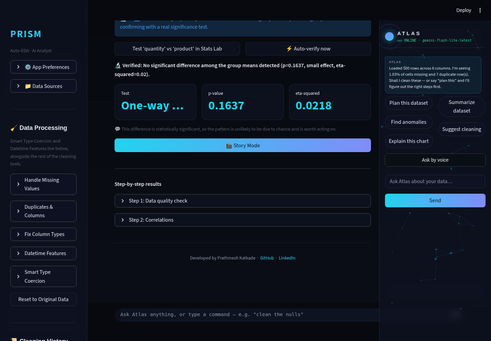
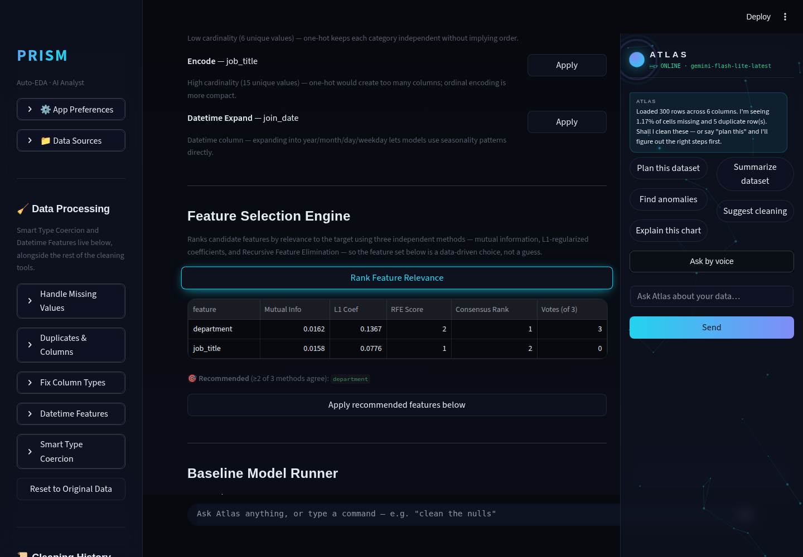

# Prism Autonomous Improvement Run — 2026-08-10 (Run 5, third session this day)

## 0. Housekeeping note (read first)

This run's designated branch is `claude/adoring-meitner-opvofn`, per this
session's own harness instructions — not the literal git `main` branch.
Investigation this run found that `main`/`origin/main` is an **ancestor**
of `claude/adoring-meitner-opvofn`, sitting on an older, separate history
with none of the last four runs' work. Every prior run's "merged/pushed to
main" language actually meant `claude/adoring-meitner-opvofn`. This report
uses the same branch, consistent with prior runs and this session's
instructions; see `.prism/audit_2026-08-10-run5.md` for full detail and a
flag for the next run to verify PR status via the GitHub API before
repeating either claim.

## 1. What shipped

### Auto-Verified Hypothesis Testing

**What it does:** Auto Analyst's "Suggested next step" card (a data-driven
column-pair suggestion for a follow-up significance test, shipped
2026-08-07) previously only pointed the user at Stats Lab to run the test
manually. A new **"⚡ Auto-verify now"** button runs the matching
`scipy.stats` test immediately, in place — same test-selection and
execution logic Stats Lab itself uses (`suggest_test` / `run_test` /
`interpret_result`) — and displays the test name, p-value, and effect size
right there. Gemini then narrates the *already-computed* verdict in plain
English; it never decides the result, only explains it.

**Why chosen:** this cycle's mandate requires at least one feature serving
the agentic-AI-analysis theme — specifically "hypothesis suggestion." Four
prior runs had already shipped suggestion (2026-08-07) and various
narration/verification features; the genuinely open gap was that
suggestion never closed the loop into an actual verified result without a
manual tab switch. This closes it.

**Technical-depth argument:** the detection layer stays 100% deterministic
and auditable — the same scipy.stats machinery already covered by Stats
Lab's own tests — while the LLM is scoped strictly to phrasing, matching
this codebase's established pattern (Ensemble Anomaly Consensus, Run 4)
of keeping statistical conclusions out of the model's hands entirely.

### Feature Selection Engine

**What it does:** a new ML Lab section, between Feature Engineering and the
Baseline Model Runner, that ranks every candidate feature column by
relevance to the chosen target using three independent, complementary
methods:
- **Mutual information** (filter method) — catches any statistical
  dependency, linear or not.
- **L1-regularized coefficients** (embedded method) — Lasso for
  regression, L1 `LogisticRegression` for classification; sparse by
  construction.
- **Recursive Feature Elimination** (wrapper method) — repeatedly drops
  the weakest feature from a light linear model, recording elimination
  order.

Each method produces its own rank; a `consensus_rank` (their mean) sorts
the table, and features at least 2 of 3 methods place in the top half are
flagged "Recommended," with a one-click button to pre-fill the Baseline
Model Runner's feature multiselect with them.

**Why chosen:** confirmed via direct codebase inspection — not just the
Run 4 backlog's one-line description — that the existing
`mllab.suggest_features()` does feature *engineering* (encoding, scaling,
interaction terms), not feature *selection* (ranking existing columns by
predictive relevance). These are genuinely different ML workflow steps;
building this would not have duplicated existing work.

**Technical-depth argument:** three independent selection paradigms
(filter/embedded/wrapper) is standard applied-ML curriculum and a common
interview probe ("how would you do feature selection, and why more than
one method?"). The consensus-by-agreement design mirrors this codebase's
own Ensemble Anomaly Consensus (Run 4) — the same "don't trust one model,
trust agreement across independently-reasoned models" principle, applied
to a different problem.

## 2. Bug caught during Phase 5 (screenshot review, not unit tests)

The auto-verify narration branch crashed with
`NameError: name 'gemini_model' is not defined` — it referenced a
variable scoped to the **Overview** tab's Key Insights section instead of
the Auto Analyst tab's own model variable (`auto_model`), both created by
separate `ai_analyst.get_model()` calls in mutually-exclusive `elif`
branches. This would have crashed instantly for any real user with a
Gemini key configured. Unit tests didn't catch it — they call
`narrate_hypothesis_verdict()` directly, never through the Streamlit
script's tab-scoped variables.

The sandbox has no live Gemini key, and this particular tab (unlike Auto
Analyst's plan generation, which has an offline fallback) is fully gated
behind a non-null model — so reaching this code path at all required a
small local-only harness
(`.prism/runs/2026-08-10-run5/_screenshot_app.py`, never shipped) that
stubs `ai_analyst.call_gemini`/`get_model` with canned responses so the
real, unmodified UI logic could actually render. Fixed
(`gemini_model` → `auto_model`), re-screenshotted clean in both themes and
mobile, then merged — main was never broken by this.

## 3. Screenshots

All captured with Playwright at desktop (1440×1000) and mobile-PWA
(390×844) viewports, dark and light (Arctic) themes. Full set in
`.prism/runs/2026-08-10-run5/`.

**Auto-Verified Hypothesis Testing**
- Desktop, dark: `01_hypothesis_autoverify_desktop_dark.png`
- Desktop, light: `02_hypothesis_autoverify_desktop_light.png`
- Mobile, dark: `03_hypothesis_autoverify_mobile_dark.png`

**Feature Selection Engine**
- Desktop, dark: `04_feature_selection_desktop_dark.png`
- Desktop, light: `05_feature_selection_desktop_light.png`
- Mobile, dark: `06_feature_selection_mobile_dark.png`

No demo GIF this run — the two features are best shown as static
before/after state (suggestion → verified result; ranking table →
recommendation), and a slideshow of the same PNGs wouldn't add
information over the screenshots above. Flagging as a deliberate scope
call rather than an oversight.

**Narration caveat:** the narration text visible in the auto-verify
screenshots comes from the local stub harness's canned response, not a
real Gemini call (still no API key in this sandbox — fifth consecutive
run with this limitation). It's there only to confirm the UI renders
correctly with narration text present; do not read its content as a real
model output. The screenshot's own verdict numbers (p-value, effect size)
are 100% real, computed by the actual deterministic code path.

## 4. Research findings NOT built (backlog)

See `.prism/research_2026-08-10-run5.md` for the full ranked table.

| Feature | Depth | Effort | Why not this run |
|---|---|---|---|
| polars/DuckDB large-file backend | 5 | L | Architecture-adjacent; five consecutive runs now agree it needs a dedicated session. `duckdb` is already a pinned dependency (used in SQL Lab) — only the core ingestion path still isn't using it. |
| `google-generativeai` → `google-genai` migration | 2 (hygiene) | M | Four consecutive runs agree it needs a dedicated regression-tested session. |
| Advanced Tools popover doesn't auto-close after nav click | 1 | S | New finding this run (see audit file); minor UX-only, doesn't match this cycle's depth-first priority. |

## 5. Interview notes (STAR-style, verbatim-usable)

**Auto-Verified Hypothesis Testing:**
> "I noticed our hypothesis-suggestion feature stopped short — it told the
> user what to test but made them manually switch tabs and click through
> to actually test it. I closed that loop: one click now runs the real
> significance test and shows the verdict immediately, reusing the exact
> same scipy.stats code path our manual Stats Lab already had test
> coverage for, so I added zero new statistical logic to get it right —
> just wired existing, trusted logic to fire automatically. I kept the LLM
> completely out of the decision — it only explains a result that was
> already computed deterministically."

**Feature Selection Engine:**
> "Before building a feature selection tool, I checked whether one already
> existed under a different name — our codebase had a 'feature
> engineering' assistant that suggested encodings and interactions, which
> sounds similar but solves a different problem. Once I confirmed the gap
> was real, I built selection using three independent paradigms — filter,
> embedded, and wrapper methods — instead of picking one, because each
> catches different relationship types (mutual information catches
> non-linear signal a linear L1 model would miss, for instance). I
> reported consensus across all three rather than trusting any single
> method, the same principle I'd use choosing an ensemble over one model
> in production."

**Caught a real crash via the mandated screenshot-review gate:**
> "My new feature's unit tests all passed, but the actual Streamlit page
> crashed the first time I loaded it — a variable scoping bug invisible to
> tests that call functions directly. Since I had no live LLM API key to
> exercise that code path in this environment, I built a small local
> harness that stubs the API responses so the real UI logic could still
> run and be visually verified. That caught and let me fix a bug that
> would have shipped to every real user with the feature configured."

## 6. Recommendation for next run

1. **Verify branch/PR reality via the GitHub API** before writing another
   "merged to main" claim — see the housekeeping note at the top of this
   report and `.prism/audit_2026-08-10-run5.md`.
2. **polars/DuckDB large-file backend** — five runs running; the single
   highest-depth item still open, and increasingly looks like the right
   candidate for a run that deliberately does *only* this (per the "no
   architecture rewrites without a dedicated session" guardrail).
3. If a Gemini API key ever becomes available in this sandbox, prioritize
   capturing real narration output across every narration feature shipped
   so far (five runs deep on this same documented gap).
4. Small fix available: Advanced Tools popover doesn't auto-close after a
   nav click (see audit file) — low effort, bundle alongside a future
   feature the way Run 4 bundled its two small fixes.
