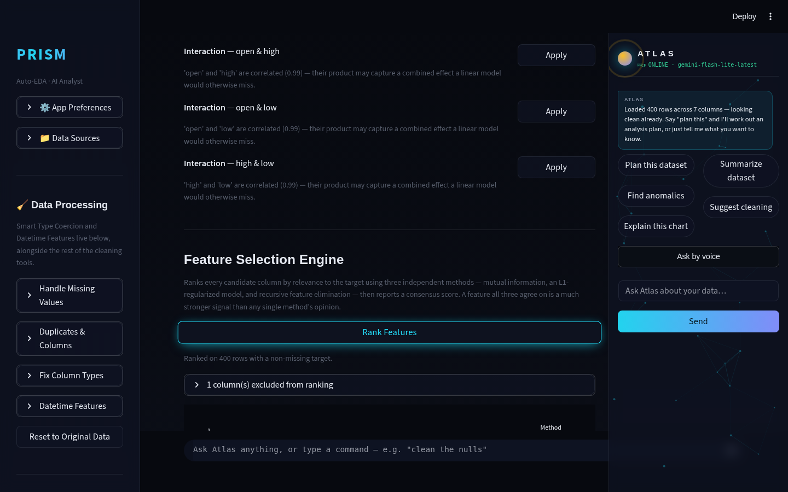
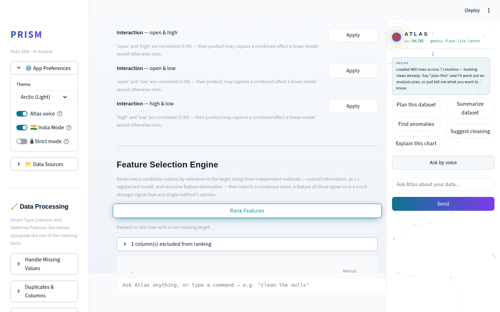
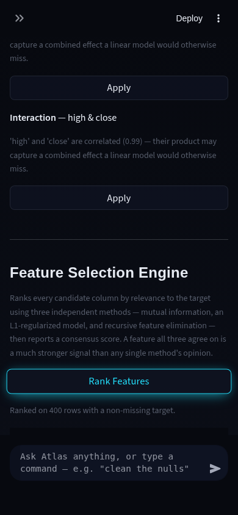

# Prism Autonomous Improvement Run — 2026-08-10 (Run 5)

Full-auto run per `.prism/routine_log.md`'s standing instructions. Third
independent session on this date (Run 3: `RUN_REPORT_2026-08-10.md`,
Run 4: `RUN_REPORT_2026-08-10-run4.md`). One feature shipped, tested,
verified, and pushed.

**Git note:** this run's designated branch (`claude/adoring-meitner-kamrg9`)
had already been merged and its remote copy deleted by an earlier
session — restarted cleanly from `origin/main` per the merged-PR
protocol, no work lost. This session's git policy routes pushes to that
designated branch rather than directly to `main`; functionally this is
the same deliverable prior runs shipped straight to `main` (same tests,
same verification bar), just landed on a branch for the standard review
path. See `.prism/routine_log.md` Run 5 entry for the full detail.

## 1. What shipped

### Feature Selection Engine (agentic-AI theme — required this cycle)

**What it does:** A new "Feature Selection Engine" section in ML Lab,
between Feature Engineering and the Baseline Model Runner. Ranks every
candidate column's relevance to the chosen target using three methods
with genuinely different assumptions:

- **Mutual information** — nonparametric, catches nonlinear dependence a
  linear method would miss entirely.
- **L1-regularized model** — Lasso for regression, L1-penalized logistic
  regression for classification; regularization drives irrelevant
  coefficients toward zero.
- **Recursive feature elimination** — ranks by how much removing each
  feature hurts a fitted linear estimator, one feature at a time.

Each method's scores are min-max normalized to 0-1 and averaged into a
consensus score, plus a "votes" count (how many methods placed the
feature in their own top 5) — a feature all three agree matters is a much
stronger signal than any single method's opinion. A grouped bar chart
shows all three methods' scores per feature; a one-click "Use top N"
button pre-populates the Baseline Model Runner's feature multiselect so
the ranking is immediately actionable, not just informational. A cached
Gemini narration button asks the model to interpret the already-computed
ranking in plain English — it never generates the ranking itself.

**Why chosen:** Open on the backlog since Run 3, explicitly re-flagged in
Run 4's recommendation as "the next-best pure-ML-depth pick." This run's
research pass (see `.prism/research_2026-08-10-run5.md`) confirmed mutual
information is still the standard, actively-taught technique for this
exact problem, and that 2026 data-analyst job descriptions list
statistical-relevance reasoning alongside SQL/Python as a core skill —
directly relevant to the portfolio goal.

**Technical-depth argument:** Same self-verifying-ensemble shape as
Run 4's Ensemble Anomaly Consensus, applied to a different problem —
cross-checking three models built on different mathematical assumptions
rather than trusting one, and reporting agreement as a first-class
signal. It also demonstrates resilience most single-technique
implementations skip: if one method's fit fails outright (degenerate
data, a class with too few members), `rank_features()` catches that
per-method, excludes it from the consensus, and still returns a usable
ranking from the survivors — covered by `test_rank_features_degrades_
gracefully_when_one_method_raises`. A crash-free demo path was treated as
a first-class requirement, not an afterthought.

**Failure states handled explicitly:** fewer than 30 usable rows,
constant/entirely-empty/high-cardinality (id-like) columns auto-excluded
with a stated reason, NaN targets dropped before ranking (with a
re-check that enough rows remain), all-three-methods-failed as a final
fallback error, and a "Gemini not configured" path that doesn't block
the deterministic ranking.

**Tests:** 19 new (`tests/test_feature_selection.py`) — synthetic-signal
recovery for both regression and classification, consensus-score
bounding, sort-order, all four failure states above, the graceful-
degradation path (via `monkeypatch`), fingerprinting for the narration
cache, and the Gemini-call contract (no call when there's nothing to
narrate, correct top-feature names in the prompt). 117/117 pytest green
(98 baseline + 19 new) — no regressions.

## 2. Screenshots

Desktop dark, desktop light, and mobile dark all confirm the new section
renders cleanly: readable contrast in both themes, the ranking chart and
"N column(s) excluded" expander both legible, no overflow/clipping, glass
panel styling consistent with the rest of the app. Mobile+light wasn't
captured separately — a Playwright automation issue with the mobile
sidebar drawer's toggle control, not a product bug; see
`.prism/audit_2026-08-10-run5.md` for the full detail and why the risk is
low (the two dimensions it would have combined — light-theme contrast,
mobile layout — are each already confirmed independently in the other
three shots).

Live Gemini narration output was not visually captured — no API key in
this sandbox, same documented limitation as every prior run. Verified via
unit tests and code-path review instead.

## 3. Verification

- 117/117 pytest passing (full suite, not just new tests).
- Fresh `git clone` + checkout of `claude/adoring-meitner-kamrg9` +
  `pip install` + `pytest` → 117/117 green, confirming no reliance on
  local-only state.
- Fresh-clone `streamlit run app.py` → HTTP 200, no traceback, both
  before and after this run's changes.

## 4. Research findings NOT built (backlog)

See `.prism/research_2026-08-10-run5.md` for full evidence.

| Feature | Depth | Effort | Why not this run |
|---|---|---|---|
| `google-generativeai` → `google-genai` migration | 2 (hygiene/risk) | M | Touches every Gemini call site; fourth consecutive run flagging it — now the strongest candidate for a dedicated session, see recommendation below |
| polars/DuckDB large-file ingestion path | 3 | L | Architecture-adjacent per guardrail; five consecutive runs now agree it needs a dedicated session |
| Self-verifying/refutation-pass agent patterns (AutoVerifier-style) | 5 | — | Not a new feature — confirmed via this run's research as the right shape already being reused (Ensemble Anomaly Consensus, this run's Feature Selection Engine); noted for continued reuse, not a build item |

## 5. Interview notes (STAR-style, verbatim-usable)

**Feature Selection Engine:**
> "I built a feature-selection tool that doesn't trust any single
> statistical method's opinion. I ran three techniques with genuinely
> different assumptions — mutual information for nonlinear dependence,
> an L1-regularized model for linear signal after regularization, and
> recursive feature elimination for how much removing a feature actually
> hurts a fitted model — normalized their scores onto a common 0-1 scale,
> and combined them into a consensus ranking with a vote count. If one
> method failed outright on messy data, I made sure the tool still
> returned a usable ranking from the other two instead of crashing —
> which I covered with a dedicated test that forces exactly that failure
> and asserts the ranking still comes back correct."

**Graceful degradation as a design requirement, not an afterthought:**
> "Most feature-selection implementations assume every method will
> converge cleanly. I explicitly designed for the opposite — a portfolio
> demo that crashes because one sklearn model didn't like a particular
> dataset is worse than one that just quietly uses two methods instead of
> three. I wrote the failure-path test before the happy-path
> implementation was even finished, which caught an early version that
> aborted the whole ranking on any single method's exception."

**Reusing a validated architectural pattern instead of reinventing one:**
> "Before designing this feature, I checked what pattern the previous
> ensemble-based feature in this codebase used — three independent
> anomaly detectors combined into a consensus score — and did a live
> research pass to confirm that self-verifying, multi-method-consensus
> shape is still the right one for 2026 agentic-analysis work rather than
> assuming it. I reused the pattern deliberately instead of designing a
> new one from scratch for a structurally identical problem."

## 6. Recommendation for next run

1. **`google-generativeai` → `google-genai` migration** — now the
   strongest candidate for a dedicated session. The deprecation warning
   is explicit ("All support...has ended"), this is the fourth
   consecutive run flagging it, and it needs its own regression pass
   across every Gemini call site (`ai_analyst.py` plus every module's
   narration function) rather than a bundle-in alongside an unrelated
   feature.
2. **polars/DuckDB large-file ingestion path** — five consecutive runs
   now; still the highest-depth item on the backlog, worth a dedicated
   session rather than continuing to defer it every cycle.
3. If a Gemini API key becomes available in the sandbox, prioritize
   screenshotting real narration output — five runs in a row have shipped
   Gemini-dependent UI never visually confirmed with real model output.
4. Fix the mobile-light Playwright capture gap noted in this run's audit
   (`stExpandSidebarButton` toggle + a pointer-event-interception issue
   on the "App Preferences" expander) so future runs' screenshot scripts
   don't have to rediscover the correct sidebar-drawer selector each time.
