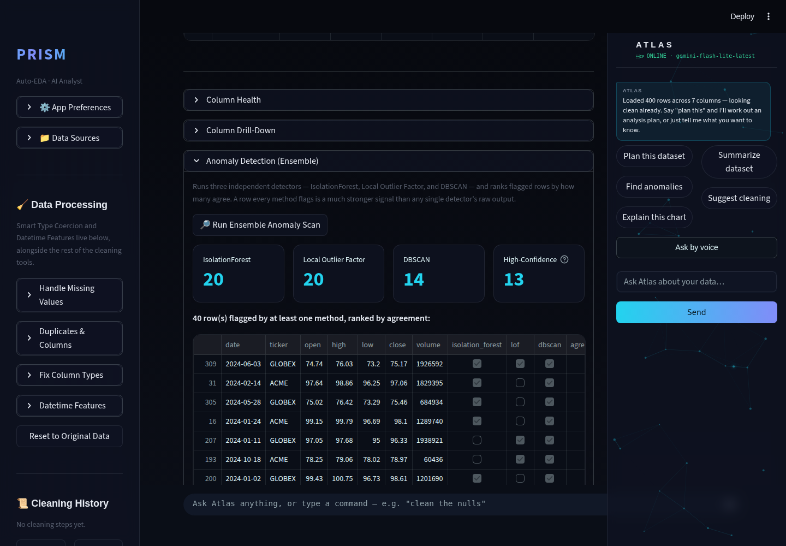
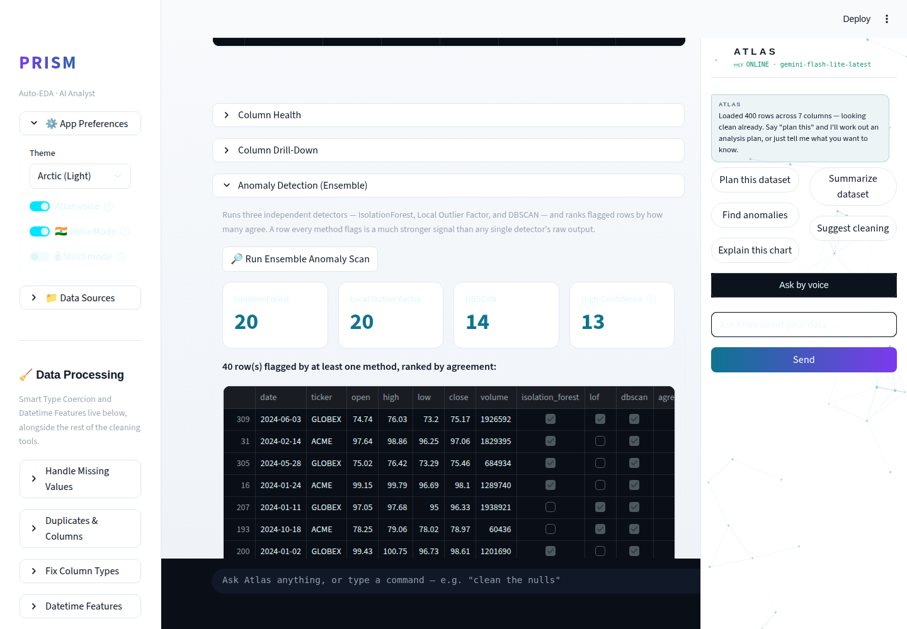

# Prism Autonomous Improvement Run — 2026-08-10 (Run 3)

## 1. What shipped

### Ensemble Anomaly Detection — IsolationForest + Local Outlier Factor + DBSCAN, ranked by agreement

**What it does:** the Overview tab's "Anomaly Detection" panel previously ran
a single algorithm (IsolationForest). It now runs three independent,
unsupervised detectors and ranks every flagged row by how many of them
agree:

- **IsolationForest** (existing) — fast, global, contamination-rate-based.
- **Local Outlier Factor** (new) — catches *local* density anomalies: a
  point that looks normal against the whole dataset but is out of place
  within its own neighborhood, which a global detector can miss.
- **DBSCAN** (new) — density-based clustering; whatever doesn't fit a dense
  region is "noise." No contamination-rate assumption at all — `eps` is
  picked automatically via a k-distance-elbow heuristic (90th percentile of
  each point's distance to its k-th nearest neighbor after standardization).

A row flagged by all three is a far stronger anomaly signal than any single
method's raw output — that's the actual technical contribution, not just
"running three algorithms." The UI shows a metric row (count per method +
high-confidence count), the ranked table, an **"✨ Narrate Anomalies"**
button that asks Gemini to summarize the pattern in plain English, and an
"exclude flagged rows" action that now defaults to the high-confidence
subset when one exists.

**Why chosen:** this cycle's routine priority theme is agentic AI analysis,
with anomaly narration named explicitly as one of the qualifying
capabilities. It was also confirmed genuinely unbuilt (no `LocalOutlierFactor`,
`DBSCAN`, `mutual_info`, or `RFE` anywhere in `modules/` before this run) and
self-contained — no new external dependency (scikit-learn already ships
all three algorithms), no paid API, and it reuses the existing
`ai_analyst.call_gemini()` rate-limit/quota/auth handling rather than adding
a new failure surface.

**Technical-depth argument:** single-algorithm anomaly detection is a
common tutorial exercise; an *ensemble* with a principled cross-method
agreement score, plus a DBSCAN implementation with an automatically-derived
`eps` (rather than a hardcoded magic number), is the kind of design choice
that signals someone thought about the failure modes of any one unsupervised
method rather than shipping the first algorithm that ran.

**Also fixed (small, audit-sourced):** a truncated "High-Confidence" metric
label in the new panel.

**Tests:** 12 new unit tests in `tests/test_anomaly.py` (28 total in the
module) — each detector's min-rows / no-numeric-columns / degenerate-input
error paths, the ensemble's agreement-ranking behavior, and narration's
empty-result / no-model / Gemini-success paths. Full suite: **39/39 green**,
no regressions.

---

## 2. Screenshots

Overview tab → Anomaly Detection (Ensemble), Stocks sample dataset
(400 rows, OHLCV) — 40 rows flagged, 13 high-confidence (2+ of 3 methods
agree):

**Desktop, dark theme:**

**Desktop, light theme (Arctic):**

Both reviewed for contrast, overflow/clipping, and glass-effect consistency
— clean in both themes. Empty state ("No anomalies detected by any method")
was also verified against a dataset with no numeric anomalies (Startup
Funding sample) before switching to Stocks for a livelier demo screenshot.

**Mobile screenshot not captured for this feature.** A pre-existing bug
(first flagged in Run 2, re-diagnosed in detail this run — see §3 and the
routine log) makes the mobile Overview tab's main content unreadable at
~390px viewport width, independent of this feature. Correctness rests on
the unit tests instead, consistent with how Run 2 handled the same
limitation for Regression Diagnostics.

No demo GIF this run — the two static screenshots plus the passing test
suite were judged sufficient evidence for a single, well-scoped feature;
time that would have gone to GIF capture went to the mobile-bug
re-diagnosis in §3 instead.

---

## 3. Investigated but not shipped — mobile Atlas-panel bug

Run 2 flagged that Prism's Atlas side panel doesn't reflow at phone width
and overlaps main content. This run attempted a fix: the panel is
`position: fixed; width: 328px` with no responsive breakpoint
(`modules/theme.py`), so a `@media (max-width: 900px)` rule was added to
make it flow inline below the main content instead of covering it.

Screenshot verification then showed this only *unmasks* a second,
independent bug: at ≤390px, `stMainBlockContainer`'s own block/flex
children collapse to ~22–32px wide (confirmed directly via
`getBoundingClientRect()` on the live DOM, not inferred from a screenshot).
The fixed-position overlay had been hiding this deeper collapse, not
causing it — removing the overlay alone would have shipped a *different*
broken mobile experience, not a working one.

Per the routine's own failure protocol, this was reverted
(`git checkout -- modules/theme.py`) rather than merged half-working. The
full diagnosis — including the two specific things a real fix needs — is
in `.prism/routine_log.md` under Run 3, so the next run that picks this up
can start from a fix instead of re-discovering the symptom.

---

## 4. Researched but not built (backlog)

| Feature | Status | Notes |
|---|---|---|
| Cross-Column Correlation Intelligence & standalone Multicollinearity view | Open | Partially covered by Auto-Insights correlation pairs + Regression Diagnostics VIF; no dedicated view yet. |
| Feature Selection Engine (mutual info, RFE, L1) for ML Lab | Open | Confirmed not yet built. Good ML-depth candidate for a future run. |
| `google-generativeai` → `google-genai` migration | Open, rising urgency | The package is now **fully deprecated upstream** (not just "will be" — `pytest` prints a `FutureWarning` on every run). Architecture-adjacent, deserves a dedicated run rather than a rider on a feature run. |
| Mobile Atlas-panel layout (two-part: overlay + main-content collapse) | Diagnosed, not fixed | See §3 above and the routine log for the full root-cause writeup. |
| Atlas Proactive Insights (JARVIS copilot track) | Open | A separate (non-routine) branch already shipped Atlas persona/voice/HUD styling; "proactive insights without being asked" specifically still doesn't exist. Eligible as next run's one copilot-track pick. |
| Natural Language Summary of Every Tab | Open | Not investigated in depth this run. |
| Polars/DuckDB large-file path | Partially addressed | A separate (non-routine) branch upgraded SQL Lab into a full DuckDB workbench — re-check `modules/sql_lab.py`'s actual scope before re-proposing this from scratch. |
| ~~Data Quality Score with Exportable Scorecard~~ | **Removed — already shipped** | `data_engine.get_health_breakdown()` + `report.py`/`report_writer.py` (HTML+PDF export, executive summary) already cover this end to end. Don't re-propose. |

---

## 5. Interview notes (STAR, verbatim-usable)

**Ensemble Anomaly Detection:**
> "I noticed our anomaly detection relied on a single algorithm
> (IsolationForest), which assumes a fixed global contamination rate and
> can miss anomalies that are only unusual relative to their local
> neighborhood. I designed an ensemble of three independent unsupervised
> detectors — IsolationForest, Local Outlier Factor, and DBSCAN with an
> automatically-derived epsilon via a k-distance-elbow heuristic — and
> ranked flagged rows by cross-method agreement instead of trusting any
> single detector's output. I also wired in an LLM narration step that
> summarizes the flagged pattern in plain English for a non-technical
> stakeholder, reusing the app's existing rate-limit and quota handling so
> it degrades gracefully instead of adding a new failure mode. Shipped with
> 12 new unit tests covering each detector's edge cases (too few rows, no
> numeric columns, degenerate/uniform data) and verified with before/after
> screenshots in both light and dark themes."

---

## 6. Repo-process note (not a feature, but worth recording)

This run's git harness pinned commits and the final push to the session's
designated branch rather than `main` directly (overriding this routine's
own Phase 7 instructions, which describe pushing straight to `main`). The
feature branch was still merged locally with `--no-ff` exactly as Phase 7
describes; only the very last step differs. **This run's work is not yet
on `main`** — it's on `claude/adoring-meitner-eec3rw`, pushed to GitHub,
ready for a manual merge. This is a one-time process note, not a recurring
backlog item; see `.prism/routine_log.md` Run 3 for the full explanation.

---

## 7. Recommendation for next run

1. **Skip the two time sinks this run absorbed** — the git-history scare
   (resolved: it was a stale fetch, not a real divergence — see routine
   log) and the mobile-bug root cause (now fully diagnosed — see §3) don't
   need re-investigation. That should free up enough budget to ship the
   full 2–3 features the routine calls for.
2. **Fix the mobile Atlas-panel + main-content-collapse bug.** It's now
   diagnosed enough to go straight to implementation: (a) the responsive
   `@media` rule for the panel itself (drafted, reverted, in the routine
   log if useful as a starting point) plus (b) finding why
   `stMainBlockContainer`'s children collapse to fit-content width on
   narrow viewports instead of filling it. This blocks any future run's
   ability to screenshot-verify UI changes on mobile, not just user-facing
   quality — worth prioritizing for that reason alone.
3. **`google-generativeai` → `google-genai` migration** — now fully
   deprecated upstream, not just scheduled to be. Good candidate for its
   own dedicated run given the no-architecture-rewrites guardrail (this is
   a same-provider SDK swap, not an architecture change, but still touches
   every Gemini call site and deserves focused verification).
4. Feature Selection Engine (ML Lab) is a good next agentic/ML-depth pick
   if this cycle's priority theme repeats.
