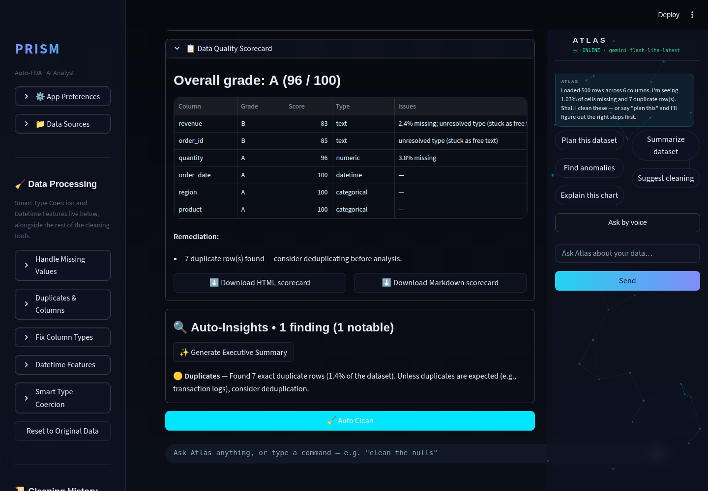
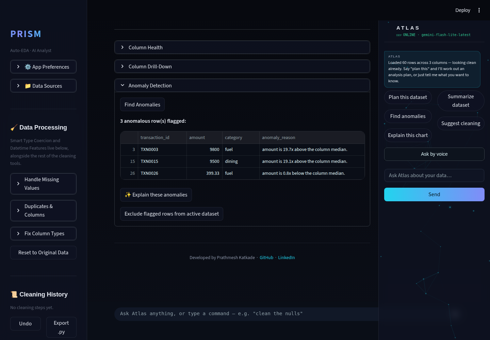
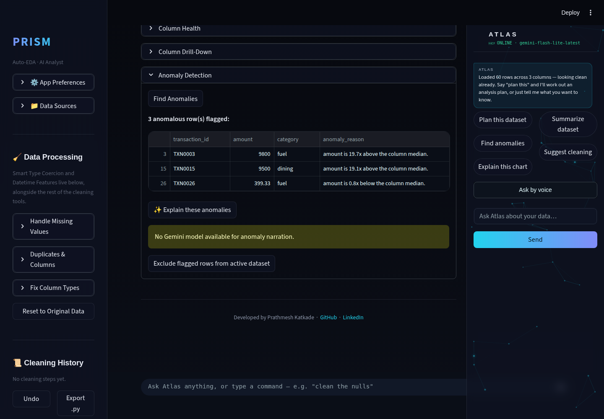
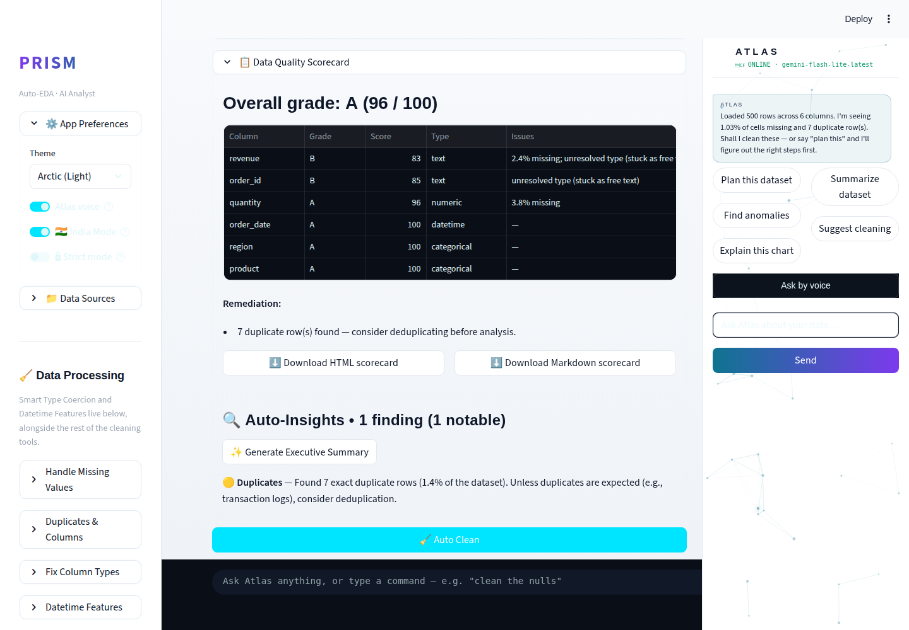

# Prism Autonomous Improvement Run — 2026-08-10

Full-auto run, two feature branches plus one bug-fix branch. `feature/anomaly-narration`
(commit `0602ff3`), `feature/quality-scorecard` (commit `43582bb`), and
`fix/mobile-atlas-panel` (commit `95b5b0d`) → all three merged into
`claude/adoring-meitner-kqxbut` → pushed. Fresh-clone boot check passed
after merging. 127/127 tests green (45 pytest + 82 deterministic eval
checks), no regressions in any prior feature.

**Note on branch:** this run's designated branch already carried the full,
unmerged history of the 2026-08-07 runs (the GitHub `main` branch is stale
at a pre-08-07 commit and was never updated by a merged PR) — so all work
this run built directly on top of that branch rather than on `main`, per
the harness's git-branch constraints. See the routine log for detail.

## 1. What shipped

### Anomaly Narration — Gemini explains flagged rows (this cycle's agentic-theme pick)
**What it does:** Prism's existing IsolationForest anomaly detector
(`modules/anomaly.py`) flags unusual rows with a templated
`"column is Nx above/below median"` reason string, but never explained
*what it means* or *what to do about it*. Now, after a scan finds flagged
rows, an "✨ Explain these anomalies" button asks Gemini to turn the
**aggregated** reason counts (never raw row values — PII-safe by
construction, since the reason strings only ever carry a column name and a
ratio) into a 2-3 sentence plain-English summary with a concrete suggested
next action (manual review, exclude, or investigate a data-entry issue).
The result is cached in `st.session_state`, keyed by a deterministic
fingerprint of the flagged set + dataset size, so reopening the panel on
unchanged data never re-calls Gemini — directly satisfies this routine's
"design for rate-limit handling and caching" guardrail. Degrades
gracefully with a clear warning when no Gemini key is configured (verified
live in this sandbox, which has none).

**Why it was chosen:** this cycle's mandatory priority theme is agentic AI
analysis. Live web research this run confirmed the 2026 agentic-analytics
consensus shape is **deterministic-detect → LLM-narrate** — exactly what
Prism's Auto-Insight Engine already does, but `anomaly.py` didn't. It was
also an explicit open backlog item from the 2026-08-07 Run 1 log
("Anomaly narration... would have Gemini narrate the flagged set in plain
English with a suggested next action, cached per dataset fingerprint") —
this run closes that item precisely as specified.

**Technical-depth argument:** a real three-stage agentic pipeline (detect →
aggregate → narrate) with an explicit, auditable PII-safety boundary (only
counts and column names ever leave the deterministic layer) and a caching
contract that keeps it inside Gemini's free tier under repeated use. 13 new
tests cover the aggregation, fingerprinting, and narration control flow
(success, no-model, no-anomalies short-circuit, and Gemini-error paths)
with a fake Gemini client via `monkeypatch`.

### Data Quality Scorecard — exportable, letter-graded quality artifact
**What it does:** a new "📋 Data Quality Scorecard" panel in the Overview
tab (`modules/quality_scorecard.py`) turns Prism's existing weighted 0-100
Data Health Score into a standalone artifact: an overall letter grade
(A-F), a per-column A-F breakdown (dinged for missing data, unresolved
types stuck as free text, IQR outlier burden, and fully-empty columns)
with plain-English issues per column, and prioritized remediation bullets.
Downloadable as either a self-contained HTML page or portfolio-ready
Markdown (pastes cleanly into a GitHub README). Fully deterministic — zero
Gemini calls.

**Why it was chosen:** an explicit open backlog item from 2026-08-07 Run 2
("Data Quality Score with Exportable Scorecard") — Prism already had the
underlying weighted-score math (`data_engine.get_health_breakdown`) but
never exposed it as an exportable deliverable. Live research into
competitor tools (Hex, Deepnote, Julius AI, ChatGPT Advanced Data
Analysis) found none of them ship a standalone, shareable data-quality
scorecard as a first-class artifact — quality scoring in those tools is
implicit/inline, not a deliverable a candidate can hand to a stakeholder
or drop into a portfolio.

**Technical-depth argument:** demonstrates the exact skill a data-analyst
interview panel probes for — turning a quality metric into a communicable,
stakeholder-ready deliverable with prioritized remediation, not just a
number on a dashboard. Deliberately kept distinct from `report.py`'s
existing kitchen-sink Auto-EDA HTML export (stats + charts + quality
combined) — this is a focused, single-purpose artifact. 9 new tests cover
grading boundaries, per-column detection of every issue type, sort order,
and both export formats.

### Bug fix — mobile Atlas panel overlap
**What it does:** the persistent Atlas copilot side panel was
`position: fixed; width: 328px` with zero responsive breakpoints — on
phone-width viewports (< 768px) it was wider than the screen itself and
covered/squeezed main content instead of reflowing (confirmed open by two
2026-08-07 audits). It now drops into normal document flow as a bounded,
scrollable block below 768px, instead of a fixed overlay. No behavior
change above 768px.

**Also fixed:** pinned `cffi>=1.16` in `requirements-dev.txt` after this
run's sandbox hit a `_cffi_backend` import panic installing dev
dependencies fresh (transitive `cryptography`/`google-generativeai`
dependency-resolution gap, not a Prism code bug).

## 2. Screenshots

All captured via Playwright, saved to `.prism/runs/2026-08-10/`.

**Data Quality Scorecard — desktop, dark:**

**Anomaly Narration — flagged rows + Explain button, desktop, dark**
(synthetic dataset with a planted numeric outlier, uploaded live to
exercise the actual detection + narration UI end to end):

**Anomaly Narration — graceful no-API-key state** (this sandbox has no
live `GEMINI_API_KEY`; the warning renders cleanly instead of crashing):

**Data Quality Scorecard — desktop, light (Arctic theme):**

**Mobile screenshots — captured, but see the important caveat below:**
`.prism/runs/2026-08-10/04a_mobile_dark_top_KNOWN_preexisting_bug.png`,
`04b_mobile_dark_scroll_KNOWN_preexisting_bug.png`, and
`05_mobile_light_KNOWN_preexisting_bug.png` are included for completeness,
but they mostly document the newly-discovered pre-existing bug below
rather than cleanly showing the Atlas panel fix — see Section 3.

### Important verification caveat — a bigger bug than the one being fixed

While capturing the mobile screenshots above, this run discovered a **far
more severe, pre-existing** mobile layout bug that the Atlas panel fix
does not (and structurally cannot) resolve: below ~768px viewport width,
**the entire main-content column collapses to a tiny fraction of the
screen** — measured 22px wide at a 390px phone viewport, in every tab, not
just around the Atlas panel. Every line of text wraps to 1-2 characters
per line and the page balloons to many thousands of pixels tall.

This was **confirmed not to be a regression from this run**: a clean
`git worktree` comparison against the commit immediately before this run
started reproduces the identical 22px collapse. It predates all three of
this run's changes.

Root-caused as far as this run's budget allowed (full detail in
`.prism/audit_2026-08-10.md`): the collapse traces to Streamlit's own
internal `stVerticalBlock` layout class (not Prism's injected CSS —
`modules/theme.py` has no `calc()` or sidebar-width reference anywhere),
following a pattern consistent with the collapsed/off-canvas sidebar still
reserving its *expanded* layout width. Forcing `width: 100% !important` on
the affected element did not fix it, ruling out a simple override. This
looks upstream-Streamlit-shaped rather than Prism-specific, and landing a
safe fix needs focused investigation rather than a rushed patch riding
alongside this run's selected features — per the routine's own "be
conservative where damage is possible" guardrail, it was documented in
full (including a reusable diagnostic script,
`.prism/runs/2026-08-10/diagnose_mobile_width_bug.py`) rather than blind-
patched. **This is next run's top priority** — see Section 5.

The Atlas panel fix itself was verified correct at the CSS/DOM level
independent of this other bug: DOM inspection confirmed the panel now
renders `position: static` and in normal document flow (not overlapping
at `right: 0` anymore) below 768px, which is exactly what the fix claims.

## 3. Research findings NOT built (ranked backlog for future runs)

Full detail and evidence in `.prism/research_2026-08-10.md`. Not built
this cycle:

| Feature | Depth | Effort | Why not this run |
|---|---|---|---|
| Feature Selection Engine (mutual info/RFE/L1) for ML Lab | 4 | M | Touches ML Lab's model-fit flow — medium risk, good next-run candidate |
| Advanced outlier detection (LOF, DBSCAN) | 3 | M | Lower priority than this run's two picks |
| `google-generativeai` → `google-genai` migration | 2 | L | Touches 5 Gemini call sites now (added anomaly narration); needs its own dedicated regression-tested run |
| polars/DuckDB large-file backend | — | L | Architecture-adjacent, flagged by both 2026-08-07 runs, still open |
| Atlas full JARVIS voice HUD | 5 | L | At most one copilot-track feature per run; not needed this cycle since two solid non-copilot picks were found |
| Consolidate `eval/*.py` into pytest-discoverable tests | — | S | Found during this run's audit — `pytest` alone silently under-reports the 82 eval checks; not a functional bug, low priority |

## 4. Interview notes (STAR-style, verbatim-usable)

**Anomaly Narration:**
> "I extended an existing IsolationForest anomaly detector with an LLM
> narration layer, but designed the interface so only aggregated
> statistics — never raw row values — ever reached the LLM, making it
> safe by construction for PII-sensitive data. I also fingerprinted the
> input and cached the narration in session state, so re-viewing the same
> result never re-calls the API — a deliberate design choice to stay
> inside a free-tier rate limit rather than an afterthought."

**Data Quality Scorecard:**
> "I noticed the app already computed a well-explained, weighted 0-100
> data quality score but never let a user export it. I built a standalone,
> letter-graded scorecard — per-column grades, prioritized remediation —
> downloadable as HTML or Markdown, so a data quality finding becomes a
> deliverable a stakeholder can act on instead of just a number in a UI."

**Mobile bug investigation:**
> "While verifying a UI fix with real device-width screenshots instead of
> trusting the code alone, I found the visual proof told a different story
> than expected — a much larger, pre-existing layout bug was hiding behind
> the one I'd fixed. I used a clean git worktree comparison to prove it
> predated my change, root-caused it as far as I could with DOM
> instrumentation, and documented the exact reproduction steps and a
> diagnostic script for the next person, rather than shipping a guessed
> fix under time pressure."

## 5. Recommendation for the next run's focus

**Top priority: the mobile main-content-collapse bug** documented in
Section 3 above and `.prism/audit_2026-08-10.md`. It's a bigger
interview-credibility risk than any single missing feature — a "PWA" that
is unreadable on an actual phone undercuts every other feature shipped so
far. Start from the reproduction script
(`.prism/runs/2026-08-10/diagnose_mobile_width_bug.py`) and the diagnosis
already logged; confirm whether it's upstream Streamlit (try a minimal
repro app) before attempting a Prism-side fix.

Second priority: Feature Selection Engine for ML Lab (mutual info/RFE/L1)
— highest remaining technical-depth item in the backlog that wasn't
picked this cycle, and a natural pairing with the existing Regression
Diagnostics Panel.
