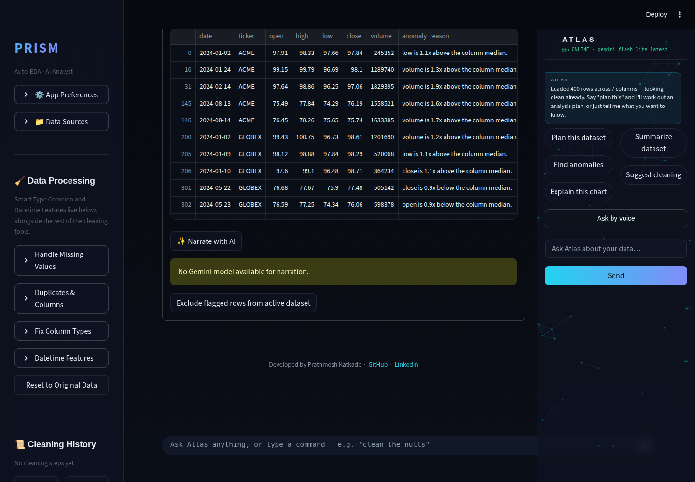
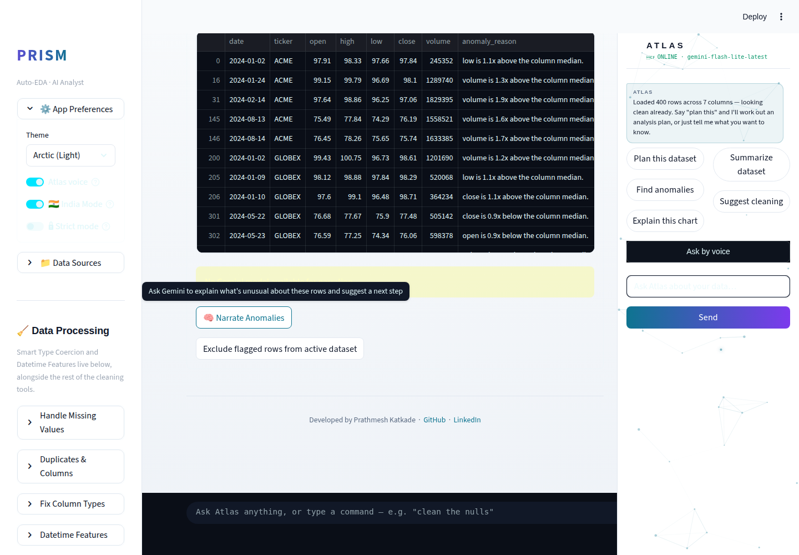
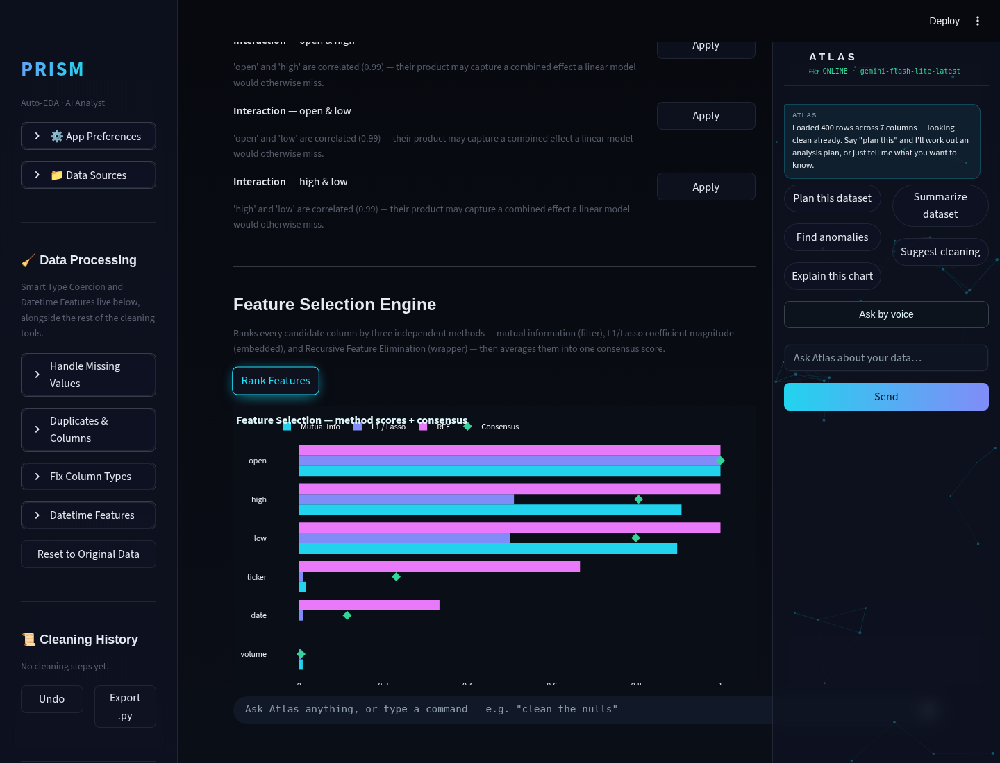
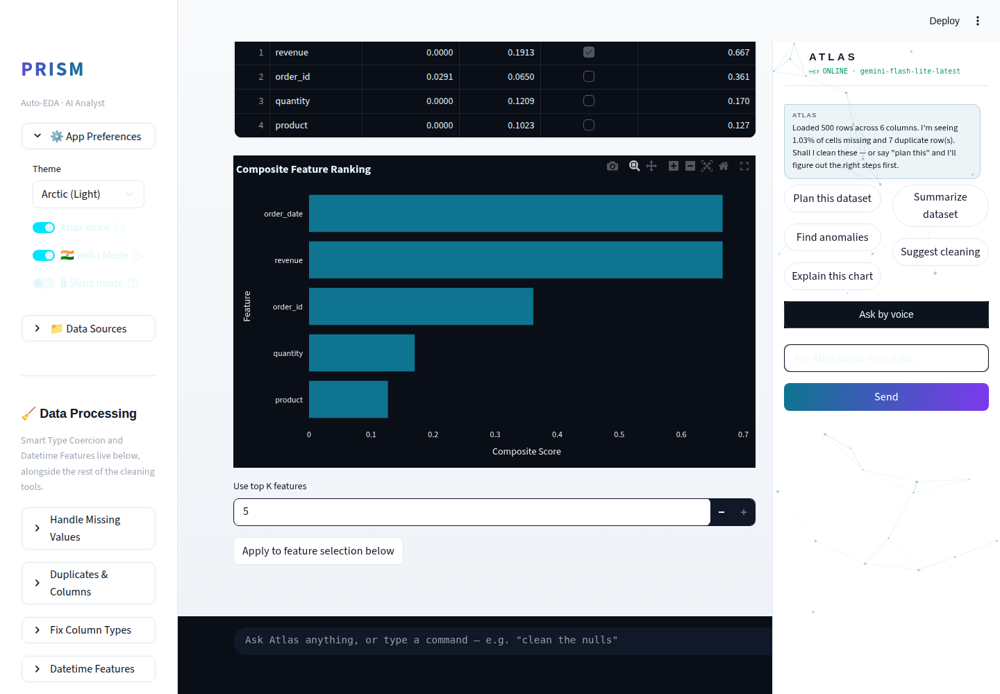

# Prism Autonomous Improvement Run — 2026-08-10 (Run 3)

## 1. What shipped

### Anomaly Narration — agentic-EDA follow-through on anomaly detection

`modules/anomaly.py` already flagged unusual rows via IsolationForest with a
templated per-row reason string ("value is 5.2x above the column median").
That's useful but mechanical — it doesn't say what the *pattern* across all
flagged rows means or what to do next. This run adds `narrate_anomalies()`:
a Gemini call that takes the flagged set and the total row count and writes
a 2-4 sentence plain-English narration plus a concrete suggested next
action, surfaced behind a new "✨ Narrate with AI" button in the Overview
tab's Anomaly Detection panel.

**Why this feature:** this cycle's mandatory priority theme is agentic AI
analysis (auto-EDA, insight generation, anomaly narration — named
explicitly in the routine's own brief), and this exact gap was flagged as
the natural next step in Run 1's backlog ("a genuinely agentic upgrade
would have Gemini narrate the flagged set... cached per dataset
fingerprint"). Anomaly-detection interview questions specifically probe
*why* something was flagged and what a false positive would look like —
narration is the layer that turns a raw flag list into an answer to that
question.

**Technical-depth argument:** the interesting engineering isn't the Gemini
call itself (one prompt, same shared `call_gemini` helper every other
Gemini feature in the app uses) — it's the failure-mode discipline around
it: zero Gemini calls when the flagged set is empty (a deterministic "looks
clean" message instead, so a clean dataset never burns a free-tier request
for a no-op answer), a hard cap on how many row-reasons go into the prompt
(bounded token cost regardless of how many rows get flagged), and a clear,
non-crashing inline message when no API key is configured — verified by 6
tests including one that asserts Gemini is *never called* for an empty
flagged set.

### Feature Selection Engine — ML Lab

`modules/feature_selection.py`, wired into ML Lab between the existing
Feature Engineering Assistant and Baseline Model Runner. Ranks every
candidate feature column by three independent, complementary signals:

- **Mutual information** (`mutual_info_classif`/`mutual_info_regression`)
  — a model-free, nonlinear dependency measure.
- **L1-regularized linear model** (L1-logistic for classification, Lasso
  for regression) — which features a sparse linear model keeps a non-zero
  coefficient for, after standardizing every feature.
- **Recursive Feature Elimination** with a Random Forest estimator — which
  features a tree ensemble treats as load-bearing when forced to drop half
  the candidates.

Each is min-max normalized to [0, 1] and averaged into a composite score,
shown as a sortable table plus a horizontal bar chart. A "Use top K
features" control one-click applies the top-ranked columns straight into
the Baseline Model Runner's feature multiselect below.

**Why this feature:** highest depth-per-effort item on the research table
(see `.prism/research_2026-08-10.md`) — pre-modeling feature triage using
exactly this three-method combination is named directly in 2026 data-analyst
interview prep material, and current LLM-feature-selection research
explicitly benchmarks against MI/RFE/Lasso as the baseline a serious tool
is expected to already offer.

**Technical-depth argument:** the real signal here is combining three
*disagreeing* methods rather than trusting one — MI catches nonlinear
relationships L1 would miss, L1 catches sparse linear structure RFE's tree
estimator might overfit around, and RFE catches interaction effects neither
of the other two sees. No single method is presented as ground truth. Each
method also degrades independently (a neutral zero/all-selected score, not
a crash) if its own estimator fails on a particular dataset shape —
verified by tests that specifically construct constant columns and
near-degenerate targets to exercise those fallback paths.

## 2. Screenshots

Saved to `.prism/runs/2026-08-10/` — desktop (1440×1000), dark and light:

*Anomaly Detection panel (Stocks sample, 20 flagged rows) — dark theme,
narration triggered.*

*Same panel, light theme — shows the graceful "No Gemini model available
for narration" fallback, since no `GEMINI_API_KEY` is configured in this
execution sandbox. This is the intended degraded state, not a bug.*

*Feature Selection panel (Sales sample, target=region) — ranking table,
composite score chart, "Use top K features" control.*

*Same panel, light theme. The dark plot canvas inside a light page is the
app's existing, intentional glass-card styling (confirmed against Run 2's
own light-theme screenshots — every card/table in the app keeps a dark
surface even on the light theme), not a new inconsistency.*

**Known limitation — no mobile screenshots this run.** Capturing both
features at 390×844 hit a pre-existing bug, not a defect in this run's
code: `.st-key-atlas_side_panel` (the always-visible Atlas copilot column)
is `position: fixed; width: 328px` with no mobile media query in
`modules/theme.py`. Combined with the mobile sidebar drawer, it leaves
almost no room for main content at phone width — Run 2 first spotted this;
this run located the actual CSS root cause while debugging the automation,
still didn't fix it (same reasoning Run 2 gave: layout-affecting CSS
deserves a dedicated pass, not a bolt-on). See `.prism/audit_2026-08-10.md`
and the routine log for the full note, including a flag that a third run
declining this fix is itself worth acting on next time.

No headline-feature demo GIF this run — both features are best shown as a
before/after table state (screenshot) rather than an interaction sequence;
a static screenshot pair is more honest here than a contrived GIF.

## 3. Researched but not built (backlog)

| Feature | Depth | Effort | Why not this run |
|---|---|---|---|
| Data Quality Score with exportable scorecard | 3 | M | Lower depth-per-effort than the two selected picks this cycle |
| Advanced outlier detection (LOF, DBSCAN) | 4 | M | Good next ML Lab/anomaly pick; needs its own parameter-sensitivity UI guardrails, didn't want to rush alongside two other features |
| Atlas proactive insights (JARVIS track) | 4 | M | Copilot track capped at 1/run per the routine's own guardrail; neither selected feature needed to be the copilot pick this cycle |
| Mobile Atlas panel CSS reflow fix | — (bugfix) | M | Root cause now known (see above) but still declined a rushed fix for the 3rd run in a row — flagged as a signal to actually do it next time |
| `google-generativeai` → `google-genai` migration | 2 | L | Deprecation warning only, touches every Gemini call site, needs its own regression-tested run |
| polars/DuckDB unified large-file pipeline | 4 | L | Architecture-adjacent, explicitly out of scope per this routine's guardrails |

Full detail, evidence, and sources in `.prism/research_2026-08-10.md`.

## 4. Interview notes (STAR, verbatim-usable)

**Anomaly Narration:**
> "My anomaly detector flagged outlier rows with IsolationForest, but a raw
> list of flagged rows doesn't tell a stakeholder what to *do* about it. I
> added an LLM narration layer on top — it takes the flagged rows and
> explains, in plain English, what pattern they share and what to
> investigate next. I made sure it never burns an API call when there's
> nothing to narrate (empty result short-circuits to a deterministic
> message), and it degrades to a clear inline error rather than crashing
> when the API key isn't configured or the free-tier quota is exhausted —
> I tested that fallback path explicitly, not just the happy path."

**Feature Selection Engine:**
> "Before running a baseline model, I built a feature-ranking step that
> combines three independent signals instead of trusting one — mutual
> information for nonlinear dependency, an L1-regularized model's
> coefficients for sparse linear structure, and Random Forest RFE for
> interaction effects a linear model would miss. I designed it so each
> method fails independently: if RFE errors out on a weird dataset shape,
> the ranking still returns valid mutual-information and L1 scores instead
> of crashing the whole panel — I specifically tested that with a
> constant-valued column to force the failure path."

## 5. Recommendation for next run

1. **Take the mobile Atlas panel fix.** Root cause is now documented (no
   `@media` breakpoint on `.st-key-atlas_side_panel` in `modules/theme.py`).
   Three runs in a row have found or re-confirmed this without fixing it —
   the safest minimal scope is `display: none` on that panel below ~768px
   (not an attempted reflow), verified with before/after mobile screenshots
   at 390×844 in both themes.
2. **Advanced outlier detection (LOF, DBSCAN)** is the next highest
   depth-per-effort ML Lab pick and pairs naturally with this run's
   IsolationForest-based anomaly work.
3. If a Gemini API key becomes available in the execution sandbox, capture
   a live "Narrate with AI" response screenshot (this run only has the
   degraded no-key state) — same open item Run 1 flagged for its own
   Gemini-dependent feature.
