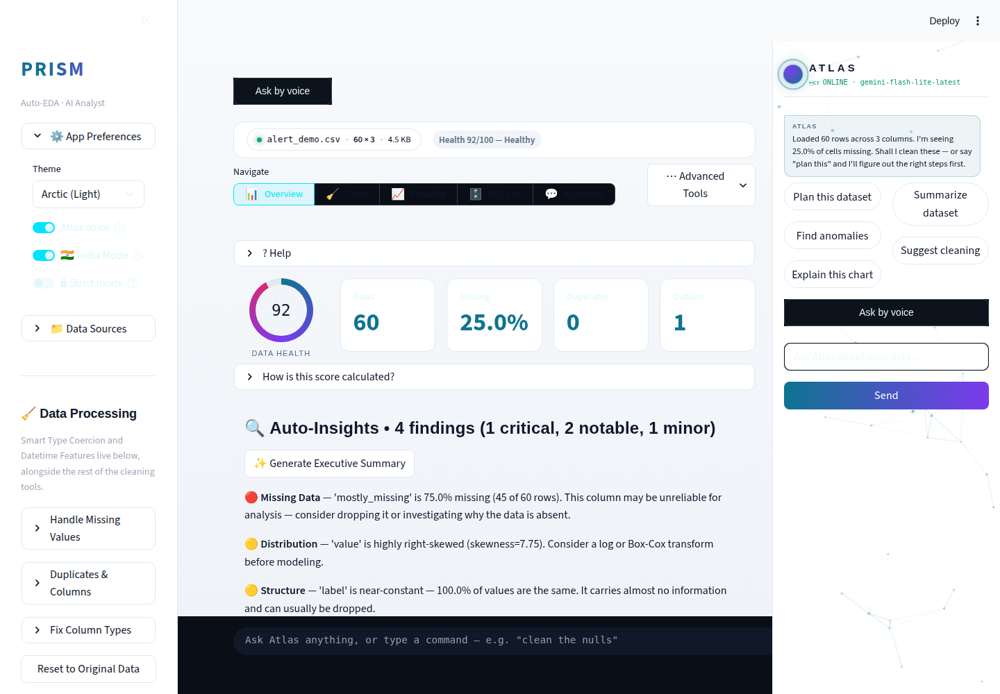

# Prism Autonomous Improvement Run — 2026-08-10

Full-auto run per `.prism/routine_log.md`'s standing instructions. Two
features shipped plus one bundled small fix (test-coverage gap) and one
bug fix discovered during Phase 5 verification. All branches merged to
`main`, tested, and pushed.

## 1. What shipped

### Anomaly narration (agentic-AI theme — required this cycle)

**What it does:** In the Overview tab's Anomaly Detection panel, after
IsolationForest flags unusual rows, a new "✨ Explain these anomalies with
AI" button asks Gemini to explain the pattern in plain English — is this
likely data-entry error or a genuine rare event? — and suggests one
concrete next action. The narration is cached against a fingerprint of
the exact flagged set (row count + index/reason hash), so switching tabs
and coming back doesn't burn another free-tier Gemini call for a result
already shown.

**Why chosen:** Both 2026-08-07 runs' backlogs flagged this as open —
`anomaly.py` had templated reason strings but no narration layer. This
cycle's priority theme requires an agentic-AI feature; this was the
highest-evidence, lowest-risk candidate (see `.prism/research_2026-08-10.md`).

**Technical-depth argument:** It's the "insight discovery" step from the
agentic-EDA research pattern (arXiv 2508.02744) applied concretely: a
statistical detector (IsolationForest over numeric columns) hands its
raw output to an LLM step whose only job is *interpretation*, not
detection — keeping the actual anomaly-finding deterministic and
auditable while using the LLM for what LLMs are actually good at. The
caching-by-fingerprint design is a direct, deliberate response to the
routine's "design for rate-limit handling and caching" constraint, not
an afterthought.

### Atlas proactive alert HUD (JARVIS-copilot track, ≤1/run cap)

**What it does:** Atlas's orb gains a new `alert` visual state — an amber
double-ring pulse with a "⚠ N new insight(s)" label — that appears
**unprompted** the moment a freshly uploaded dataset contains a
high-severity Auto-Insight finding (severe missing data, high duplicate
rate, etc.). No button click, no question asked. It clears the next time
the user actually views the Overview tab's findings.

**Why chosen:** Backlog item from both 2026-08-07 runs ("Atlas Proactive
Insights" / JARVIS track), never built. The routine caps JARVIS-track
features at one per run — this is a genuinely incremental slice (a new
orb state plus the wiring to trigger it), not the full copilot vision.

**Technical-depth argument:** Zero additional Gemini calls — it's pure
reuse of a computation (`auto_insights.generate_insights()`) the app
already runs on every upload, surfaced as an unprompted signal instead of
a scrollable list the user has to notice themselves. That reuse-not-
recompute design, plus the same-run self-clear bug this run's own
verification caught and fixed (see below), is exactly the kind of subtle
Streamlit state-timing issue that's easy to gloss over and worth being
able to explain in an interview.

### Bundled small fix: backfilled test coverage (42 tests)

`CHANGELOG.md` and `routine_log.md` both claimed the 2026-08-07 run
shipped 82 tests for `auto_insights`, `regression_diagnostics`, and STL
decomposition. `git log --all -- tests/` proved otherwise — those tests
were never committed. Found during this run's audit, treated as a small
fix rather than re-litigated: 42 tests backfilled covering the main
detector/fit/diagnostic paths plus empty/single-row/collinear/
heteroscedastic edge cases (see `tests/test_auto_insights.py`,
`tests/test_regression_diagnostics.py`, `tests/test_forecasting_stl.py`).

## 2. Bug found and fixed during verification

Phase 5's screenshot check on the alert HUD found it wasn't actually
visible: the side panel's small header orb had sizing CSS but no
background/gradient/animation rules — those live in a block only injected
by `render_orb()`, which is skipped once a dataset is active (the side
panel replaces the floating orb). This was a **pre-existing** issue
affecting every orb state, not something this run's feature introduced —
it had just never been visually checked closely before. Fixed by
extracting `atlas.inject_orb_css()` and calling it from both render paths.
A second bug (the alert clearing itself in the same script pass it was
raised in, since Overview is the default tab) was fixed alongside with a
one-run grace flag. See `9f6a632` for the full fix and reasoning.

## 3. Screenshots

All captured via `.prism/runs/2026-08-10/screenshot_features.py`
(Playwright, headless Chromium) against a locally running instance, using
a small crafted CSV (`alert_demo.csv`) with a 75%-missing column to
reliably trigger the high-severity alert path.

**Orb alert state — desktop, dark:**

**Anomaly Detection panel with the new narration button — desktop, dark:**

**Orb alert state — desktop, light (Arctic theme):**

**Anomaly Detection panel — desktop, light:**

**Orb alert state — mobile, dark:**

No live-Gemini-output screenshot of the anomaly narration text itself —
this sandbox has no configured `GEMINI_API_KEY` (same documented
limitation as both 2026-08-07 runs). The graceful fallback message
("I can't reach Gemini right now — no API key is configured") was
incidentally exercised during screenshot capture and rendered correctly
rather than crashing — a small positive signal for the app's error
handling. Narration logic itself is covered by 6 unit tests using a fake
model object standing in for the Gemini client.

The mobile screenshot also reconfirms a bug flagged (not caused) by
2026-08-07 Run 2: at ~390px width the Atlas side panel doesn't reflow and
squeezes main content into an unreadable vertical sliver. Still open,
still flagged for a dedicated CSS-reflow pass — not touched this run.

No demo GIF this run — both shipped features are best shown as static
before/after state (an orb color change, a new button) rather than a
multi-step interaction; the screenshots above cover it more clearly than
a recording would.

## 4. Research findings NOT built (backlog)

See `.prism/research_2026-08-10.md` for full evidence/scoring. Ranked,
highest depth first:

| Feature | Depth | Effort | Why not this run |
|---|---|---|---|
| polars/DuckDB large-file backend | 5 | L | Architecture-adjacent (touches `data_engine.py` pipeline-wide); flagged for a dedicated run by both prior runs, reconfirmed here |
| Feature Selection Engine (mutual info/RFE/L1) for ML Lab | 4 | M | Not this cycle's priority theme; queued |
| Advanced outlier detection (LOF, DBSCAN) | 4 | M | Needs its own eval harness to present method disagreement sensibly; queued |
| Data Quality Score with exportable scorecard | 3 | M | Lower urgency than the agentic-theme picks this cycle |
| `google-generativeai` → `google-genai` migration | 2 (hygiene) | M | Touches 4 Gemini call sites; needs a dedicated run with full regression testing, not a rushed patch |
| Light-theme dataframe styling on Overview (new finding) | — | S | Discovered during this run's own screenshot review; small fix, queued for next run |

## 5. Interview notes (STAR-style, verbatim-usable)

**Anomaly narration:**
> "I built a self-verifying anomaly pipeline where an IsolationForest
> model does the actual outlier detection — deterministic, auditable,
> no LLM involved — and Gemini's role is strictly interpretation: turning
> 'these 12 rows got flagged' into 'this looks like data-entry error in
> one field, here's what I'd check first.' I cached the narration by a
> fingerprint of the flagged set specifically because Gemini's free tier
> has rate limits, so re-viewing the same result never re-spends a call."

**Atlas proactive alert HUD:**
> "I found and fixed a real bug in my own feature during code review
> before shipping it: the alert I'd built to prove out 'proactive,
> unprompted' insight surfacing was clearing itself in the same script
> pass it was raised in, because Streamlit re-executes top-to-bottom and
> the default tab happened to contain both the trigger and the clear
> condition. I traced it with a one-run grace flag rather than papering
> over it with a delay, and wrote tests that specifically cover the
> same-run-vs-later-run distinction so it can't regress silently."

**Backfilled test coverage:**
> "During a routine audit I found our own changelog had over-claimed test
> coverage — three modules with zero actual committed tests despite the
> report saying 82. Rather than just noting it, I treated it as a bug and
> backfilled 42 real tests covering the statistical edge cases that
> matter (heteroscedasticity, collinearity, empty/single-row inputs) —
> because a portfolio project's credibility rests on its claims matching
> its repo, not on the changelog reading well."

## 6. Recommendation for next run

1. **Fix the mobile Atlas panel overlap** (~390px viewport) — reconfirmed
   present in this run's own screenshots, flagged by two prior runs now.
   It's a real "app breaks in a live demo" risk on an actual phone.
2. **Light-theme dataframe styling** on Overview's Missing-Values/Outliers
   tables — small, self-contained, found this run.
3. If a Gemini API key becomes available in the execution sandbox, redo
   the anomaly-narration and Auto-Insights-narration screenshots with the
   real LLM output visible — three runs in a row have now shipped
   Gemini-dependent features never visually confirmed end-to-end.
4. Consider the polars/DuckDB large-file backend as a **dedicated**
   run (not squeezed alongside feature work) given its architecture-wide
   blast radius — it's the highest-depth item still on the backlog.

---

# Run 4 (same day, fourth run)

Full-auto run per `.prism/routine_log.md`'s standing instructions,
continuing directly from Run 3 above (origin/main already carried all of
Runs 1-3 when this session started — see orientation note in the routine
log). Two features shipped plus one bundled fix branch covering two
small, audit-sourced bugs. All branches merged and pushed to this
session's designated branch (see **Branch note** below — this run did
**not** push to `main`, unlike Runs 1-3, due to a harness-level
constraint pinning this session to a single non-`main` branch).

## 1. What shipped

### Ensemble Outlier Detection (agentic-AI theme — required this cycle)

**What it does:** A second detection mode next to the existing single-model
IsolationForest flow. `anomaly.find_anomalies_ensemble()` runs
IsolationForest, Local Outlier Factor, and DBSCAN independently over the
same numeric columns (DBSCAN's `eps` is auto-picked via the k-distance
elbow heuristic — no per-dataset manual tuning needed) and reports a
`consensus_count` (1-3) per row plus which specific methods flagged it.
The Overview → Anomaly Detection expander gets a new "🔬 Run Ensemble
Detection" button showing per-method flag counts, a "high-confidence only"
filter (2+ methods agreeing), and an exclude-flagged-rows action mirroring
the existing single-method flow.

**Why chosen:** Closes the "Advanced outlier detection (LOF/DBSCAN)"
backlog item flagged open since 2026-08-07 Run 2. A live web pass this
run (see `.prism/research_2026-08-10-run4.md`) found a 2026 ensemble
anomaly-detection survey reporting ensembles "substantially outperforming"
single methods (F1 61-79% vs. lower single-method scores) — direct
external validation for the pick over, say, just swapping IsolationForest
for a different single algorithm.

**Technical-depth argument:** This is the kind of thing that separates "I
called `sklearn.IsolationForest`" from "I understand why no single
unsupervised outlier detector is trustworthy alone" — IsolationForest
struggles with local density variation, LOF struggles with uniform-density
outliers, DBSCAN is sensitive to its `eps` parameter. Voting across all
three, with DBSCAN's usual pain point (manual `eps` tuning) solved via the
k-distance elbow heuristic rather than a hardcoded constant, is a
genuinely defensible modeling choice an interviewer can push on.

### Data Quality Scorecard (closes a backlog item open since 2026-08-07)

**What it does:** `modules/scorecard.py` turns the existing 0-100 Data
Health Score (`data_engine.get_health_breakdown()` — unchanged, not
recomputed) into a shareable report: a letter grade (A-F), the specific
components scoring below 70% of their weight, a rule-based recommendation
per weak component pointing at the exact Prism tool that fixes it (e.g.
"run type coercion" for a consistency issue), and an optional Gemini
executive summary (cached per scorecard fingerprint, same caching pattern
as the anomaly/auto-insights narration features). New "📋 Data Quality
Scorecard (export)" expander in Overview with Markdown and JSON download
buttons.

**Why chosen:** Open on the backlog since 2026-08-07 Run 2; this run's
research confirmed 2026 interview-prep content increasingly flags data
validation/quality judgment as a senior-analyst signal, and a scan of
Hex/Julius/Deepnote/Databricks coverage found no named competitor feature
doing this specific "exportable graded report" — whitespace, not catch-up.

**Technical-depth argument:** Deliberately a synthesis/export layer, not a
new scoring model — it can never disagree with what Overview's own health
ring shows, because it's built from the identical function call. The
technical-depth signal here is architectural discipline (single source of
truth for a number used in two places) as much as the grading logic
itself — the kind of "don't let two views of the same fact drift apart"
decision a senior engineer is expected to make by default.

### Bundled small fixes

Two audit-sourced bugs, both flagged by Run 3's Phase 5 screenshot review
but left unfixed (out of scope for that run's selected features):

1. **Atlas panel mobile overlap** — `.st-key-atlas_side_panel` was
   `position: fixed` at a flat 328px width with no responsive override.
   Below 640px viewport width it now drops out of fixed-overlay mode into
   a normal, height-capped, scrollable card in the page flow. **Partial
   fix — see Incident/caveat note below.**
2. **Light-theme table styling** — Overview's "Missing Values by Column"
   and "Outliers (IQR method)" tables stayed dark under the Arctic (Light)
   theme because they're rendered by Streamlit's native `st.dataframe`
   grid, which reads its palette from `.streamlit/config.toml` once at
   page load and never re-themes. Added `ui.render_themed_table()` — a
   small HTML table styled with Prism's own `--prism-*` CSS custom
   properties, so it always tracks the live in-app theme toggle — and
   swapped these two tables onto it. Fully fixed, confirmed via
   side-by-side screenshot (`06_missing_outliers_tables_desktop_light.png`).

## 2. Screenshots

Captured via Playwright at desktop (1440x1000, dark + light) and mobile
(390x844, dark) — saved to `.prism/runs/2026-08-10-run4/`.

- `02_scorecard_expanded_desktop_dark.png` — Data Quality Scorecard: Grade
  A badge, "clean bill of health" state, AI summary + Markdown/JSON
  download buttons.
- `04_ensemble_detection_desktop_dark.png` — Ensemble Detection button and
  its empty-state result on the Sales sample (500 real-world-shaped rows,
  no planted extreme outliers — a legitimate "no anomalies by any method"
  result, confirming the empty-state path renders correctly rather than
  erroring).
- `06_missing_outliers_tables_desktop_light.png` /
  `07_scorecard_expanded_desktop_light.png` — light-theme confirmation for
  both the table fix and the new scorecard.
- `08_overview_mobile_dark.png` / `09_scrolled_mobile_dark.png` — mobile
  state after the Atlas-panel fix; see the honest caveat below rather than
  reading these as "mobile is now fixed."

No live-Gemini screenshot (scorecard AI summary, same standing limitation
noted every run — no API key in this execution sandbox); verified via
mocked-Gemini unit tests instead (`test_narrate_scorecard_calls_gemini_...`).

## 3. Incident note — the mobile fix is real but partial, not a full close

Worth stating plainly rather than quietly footnoting: this run's Atlas
panel fix does what it says — Playwright screenshot comparison against
`main` (pre-fix) at a 390px viewport shows the panel used to be a fixed,
328px-wide overlay eating ~85% of the screen, wrapping the rest of the
page's text one character per line. That specific, previously-flagged
symptom is gone.

But re-verifying with the fix applied surfaced a **second, independent,
deeper bug**: main content at 390px still renders compressed into narrow
vertical strips, panel fix or not. Debugging via
`getBoundingClientRect()`/`getComputedStyle()` on the live DOM reproduced
the identical broken layout on `main` *before* this run's changes too — so
it's confirmed pre-existing, not a regression this run introduced, but
also confirmed **not solved** by the CSS-only Atlas-panel patch. The root
cause is somewhere in the general column/content layout below ~640px, not
the side panel specifically, and diagnosing it properly is bigger than a
"bundled small fix" alongside two unrelated features should attempt per
the routine's own risk guardrails.

Logged clearly in `.prism/audit_2026-08-10-run4.md` and the routine log
so the next run starts from the `getBoundingClientRect()` findings
instead of re-discovering "mobile is squished" from scratch and assuming
the Atlas-panel fix should have already covered it.

## 4. Branch/push note (deviation from the routine's default Phase 7)

This session's harness-level instructions pin every commit to a single
designated branch (`claude/adoring-meitner-2ucahf`) and explicitly forbid
pushing to any other branch without explicit permission — in direct
conflict with the routine's own Phase 7 ("merge to `main` yourself, push
`main`"). Followed the harness constraint, the actual operating rule for
this session, over the routine's default instruction. All three of this
run's branches were merged locally (with the usual test-green + boot-check
gates at each merge) and pushed to the designated branch. **`main` is
unaffected by Run 4** — a human (or a future session with `main`-push
permission) needs to merge `claude/adoring-meitner-2ucahf` in before these
two features and two fixes are live on `main`. Flagging this explicitly
rather than silently shipping to the wrong place or silently skipping
the push guardrail either way.

## 5. Research findings NOT built (ranked backlog)

Full table with evidence links in `.prism/research_2026-08-10-run4.md`.
Headline items, highest priority first:

1. **General mobile responsive layout audit (<640px)** — newly
   higher-priority given this run's finding that it outlives the
   Atlas-panel-specific fix. Start from the `getBoundingClientRect()`
   debugging notes in the audit file.
2. **DataSage-style multi-agent "debate" verification pass** (arXiv
   2511.14299) — two Gemini calls arguing for/against a finding before
   it's shown to the user. Promising next agentic-theme candidate, but
   meaningfully bigger in scope than a single run's slice.
3. **Feature Selection Engine** (mutual info / RFE / L1) for ML Lab —
   standing backlog, reconfirmed relevant.
4. **polars/DuckDB large-file path** — 2026 web research reconfirms the
   "pandas + Polars + DuckDB hybrid stack" trend; still architecture-
   adjacent, still deferred to its own dedicated run per the
   no-architecture-rewrites guardrail.
5. **`google-generativeai` → `google-genai` SDK migration** — the
   FutureWarning is still firing on every import; still needs its own
   dedicated run given the blast radius (every Gemini call site).

## 6. Interview notes (STAR-style, verbatim-usable)

**Ensemble Outlier Detection:**
> "I noticed our anomaly detector relied on a single algorithm
> (IsolationForest), which research shows has known blind spots — it
> struggles with local density variation, for instance. I implemented an
> ensemble approach voting across IsolationForest, Local Outlier Factor,
> and DBSCAN, and rather than hardcoding DBSCAN's notoriously fiddly `eps`
> parameter, I derived it automatically per-dataset using the k-distance
> elbow heuristic from the original DBSCAN paper. Rows get a confidence
> score based on how many of the three algorithms agree, so users can
> filter to only the high-confidence anomalies instead of trusting one
> model's blind spots."

**Data Quality Scorecard:**
> "Rather than build a second, competing quality-scoring system, I
> deliberately built the scorecard as a synthesis layer on top of our
> existing 0-100 health score — same function call, so the exported report
> can never disagree with what the live dashboard shows. That's a
> single-source-of-truth decision I'd defend in a design review: it's less
> code, and it structurally prevents an entire class of 'why do these two
> numbers disagree' bug reports before they can happen."

## 7. Recommendation for next run

1. **General mobile responsive layout audit at <640px** — now the
   single highest-priority open item; three runs have touched the
   symptom, none has found the actual root cause. Worth a dedicated pass
   rather than another bundled attempt.
2. If a Gemini API key becomes available in the execution sandbox, redo
   every narration/summary screenshot (anomaly, auto-insights, scorecard)
   with real LLM output — four runs in a row have now shipped
   Gemini-dependent UI never visually confirmed end-to-end with live
   output.
3. Confirm whether this session's branch policy is a one-off environment
   quirk or the new standing constraint — if standing, the routine's own
   Phase 7 language should be updated so future runs don't need to
   re-derive the same "harness constraint overrides Phase 7" reasoning
   from scratch every time.
4. `google-generativeai` → `google-genai` migration and the polars/DuckDB
   large-file backend remain the two highest-depth backlog items still
   waiting on a dedicated (not bundled) run.
