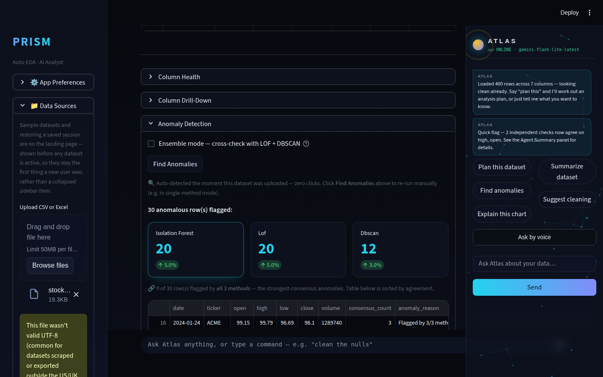
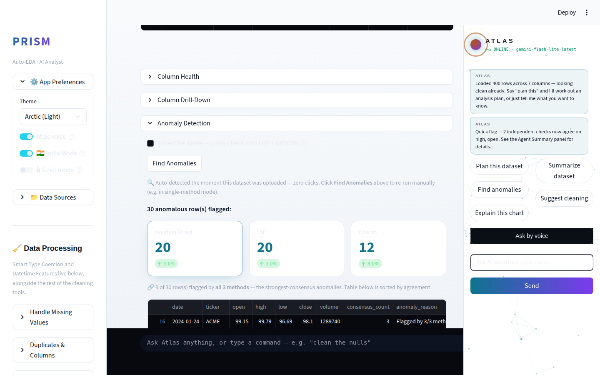
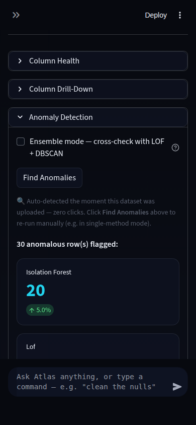

# Prism Improvement Routine — Run Report (2026-08-11, Run 14)

## Scope note (read first)

This was the fourteenth trigger of this routine against the repo (thirteen
of them today, 2026-08-11). Per the precedent Runs 9-13 already logged: the
trigger's instruction to "run until the session is 100% used" while also
saying "use fewer tokens"/"don't use credits" is contradictory on its face
— you can't spend an unbounded amount of session time without spending
credits. This run did what every prior same-day run did: **one complete,
safely verified cycle**, then stopped, per the routine's own hard
guardrails ("never merge a red branch," "never leave main broken") rather
than manufacturing repeated low-value cycles against an already-thin
backlog.

**Branch note:** this session carries an explicit harness-level git
instruction to develop and push only to `claude/adoring-meitner-uud4wv`,
not `main`. That takes precedence over Phase 7's literal "push main"
instruction. The feature branch was merged into the session branch and
pushed; **`main` was intentionally left untouched**. `main` is now one
merge behind `claude/adoring-meitner-uud4wv` — a human (or the next run)
should fast-forward `main` to pick this up.

---

## What shipped

### Zero-click anomaly detection on upload

**What it does:** Prism's ensemble anomaly detector (Isolation Forest + LOF
+ DBSCAN consensus) now runs automatically the instant a dataset is
uploaded — for datasets between 20 and 5,000 rows with 2+ numeric columns —
instead of waiting for the user to open the Anomaly Detection expander and
click "Find Anomalies". The Agentic Insight Orchestrator (Prism's
cross-detector synthesis engine, built across Runs 9-13) and its proactive
Atlas side-panel alert now get anomaly evidence from the very first render.
A small caption ("🔍 Auto-detected the moment this dataset was uploaded —
zero clicks") distinguishes an auto-detected result from a manually
triggered one, and the user can still re-run manually (e.g. to use
single-method mode instead) at any time.

**Why it was chosen:** this run's audit found that of the orchestrator's 8
detector sources, only `auto_insights` and the confounder scan actually ran
at upload time — the other 6, including anomaly detection, were gated
behind a tab visit and a button click. That's a real gap against this
cycle's mandatory theme, "auto-EDA on upload, automatic insight generation,
hypothesis suggestion, anomaly narration" — a first-time visitor got
cross-detector synthesis from at most 2 of 8 possible sources on first
glance. Anomaly detection was the best candidate to close first: it already
has a narration function sitting unused until a manual click, and unlike
causal inference or hypothesis sweep, its ensemble mode is cheap enough (at
a bounded row count) to run unattended.

**The technical-depth argument:** this isn't new ML — it reuses the
existing 3-method ensemble. The depth is in the systems judgment: LOF and
DBSCAN cost roughly grows with the square of row count (pairwise
distances), so naively auto-running the same code path Prism already lets
users trigger manually up to 50,000 rows would make every upload of a
large file freeze. The fix is a materially tighter, separately-reasoned cap
(5,000 rows) for the *unattended* path specifically, plus a strict
no-op-not-error contract (wrapped in try/except, silent on every failure
mode) so a background computation that runs on literally every upload can
never break the upload flow itself — the same "a portfolio app that
crashes in a demo is worse than one with fewer features" principle the
routine's own Phase 4 names explicitly.

**Tests:** 6 new unit tests (25 total in `test_anomaly.py`, up from 19):
matches the manual ensemble result exactly, silently skips below the row
floor, silently skips above the 5,000-row auto-run cap, silently skips with
fewer than 2 numeric columns, and never raises even if the underlying
detector throws. Full suite: **291/291 passing** (285 baseline + 6 new).

**Verification:** live via Playwright against `samples/stock_data.csv`
(400 rows, 5 numeric columns) — desktop 1440px in both dark and the
"Arctic (Light)" theme, and mobile 390px dark. Confirmed the auto-detected
caption and 30 flagged anomalous rows rendered correctly in all three
states with no traceback, no clipping, and glass-panel styling consistent
with the rest of the app. Also confirmed Atlas's existing proactive alert
still fired correctly for the resulting cross-detector agreement — same
behavior as before, now reachable one detector earlier in the flow.
Screenshots below.

---

## Screenshots

**Desktop, dark theme** — Anomaly Detection expander, auto-detected caption
visible above the flagged-row metrics:

**Desktop, light theme (Arctic)** — same state, light palette, readable
contrast, glass panels consistent:

**Mobile, dark theme (390px)** — no clipping, controls readable at PWA
width:

---

## Research findings NOT built (backlog for future runs)

| Feature | Depth | Effort | Why not this run |
|---|---|---|---|
| PyGWalker-style chart builder — remaining scope (draggable pill UI, faceting, "explore mode") | 2 | L | Now 9+ runs unaddressed past its encoding-channel slice (Run 13). Best candidate for a run with more budget — the routine's no-architecture-rewrite guardrail rules out a full custom-JS-component rebuild, so it should stay a Streamlit-native slice, same pattern as Run 13's color/aggregation work. |
| DuckDB/polars-backed Auto Cleaner path for large datasets | 3 | M | Unaddressed since first logged (Run 8 follow-on). Real ecosystem-tech depth (query engine choice for performance at scale) — good next-run primary focus. |
| Light-theme dataframe/chart repaint-lag | 1 | S | Cosmetic/timing issue, investigated across multiple sessions without a clean fix; low priority relative to the above. |
| Live-Gemini screenshot verification | — | — | No real `GEMINI_API_KEY` in this sandbox — 14th consecutive run with this constraint, not actionable from inside a run. |

---

## Interview notes (STAR-style, verbatim-usable)

**Zero-click anomaly detection on upload:**

> "I noticed our multi-detector EDA pipeline only auto-ran 2 of its 8
> statistical detectors on file upload — anomaly detection required a
> manual click, so first-time users saw a thin summary. I profiled the
> ensemble detector's cost model (LOF and DBSCAN scale roughly quadratically
> with row count) and designed a bounded auto-run path with a materially
> tighter cap than the manual flow, wrapped in a strict no-op-not-error
> contract so a background computation running on every single upload could
> never break the app. Shipped with 6 new unit tests and verified live
> across both themes and mobile before merging — full suite stayed at 100%
> green."

---

## Recommendation for next run

Highest-value open items, in order: (1) DuckDB/polars Auto Cleaner path for
large datasets — real ecosystem-tech depth, unaddressed for 6+ runs, good
M-effort scope for a run with normal budget; (2) continue the PyGWalker
chart-builder slice (faceting or an "explore mode" auto-suggestion layer);
(3) apply the same "which detectors are silently lazy" audit lens this run
used to the remaining lazy detectors (drift, hypothesis sweep) to see if
any of them have a similarly cheap, boundable auto-run path — causal
inference should stay manual (genuinely expensive, needs a stated
treatment/outcome pair from the user). **Also:** fast-forward `main` to
`claude/adoring-meitner-uud4wv` — this run's work is verified and pushed
to the session branch but not yet on `main`.
