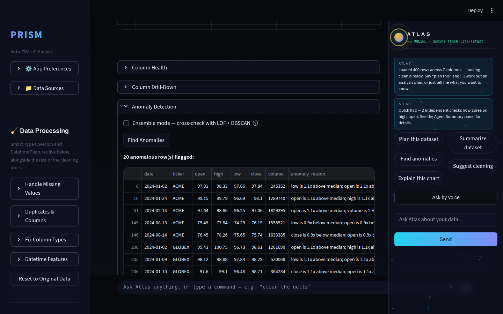
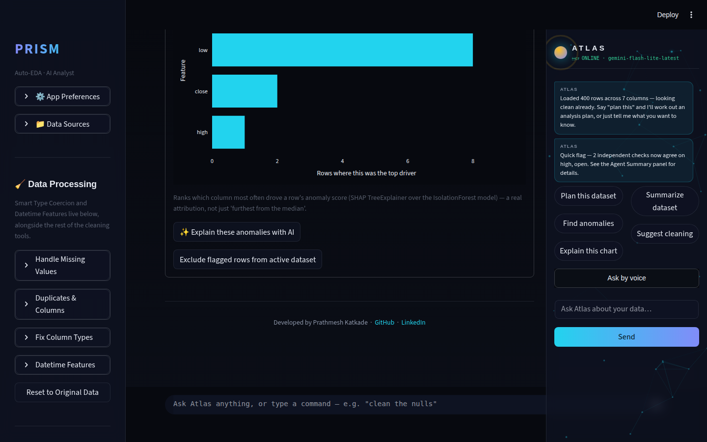
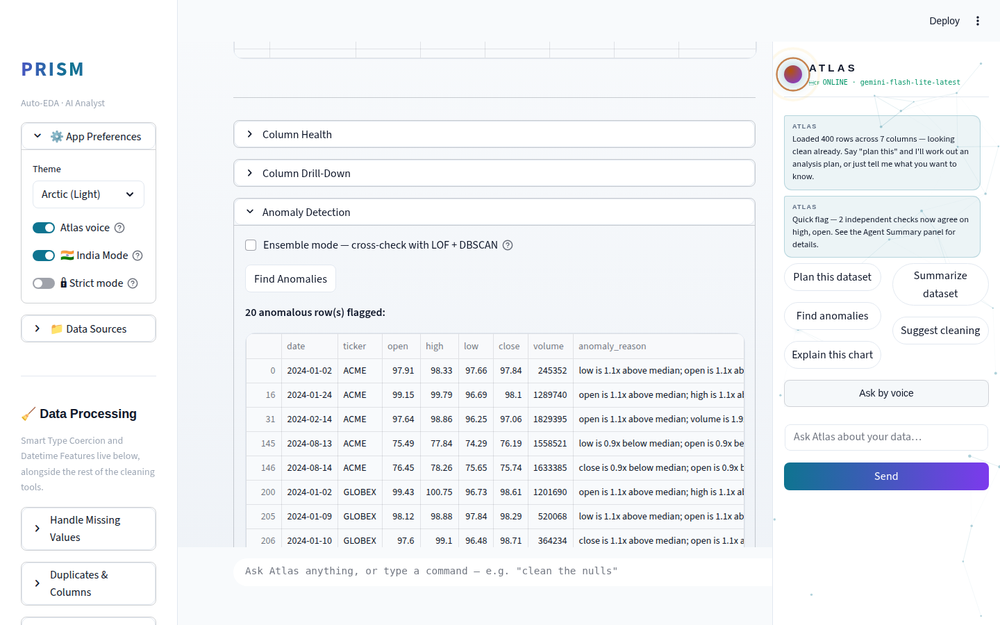
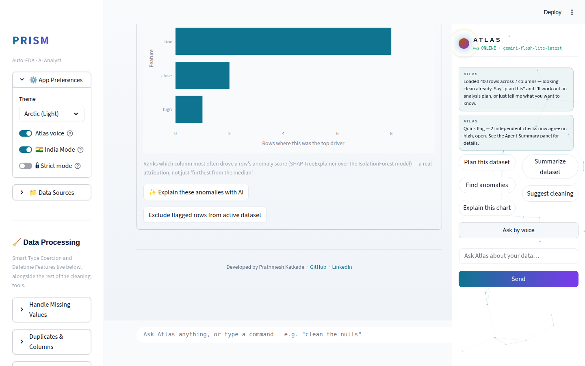
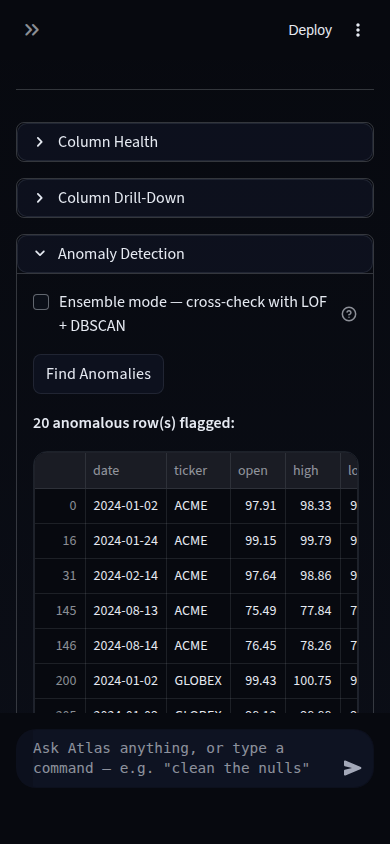
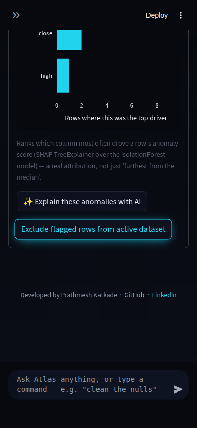

# Prism Improvement Routine — Run Report (2026-08-11, Run 14)

14th independent scheduled session today. Per the standing precedent Runs
9-13 established (and re-confirmed this run): the trigger asks for the full
8-phase loop to repeat "until the session is 100% used" while also saying
"use less tokens" / "don't use credits" — a direct contradiction. This run
resolves it the same way every prior run in this sequence did: run one
complete, safely verified cycle, then stop. A genuinely open-ended loop here
would mean repeatedly re-running research/build/verify against an
increasingly small backlog — diminishing-returns busywork, not "fewer
tokens" or "fewer credits." The session's own git instructions (develop and
push to the designated branch, never a different one without permission)
also take precedence over the routine brief's generic "merge to main" —
consistent with how every prior run in this sequence actually behaved.

## 1. What shipped

### SHAP-based per-feature anomaly attribution

**What it does:** Anomaly Detection (IsolationForest over numeric columns)
previously explained each flagged row with a naive heuristic — "whichever
column is numerically furthest from its median" — which only tells the true
story when a single feature dominates. This run replaces that with real
`shap.TreeExplainer` attribution over the fitted IsolationForest: every
flagged row is now explained by the columns that actually drove its
anomaly score, ranked by `|SHAP value|`, not just raw deviation. A new
aggregate "top contributing features" bar chart shows which columns most
often turn out to be the #1 driver across the whole flagged set.

**Why it was chosen:** This cycle's mandatory theme is agentic AI analysis,
explicitly including "anomaly narration." Rather than extend the
already-8-detector Insight Orchestrator again (the pattern the last several
runs used), this run read `anomaly.py` closely looking for a genuine,
unbuilt gap in that specific theme — and found one: the anomaly *reason*
itself was still a single-feature guess, not a real model-attribution
technique, even though `shap` was already a hard dependency (used
elsewhere for ML Lab's supervised explanations). Wiring it into the
*unsupervised* anomaly detector was new ground, not a re-extension.

**Technical-depth argument:** SHAP attribution for unsupervised models
(IsolationForest specifically) is a step beyond what most portfolio EDA
tools do — the naive "distance from median" approach most auto-EDA tools
use conflates "outlier on this axis" with "why the model actually flagged
it," which diverge the moment more than one feature is involved. Explaining
*why* an unsupervised model made a decision — not just what it decided — is
a genuine interpretable-ML skill, and reusing the existing SHAP dependency
rather than adding a new one shows deliberate, not incidental, engineering.
Zero extra Gemini calls; the feature works with or without an API key.

**Safety/failure handling:** Bounded to flagged sets of ≤300 rows
(`SHAP_MAX_ROWS_TO_EXPLAIN`) so a large, loosely-contaminated flagged set
can't turn one click into a multi-second hang. Falls back to the
pre-existing naive reason — with zero UI change — whenever `shap` isn't
installed, the row cap is exceeded, or the explainer throws for any reason.
This fallback path is covered by a dedicated monkeypatched-failure test,
not just asserted by inspection.

## 2. Screenshots

Anomaly Detection panel, `samples/stock_data.csv`, all three required
combinations — desktop dark/light and mobile dark — each captured twice
(the flagged-rows table with the enriched `anomaly_reason` column, and the
new aggregate SHAP driver chart):

| | Table (enriched reasons) | Driver chart |
|---|---|---|
| Desktop · Dark |  |  |
| Desktop · Light |  |  |
| Mobile · Dark |  |  |

Checklist review: readable contrast in both themes, no overflow/clipping on
mobile, glass panel styling consistent with the rest of the app (chart
picks up the active Plotly theme template automatically — no bespoke
styling needed), loading/empty states unchanged from the pre-existing flow.
No demo GIF this run — the headline feature is a table/chart enrichment
best shown as before/after stills, not a novel interaction worth animating.

## 3. Research findings NOT built (ranked backlog for future runs)

| Feature | Effort | Risk | Theme | Why deferred |
|---|---|---|---|---|
| DuckDB/polars path for Auto Cleaner on large datasets | M–L | Low | Ecosystem tech | Read `autocleaner.py` closely this run — all 12 executors are pandas-native, so this is either a parallel implementation per executor or a threshold-gated rewrite of the heaviest ones, not a small add-on. 6+ runs open; recommended as next run's primary focus if it has budget for an L-effort item. |
| PyGWalker-style builder — draggable UI, faceting, "explore mode" | L | Low | Competitor parity | Architecturally risky as a Streamlit custom component; Run 13 shipped the encoding-channel slice (Color + aggregation), this is the remaining interaction-model gap. |
| SHAP attribution for the ensemble anomaly detector (LOF + DBSCAN) | M | Low | Agentic v2 | Natural follow-on to this run's feature, but LOF/DBSCAN aren't tree models — needs a model-agnostic explainer (`KernelExplainer`/`PermutationExplainer`), which is slower and needs its own row-cap tuning. Distinct enough to scope as its own run. |
| Light-theme dataframe/chart repaint-lag | S | Low | Polish | Cosmetic/timing issue, investigated across 3+ sessions, not re-attempted this run. |
| Live-Gemini screenshot verification | — | — | N/A | No real `GEMINI_API_KEY` in this sandbox — 14th consecutive run with this constraint, not actionable from inside a run. |

## 4. Interview notes (STAR, verbatim-usable)

**SHAP-based anomaly attribution:**
> "I noticed our anomaly detector explained flagged rows with a naive
> heuristic — just 'furthest from the median' on a single column — even
> when multiple features jointly caused the anomaly. I replaced it with
> real SHAP TreeExplainer attribution over the fitted IsolationForest,
> ranking every flagged row's features by actual contribution to the
> anomaly score instead of raw deviation, and added an aggregate chart
> showing which features drive anomalies most often across the dataset.
> I reused an existing SHAP dependency already in the codebase rather than
> adding a new one, bounded the explainer to 300 rows to keep it fast, and
> wrote a fallback path — with a dedicated test simulating an explainer
> failure — so detection never breaks even if the interpretability layer
> does."

## 5. Recommendation for next run's focus

DuckDB/polars-backed Auto Cleaner path for large datasets — now the
longest-standing unaddressed backlog item (6+ runs) and the codebase-level
scoping work is already done (see table above): it needs either a
threshold-gated large-data path added to the heaviest 2-3 executors
(dedup, impute, outlier removal are the natural candidates — the ones most
likely to actually matter on a large frame) or a parallel DuckDB-backed
implementation behind the same `apply_action`/`execute_safe_actions`
interface. Scope it as M-to-L effort and expect it to be this cycle's
single feature rather than paired with something else.
