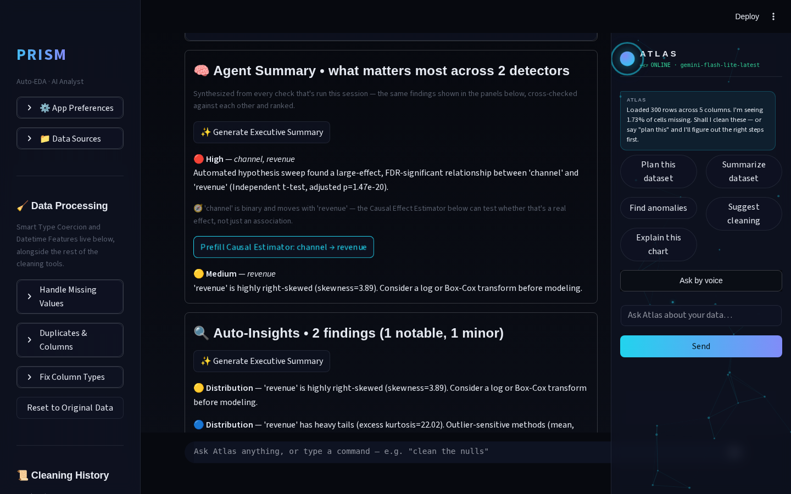
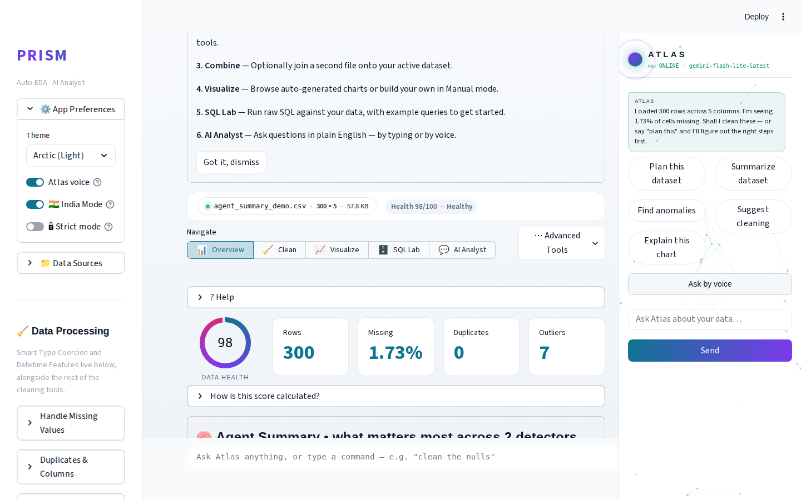
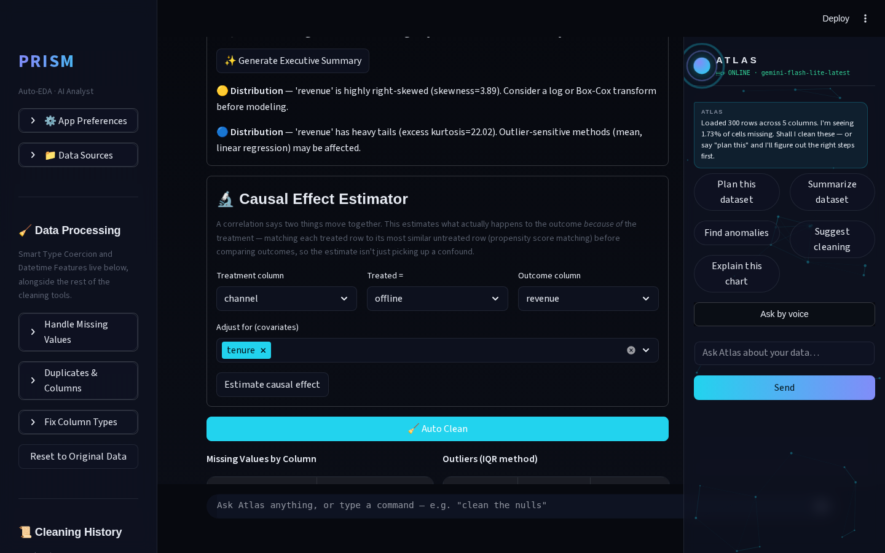
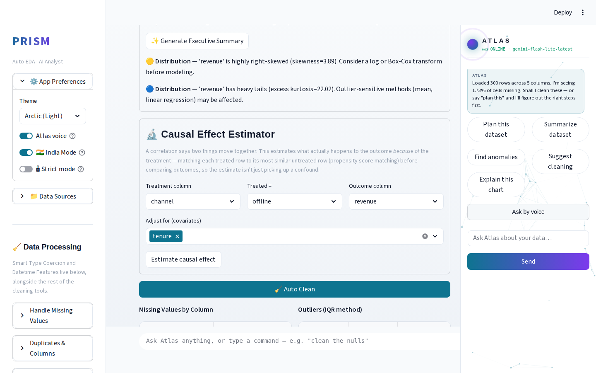
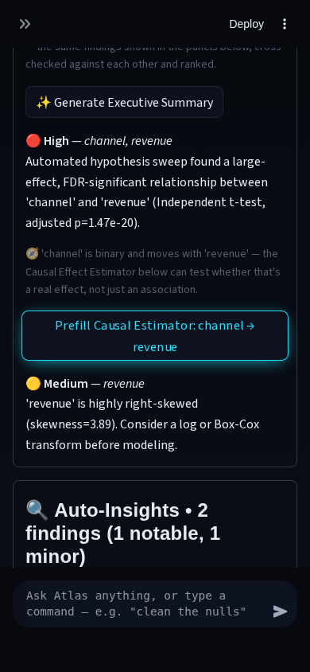
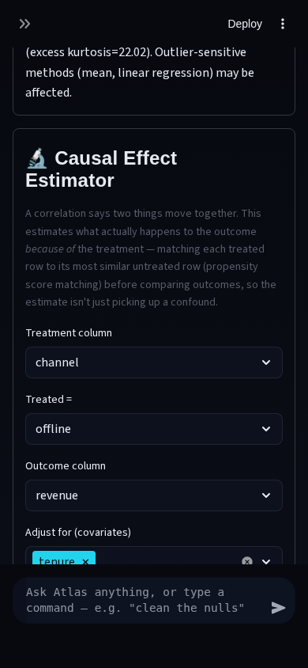

# Prism Autonomous Improvement Routine — Run 25 (2026-08-11)

## What shipped

**Agent Summary → one-click "recommended next step."**

Prism's Agent Summary panel (`modules/insight_orchestrator.py`) already
synthesizes findings across every detector that's fired in a session —
Auto-Insights, Confounder Check, the Causal Effect Estimator, Anomaly
Detection, Drift, and the Hypothesis Sweep — de-duplicating overlapping
claims, flagging cross-detector agreement/contradiction, and ranking the
result into a "what matters most" top-5 list. Until this run, that list
was read-only: it told you what mattered but not what to do about it, so
acting on a finding meant scrolling to the right panel and re-picking the
same two columns by hand.

New `suggest_next_step(group, column_types, binary_columns)` closes that
loop with two rule-based routes, no Gemini call:

1. **A binary/numeric pair some detector already flagged as related, with
   no causal estimate yet** → a "Prefill Causal Estimator: X → Y" button
   that sets `causal_treatment_col`/`causal_outcome_col` in
   `st.session_state` *before* the Causal Effect Estimator's own
   selectboxes are instantiated later in the same script pass — the same
   widget-preload pattern Run 23's Explore Mode click-through and Auto
   Analyst's Stats Lab hand-off already established. The estimator
   renders on the same Overview tab, so this is a same-page prefill, not
   a tab jump.
2. **A pair the automated hypothesis sweep flagged as still significant
   after Benjamini-Hochberg FDR correction** → an "Open in Stats Lab"
   button, prefilling `stats_col_a`/`stats_col_b` and jumping tabs via
   the existing `st.session_state.jump_to_tab` mechanism.

## Why this feature, and why now

This cycle's mandatory theme is agentic AI analysis, and Run 24 closed
the last well-scoped non-cosmetic backlog item, triggering this
routine's own rule to run a fresh Phase 2 web sweep rather than reuse old
research (`.prism/research_2026-08-11-run25.md`). That sweep converged
on the same point from three independent angles: competitor tools (Hex,
Deepnote, Julius, ChatGPT-ADA) differentiate on *proactively suggesting
what to run next*, not just running what's asked; recent agentic-EDA
papers (DataSage, QUIS) frame "routing findings into concrete next
actions" as the differentiator over a flat findings list; and reading
Prism's own orchestration code confirmed the gap was real — there was no
`action` or `next_step` field anywhere in the `Claim`/`ClaimGroup` shape,
and no button under the Agent Summary's ranked list.

## A design mistake caught before shipping

My first draft gated the causal-estimator suggestion to `auto_insights`/
`confounder` claims specifically, on the assumption those detectors would
sometimes flag a binary/numeric pair. Live Playwright verification against
a real dataset immediately falsified that: `auto_insights`'s correlation
sweep and `confounder_detection`'s stress-test are **both numeric-numeric
only** (confirmed by reading `modules/auto_insights.py`'s `corr()` loop
directly) — a binary column can only reach the orchestrator as a subject
via the Hypothesis Sweep's categorical-vs-numeric tests. The first draft's
Rule 1 was dead code that could never fire in the real app, and my first
synthetic test fixture (which hand-built an `auto_insights` claim with a
binary/numeric pair) would have shipped that bug silently, since it never
exercises the real adapter path. I widened the rule to be detector-
agnostic (any claim group with the right subject *shape*, not a specific
source) and added a regression test,
`test_suggest_next_step_causal_followup_reachable_from_hypothesis_sweep_alone`,
that goes through the real `hypothesis_sweep` adapter — the test that
would have caught this the first time.

## Technical-depth argument

- **Rule-based, not hand-wavy**: the routing logic is a pure function
  over already-computed `Claim`/`ClaimGroup` objects — fully unit-
  testable without pandas, Streamlit, or a Gemini call in the loop.
- **Mirrors the target widget's own render gate**: the causal-estimator
  route checks `total_numeric >= 2` (the same condition
  `app.py`'s Causal Effect Estimator panel gates its own rendering on)
  so it never prefills a widget that isn't actually on the page for that
  dataset shape — a subtlety only visible by reading the consuming code,
  not just the producing code.
- **Reachability was actually verified, not assumed**: the bug above is
  the kind of thing that looks fine in a code review and only breaks in
  production. Catching it via live browser automation against synthetic
  data (rather than trusting hand-built test fixtures) is the same
  discipline a data-science interview panel would be probing for when
  they ask "how do you know your pipeline actually produces this output
  on real data, not just in your test mocks?"
- **No new dependencies, free, and rate-limit-safe**: zero Gemini calls
  added — the whole feature is deterministic Python.

## Verification

- **Tests**: 6 new tests in `tests/test_insight_orchestrator.py`
  (causal-followup for a binary/numeric pair, suppression once a causal
  estimate already covers the exact pair, Stats Lab fallback for a
  numeric-numeric sweep pair, the single-subject-group no-op case, the
  no-binary-column no-op case, and the hypothesis-sweep reachability
  regression guard). Full suite: 454 → **460/460 green**, zero
  regressions.
- **Live Playwright verification**, 4 combinations, all green, zero
  console errors: uploaded a synthetic 300-row dataset with a genuine
  binary (`channel`) / numeric (`revenue`) relationship, ran the
  Hypothesis Sweep on Stats Lab, returned to Overview, clicked the
  suggested button, and confirmed the Causal Effect Estimator's
  Treatment/Outcome selects read back `channel` / `revenue` with
  `tenure` pre-populated as a covariate.

| Desktop · Dark | Desktop · Arctic (Light) |
|---|---|
|  |  |
|  |  |

| Mobile (390px) · Dark |
|---|
|  |
|  |

Supporting screenshots (Stats Lab, sweep result) are in
`.prism/runs/2026-08-11-run25/`.

Streamlit was launched fresh and confirmed serving (HTTP 200, no
traceback) before and after the verification pass. `.env`/secrets
hygiene re-checked — `.gitignore` still covers `.env*`; nothing touched
this run.

## Not built this run (backlog for future runs, ranked)

1. **Question-guided insight generation** (QUIS-style: user names a
   question, Prism plans and runs the analysis) — highest depth (5/5) of
   this run's candidates, but Large effort and needs a new planning
   layer; a natural Run 26+ candidate if the team wants to go deeper on
   the agentic theme again.
2. **"Not valid UTF-8" false-positive banner** on some clean ASCII/UTF-8
   CSVs — found during this run's audit (`.prism/audit_2026-08-11-run25.md`),
   confirmed independently that the file *does* decode as UTF-8. Cosmetic/
   confusing in a demo, not a data-correctness bug. Small, well-scoped
   fix for a future run.
3. **Light-theme repaint lag** — cosmetic, app-wide, long-standing
   backlog item, still not this run's priority (depth-over-polish rule).
4. **Polars-backed fast path for very wide datasets** — real ecosystem
   signal from this run's research sweep, but medium risk (a second
   dataframe engine to maintain alongside the existing DuckDB path) and
   no concrete user-facing gap identified yet to justify it.
5. **Atlas/JARVIS voice+HUD maturity slice** — explicitly capped at one
   slice per run by the routine's own guardrail; not touched this run.

## Interview notes (STAR-style, verbatim-usable)

> **Situation**: Prism's cross-detector "Agent Summary" synthesized
> findings from six independent statistical/ML detectors into one ranked
> list, but the list was read-only — acting on a finding meant manually
> renavigating and re-selecting the same columns in another panel.
> **Task**: Design a way to turn each ranked finding into a concrete,
> one-click next action without adding latency, cost, or a new LLM
> dependency. **Action**: I wrote a pure, rule-based routing function
> over the app's existing normalized `Claim`/`ClaimGroup` data that maps
> a finding's column-type shape (e.g., "one binary column, one numeric
> column, no causal estimate yet") to the single most relevant existing
> tool, then wired it to prefill that tool's own widgets via
> Streamlit's session-state-before-instantiation pattern. When my first
> design (gated to specific "correlation-shaped" detectors) turned out to
> be unreachable in practice — I'd assumed a detector could produce a
> pairing it structurally never does — live browser verification against
> synthetic data caught it before it shipped, and I widened the rule and
> added a regression test that exercises the real code path instead of a
> hand-built fixture. **Result**: 6 new unit tests, a full 460/460 green
> suite, and a verified live flow across 4 desktop/mobile × dark/light
> combinations, shipped with zero new dependencies and zero added Gemini
> calls.

## Recommendation for Run 26

Two reasonable directions, both well-scoped: (a) the small "not valid
UTF-8" false-positive fix from this run's audit, if a quick portfolio-
polish pass is wanted; or (b) start scoping the question-guided insight
generation feature (item 1 above) as a Medium-sized slice — e.g., a
fixed menu of 5-8 canned "what would you like to know" questions mapped
to existing detectors first, before attempting free-form question
planning, to keep it inside Gemini free-tier limits and this routine's
own "ship a working slice, not the whole vision" discipline.
