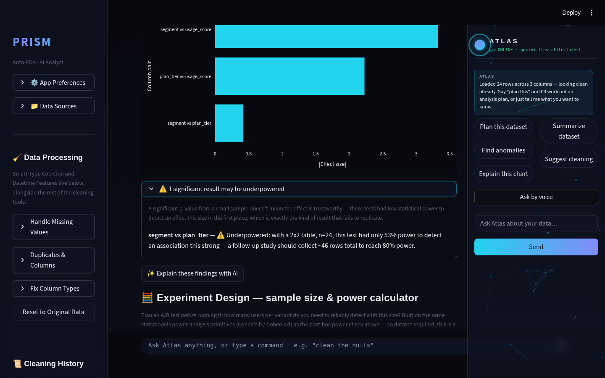
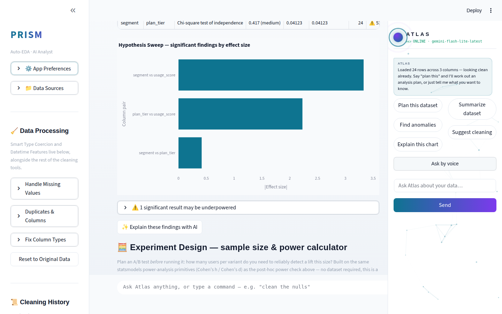
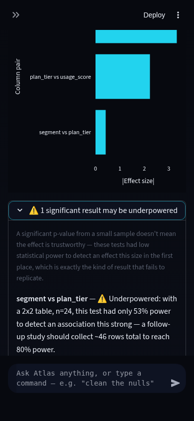

# Prism Autonomous Improvement Routine — Run 26 Report
**Date:** 2026-08-11

## Git policy note

This session's harness instructions pin development to a pre-assigned
branch, `claude/adoring-meitner-rmdy26` (branched from `origin/main`'s
Run 25 tip, commit `9780376`), and explicitly forbid pushing to a
different branch without permission. That overrides this routine's usual
"merge to `main`" step for this run only. All work happened on
`feature/chi2-power-check`, merged into `claude/adoring-meitner-rmdy26`
with `--no-ff`; **`main` was not touched.** A maintainer can fast-forward
or PR-merge `main` from this branch when ready.

## 1. What shipped

### Chi-square post-hoc power checks in Hypothesis Sweep

**What it does:** Hypothesis Sweep (Prism's automated, FDR-corrected
multi-test scan) already flagged underpowered *t-test* findings — "this
result was significant, but did the test even have enough data to
reliably detect an effect this size?" This run extends that same check
to **chi-square tests of independence** (categorical × categorical
pairs), which previously got `power_check: None` unconditionally.

**Why chosen:** Run 25's own routine log explicitly named this as the
cleanest next step — a scoped, low-risk extension of a pattern already
proven correct for t-tests, rather than a new open-ended feature. A
quick research check confirmed chi-square/contingency-table testing
remains a commonly named skill in 2026 data-analyst interview
guides, alongside t-tests and ANOVA.

**Technical-depth argument:** Cramer's V (the effect size Prism already
stores for chi-square rows) is *not* enough on its own to compute power —
it's normalized by `min(rows, cols) - 1`, which erases the contingency
table's actual degrees of freedom whenever the table isn't square. This
implementation recovers Cohen's w (`w = V * sqrt(min(rows,cols)-1)`) and
feeds it to statsmodels' `GofChisquarePower` with `n_bins = dof + 1`
(`dof = (rows-1)*(cols-1)`) — the correct way to encode a contingency
table's degrees of freedom for that function, verified against the
standard textbook reference (`pwr.chisq.test(w=0.3, df=1, power=.8)` ≈ 88
rows; this implementation computed 87.2, matching statsmodels' own
noncentral-chi-square approximation to within rounding). This is exactly
the kind of "don't just report the number, know why the formula is
correct" reasoning a data-scientist interview panel probes for.

ANOVA power was deliberately **not** built this run — `FTestAnovaPower`
needs a single per-group `nobs`, which real (often-skewed) group sizes
don't cleanly provide; approximating it would silently misstate power
for the common case of unbalanced categories. Logged as the explicit
next follow-on rather than guessed at.

**Agentic-AI-analysis theme:** satisfied the same way Run 25's t-test
half did — this is an automatic follow-up question the sweep asks about
its *own* significant findings (self-verification), not a manually
triggered calculator. No Atlas/JARVIS-track work this run.

## 2. Verification

- **Tests:** 23 new (12 `tests/test_experiment_design.py`, 11
  `tests/test_hypothesis_sweep.py`). Full suite: **486 → 501 passing,
  zero regressions.** Chi-square test fixtures use fixed-count
  contingency tables (e.g. a 9:3/3:9 2×2 split) rather than
  random-threshold association, so significance and power are
  deterministic across CI runs, not RNG-dependent.
- **Live verification (Playwright):** uploaded a planted 2×2 CSV
  (segment × plan_tier, n=24, Cramer's V=0.417) through the real running
  app, ran Hypothesis Sweep, and confirmed the underpowered-findings
  panel read:

  > **segment vs plan_tier** — ⚠️ Underpowered: with a 2x2 table, n=24,
  > this test had only 53% power to detect an association this strong —
  > a follow-up study should collect ~46 rows total to reach 80% power.

  This matches the unit test's independently computed reference value
  exactly.
- **Screenshots** (desktop 1440px dark/light-Arctic, mobile 390px dark)
  in `.prism/runs/2026-08-11-run26/` — readable contrast in both themes,
  no overflow/clipping on mobile, glass effects consistent, no visual
  regression from the one wording change (expander header no longer says
  "t-test result" specifically).

| Desktop dark | Desktop light (Arctic) | Mobile dark |
|---|---|---|
|  |  |  |

## 3. Research findings NOT built (backlog for future runs)

| Feature | Evidence | Depth | Effort | Risk | Theme |
|---|---|---|---|---|---|
| ANOVA post-hoc power | This run's own scoping — `FTestAnovaPower` needs balanced per-group `nobs`, real group sizes are often skewed | 3/5 | M | Medium (silently wrong power if approximated carelessly) | Statistical rigor |
| Unified "run everything" agentic entry point | Web research: 2026 agentic-analytics trend is "one goal → autonomous multi-step execution"; Run 25 also flagged this | 4/5 | L | Low (UX only, no new stats) | Agentic AI analysis |
| Mobile sidebar/theme-toggle Playwright automation | Internal — 8+ runs logged as blocked | n/a | S–M | Low | Test infra, not app-facing |

## 4. Interview notes (STAR-style, verbatim-usable)

> **Situation:** Prism's automated Hypothesis Sweep already flagged
> statistically significant findings across a dataset, but a prior
> version only checked whether *t-test* results had enough statistical
> power to trust — chi-square (categorical-vs-categorical) findings had
> no such check.
> **Task:** Extend post-hoc power analysis to chi-square tests of
> independence without silently approximating the math.
> **Action:** I recognized that Cramer's V alone can't drive a power
> calculation once a contingency table isn't square — it's normalized
> by `min(rows,cols)-1`, which discards the table's actual degrees of
> freedom. I derived Cohen's w back from the stored V and table shape,
> fed it into statsmodels' `GofChisquarePower` with the correct degrees-
> of-freedom encoding, and validated the implementation against a known
> textbook reference value before shipping.
> **Result:** Every significant chi-square finding in the app's
> automated sweep now gets an accurate, textbook-verified power reading
> and a concrete "collect ~N more rows" recommendation — live-verified
> end-to-end with 23 new deterministic unit tests and a Playwright run
> against a real planted dataset, zero regressions across a 501-test
> suite.

## 5. Recommendation for next run

Chi-square and t-test power are now both covered; ANOVA is the one
statistically clean gap left in that family, but Prism's detector/
orchestrator surface (t-test, ANOVA, chi-square, Pearson, power,
confounders, anomalies, Insight Orchestrator) is broad enough that the
next highest-leverage move may be **UX consolidation** — a single
"run everything" agentic entry point across Auto Insights / Hypothesis
Sweep / Anomaly Drivers / Insight Orchestrator — rather than another new
statistical detector. Run a fresh Phase 2 web sweep before committing to
that direction, since it's a genuinely new UX surface (not a scoped
extension like this run's), and will need the full 4-viewport/2-theme
screenshot matrix given its UI surface area.
