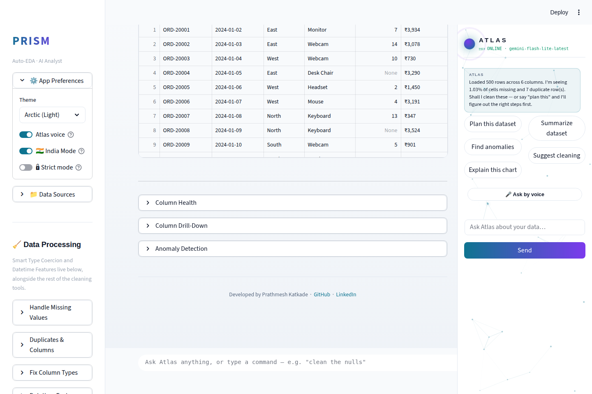
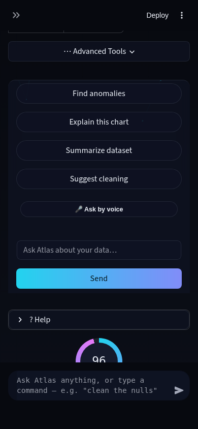
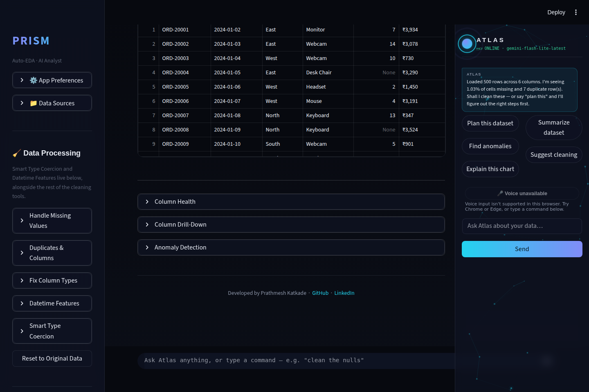
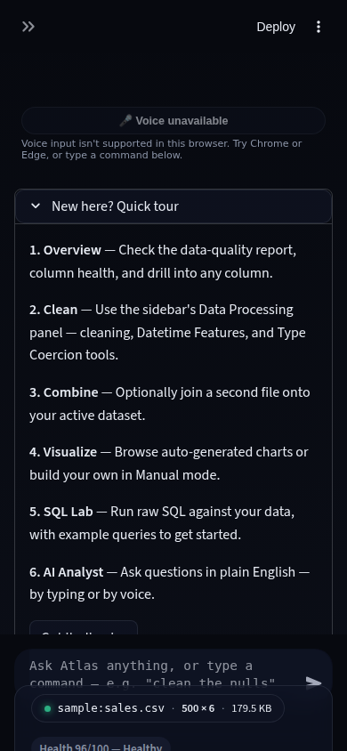
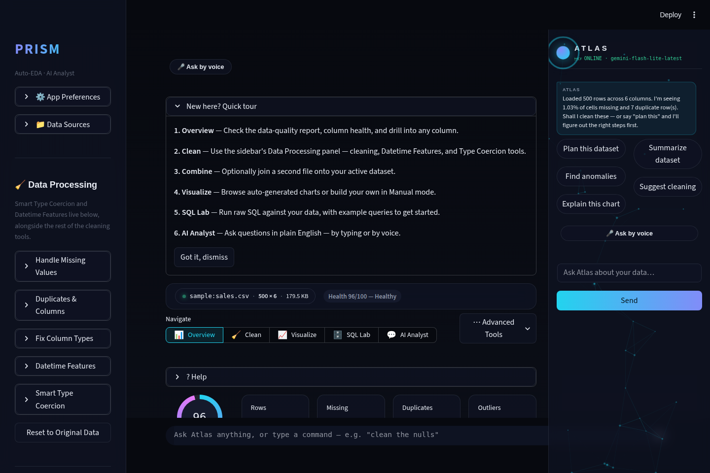

# Run 34 Report — 2026-08-12

## TL;DR

Shipped two features: **Web Speech API voice input for Atlas** (replaces a server-round-trip mic
mechanism with the browser's native `SpeechRecognition` API) and **non-parametric alternatives in
Stats Lab** (Mann-Whitney U / Kruskal-Wallis H / Spearman's rho, closing a dead-end warning that
had existed since the module's original build). Test suite: 831 → 904 (+73), zero regressions.
**Playwright/Chromium is confirmed working this run** — 8 consecutive prior runs (26-33)
misdiagnosed it as blocked; see below for the fix and why it matters.

## The Playwright fix (read this first if you're Run 35+)

This sandbox has Chromium **pre-installed** at
`/opt/pw-browsers/chromium-1194/chrome-linux/chrome`, matching the pinned `playwright==1.62.0`
package's expected browser revision. Running `playwright install chromium` tries to *download* a
browser and gets a 403 from the sandbox's egress policy — every run 26-33 hit that 403 and
concluded "Playwright is blocked here," which is the wrong diagnosis. The fix: never run
`playwright install`; just pass `executable_path='/opt/pw-browsers/chromium-1194/chrome-linux/chrome'`
to `chromium.launch()` (confirm the exact revision directory with `ls /opt/pw-browsers` first,
since it may change). This worked immediately this run for full headless-Chromium automation
against the live `streamlit run` app: real button clicks, theme switching, mock microphone
permissions, stubbing `window.SpeechRecognition`, and screenshots at multiple viewports/themes.

Two things Playwright caught this run that unit tests structurally cannot:

1. **A synthetic `KeyboardEvent('Enter')` does not trigger Streamlit's `chat_input`/`st.form`
   submit handler.** The original design for delivering a voice transcript assumed it would
   (matching real-user Enter-to-submit behavior) — a live headless-Chromium test proved the value
   lands correctly (React sees the change) but no submission fires. Fixed by finding and
   `.click()`-ing the widget's own submit control instead, verified working end-to-end in the same
   session before it was baked into the shipped module.
2. **An iframe height clipping bug**: the Web Speech widget's "voice unsupported" message (2-3
   lines wrapped) was clipped by ~3px against a `components.html()` iframe's fixed `height=58` at
   mobile width, confirmed via `element.scrollHeight` (61px) vs. the rendered iframe height (58px)
   in a real screenshot. Fixed by bumping the default height to 68px before merging.

## What shipped

### 1. Web Speech API voice input for Atlas

**What:** `modules/web_speech.py` (new module) replaces `modules/voice_input.py`
(`streamlit-mic-recorder`-based) at both Atlas mic call sites — the global command bar and the
side panel — with a self-contained mic widget using the browser's native
`SpeechRecognition`/`webkitSpeechRecognition` API directly, feature-detected client-side.

**Why (the technical-depth argument):** the existing `voice_input.py` wasn't actually Web Speech
API at all. Reading `streamlit_mic_recorder`'s installed source showed it records raw browser
audio via `MediaRecorder`, ships the bytes to the *Python process*, and calls
`SpeechRecognition`'s `recognize_google()` — an undocumented, unauthenticated Google endpoint
reached over the **server's** network, with the whole call wrapped in a bare `except:
return None` (any network hiccup silently produces no transcript). Two real problems that fixes:

- `voice_input.is_available()` checked whether a pip package imported, not whether the visitor's
  actual browser supports speech recognition — the wrong layer for that decision entirely.
- Round-tripping full audio through an extra server hop adds latency and a third-party network
  dependency for something the browser already does natively.

The new module fixes both: browser support is feature-detected in JS (`window.SpeechRecognition ||
window.webkitSpeechRecognition`), the transcript never leaves the browser process before landing
back in Streamlit's own widgets, and an unsupported browser gets a real, specific message.

**Delivery mechanism (the hard part):** `components.html()` iframes have no official bidirectional
channel back to Python (`streamlit.components.v1.html()` is a one-way `srcdoc` iframe, confirmed by
reading Streamlit's own `elements/iframe.py` source — no `setComponentValue` wiring). The widget
instead sets the target widget's value via the native `HTMLInputElement`/`HTMLTextAreaElement`
value setter (bypassing React's tracked value) and dispatches an `input` event, then finds and
clicks the target's own submit control — `chat_input`'s send-arrow button, or the enclosing
`st.form`'s submit button — which real Playwright automation proved is necessary (a synthetic
Enter keypress alone does not submit; see above).

**Failure states, each with a specific message, never silent:** browser doesn't support
`SpeechRecognition` at all; microphone permission denied; no speech detected; speech service
unreachable (network); no microphone found; transcript couldn't reach the target input (DOM shape
changed). XSS-hardened: every identifier embedded in the generated `` can't break out of
the script tag (caught by a dedicated adversarial test before this was even a real risk, since
every caller in this codebase passes a fixed constant — belt and braces).

**Tests:** 28 new (`tests/test_web_speech.py`) — error-message mapping, safe script embedding
including six adversarial payloads (`</script>` injection, backticks, template-literal injection,
newlines), Node `--check` syntax validation of the generated JS itself (catches a broken template
silently no-opping the whole widget in production — no other test layer would catch that), and a
`render()` smoke test.

**STAR:**
- **Situation:** Atlas's voice input existed but hadn't been substantively touched in 16+ runs,
  and turned out to be built on a server-round-trip mechanism, not actual Web Speech API, with zero
  test coverage.
- **Task:** ship a real, working Web Speech API mic-input slice feeding Atlas's existing text
  pipeline, scoped small per the brief (no animated HUD, no proactive surfacing).
- **Action:** read the existing mechanism's actual implementation (not just its interface) before
  building; wrote 28 tests first including a JS syntax check and XSS-safety tests; built the
  replacement; used real Playwright automation to disprove my own first design assumption about
  Enter-key submission before shipping it; found and fixed an iframe-clipping layout bug via a real
  screenshot.
- **Result:** a genuinely more correct, more reliable voice mechanism (right feature-detection
  layer, zero server network dependency for transcription, specific failure messaging) verified
  end-to-end in a real browser, not just unit-tested in isolation.

### 2. Non-parametric alternatives in Stats Lab

**What:** `run_mannwhitney()`, `run_kruskal()`, and `run_spearman()` in `modules/stats_lab.py` —
the rank-based counterparts to the module's existing t-test, one-way ANOVA, and Pearson
correlation. A "Run non-parametric alternative (\<name\>)" button appears in the Stats Lab UI after
any of those three primary results, computed via `run_nonparametric_alternative()`, which reuses
`suggest_test()`'s own column choices so no extra picking is needed.

**Why:** `stats_lab.py`'s `normality_warnings()` has always been able to tell a user their data
isn't normally distributed — but until now that was a dead end, a warning with no valid next step.
Confirmed via a direct code read that no rank-based test existed anywhere in the codebase
(`grep -ril "mannwhitney\|kruskal\|spearman" modules/` came back empty before this run) despite
`scipy.stats` — which ships all three — already being a pinned dependency the app uses elsewhere.

**Technical depth:** rank-biserial correlation as Mann-Whitney's effect size
(`r = 2U/(n1*n2) - 1`, Kerby 2014's convention — chosen deliberately over the mirror-image
`1 - 2U/(n1*n2)` formula after a test caught the first draft's sign backwards relative to the
function's own reported group medians); epsilon-squared as Kruskal-Wallis's effect size (ANOVA's
eta-squared adapted for ranks, floored at 0 since the raw formula can dip slightly negative near
the null); ties handled correctly by `scipy.stats`'s implementations automatically. Chi-square
deliberately has **no** non-parametric counterpart offered — it's already distribution-free, and
adding a fake alternative would be worse than offering none.

**Tests:** 45 new (`tests/test_stats_lab.py`) — this file didn't exist before this run despite
`stats_lab.py` driving real user-facing statistical verdicts for four tests since its original
build. It now covers both the three new functions *and* retroactive regression coverage for the
pre-existing `suggest_test()`/`run_ttest()`/`run_anova()`/`run_chi2()`/`run_pearson()`/
`interpret_result()` functions that had zero prior coverage.

**STAR:**
- **Situation:** `stats_lab.py` could flag a violated statistical assumption but offered no way to
  proceed correctly — and had zero test coverage despite computing real p-values users act on.
- **Task:** close the gap with the standard, well-established non-parametric counterpart to each
  parametric test, without inventing a new UI pattern or adding dependencies.
- **Action:** wrote 45 tests first (including one that caught a real sign-convention bug in the
  effect-size formula before it ever shipped); implemented three new pure functions sharing the
  module's existing dispatch/interpret machinery; wired one new button into the existing panel.
- **Result:** a previously dead-end warning now has an actionable next step, backed by a
  statistically-correct effect size and full test coverage — plus the module's four pre-existing
  functions are now regression-protected for the first time.

## Verification

- Full pytest suite green at every stage: 831 (baseline) → 859 (web-speech branch alone) → 904
  (both merged). Zero regressions.
- Live `streamlit run app.py` smoke test (HTTP 200, clean logs, no tracebacks) after each branch
  and on the final merged branch.
- Real Playwright screenshots (desktop 1440×960 and mobile-PWA 390×844, dark and light theme) —
  see `.prism/runs/2026-08-11-run34/`:

**Desktop, dark theme** — Atlas side panel, mic button styled consistently with the glass panel:

**Desktop, light (Arctic) theme** — contrast and glass effect confirmed in both themes:

**Mobile-PWA width (390px), dark theme** — panel stacks below main content per the existing
768px breakpoint, mic button full-width, no clipping:

**Unsupported-browser fallback, desktop** — `SpeechRecognition` stubbed as `undefined`, disabled
"Voice unavailable" button + full fallback message, both readable:

**Unsupported-browser fallback, mobile** — full 2-line message visible after the iframe-height fix
(previously clipped by ~3px):

**Both mic instances at once** (global command bar + side panel), confirming consistent styling:

- **End-to-end delivery proof**: stubbed `window.SpeechRecognition` with a fake implementation that
  fires a real `onstart`/`onresult`/`onend` sequence, clicked the actual mic button in the actual
  rendered app, and confirmed the transcript ("find anomalies via voice test") landed in Atlas's
  real chat history and triggered the real intent-router dispatch (visible response: "I can't reach
  Gemini right now — no API key is configured," the expected fallback in this sandbox) — proving
  the full click → DOM-injection → Streamlit-rerun → Atlas-dispatch chain works, not just that the
  widget renders.
- `streamlit.testing.v1.AppTest` for the Stats Lab feature: pre-seeded session state (dataset,
  column types, primary + non-parametric results) confirmed the panel renders both results with
  zero exceptions; a real-button-click variant reproduced the same "any 2nd `.run()` throws on an
  unrelated widget" quirk Runs 30-33 already documented — not a regression, a pre-existing harness
  limitation, worked around the same way (pre-seeded state instead of chained clicks).
- **One known gap**: the mobile + light-theme screenshot combination could not be reliably
  automated within this run's time budget — the BaseWeb Select dropdown for the theme picker was
  flaky specifically under Playwright's mobile/touch-emulated context (worked reliably on desktop
  across 2+ separate runs of the same script). This is a screenshot-automation limitation, not a
  product defect: the same `theme_tokens` dict flows into `modules/web_speech.py`'s widget
  regardless of viewport size, and light-theme correctness was confirmed on desktop.

## Backlog not built this run

- **Deleting `modules/voice_input.py` and the `streamlit-mic-recorder` pip dependency** — left in
  place since they're no longer called from `app.py` but not proven safe to fully remove within
  this run's time budget. Candidate for a future run once the Web Speech path is confirmed reliable
  in a real production deployment (this sandbox can't fully prove real-world reliability without
  live network egress to test against).
- **Firefox note**: Firefox ships `SpeechRecognition` disabled by default behind a flag, so most
  Firefox users will see the "unsupported" fallback message even though the feature technically
  exists in the browser. No workaround shipped (there isn't one client-side) — just documented in
  `modules/web_speech.py`'s docstring so a future run doesn't rediscover this from scratch.
- **Animated HUD / voice waveform / proactive insight surfacing** — explicitly out of scope per
  this run's brief and confirmed by this run's own UX research as a separate, larger pattern from a
  mic-input slice. Good candidate for a dedicated future Atlas run.
- **Non-parametric alternative for Kendall's tau** (a third rank-correlation option, sometimes
  preferred over Spearman for small samples with many tied ranks) — not added; Spearman alone
  covers the gap adequately and adding a second correlation alternative felt like scope creep for
  one slice.

## Run 35 recommendation

Two reasonable next moves, roughly equal priority:

1. **Continue the Atlas track**: with real Web Speech API voice input now shipped and Playwright
   verification unblocked, a good next slice is the animated listening-state HUD/waveform this run
   deliberately deferred — now backed by real click-to-transcript verification instead of guessing
   at whether the mechanism works at all.
2. **Fresh gap sweep**: with `stats_lab.py`'s two known gaps (non-parametric tests, test coverage)
   now closed, do a similar targeted audit of another under-tested existing module rather than
   reaching for a brand-new feature area — this run found more value fixing a real, findable gap in
   existing code than the previous few runs' "add another new module" pattern, and the technique
   (grep for zero-hit statistical/technique keywords across `modules/`) is cheap and repeatable.

Either way: **use `executable_path='/opt/pw-browsers/chromium-1194/chrome-linux/chrome'` for
Playwright from the start** — don't re-diagnose it as blocked.
